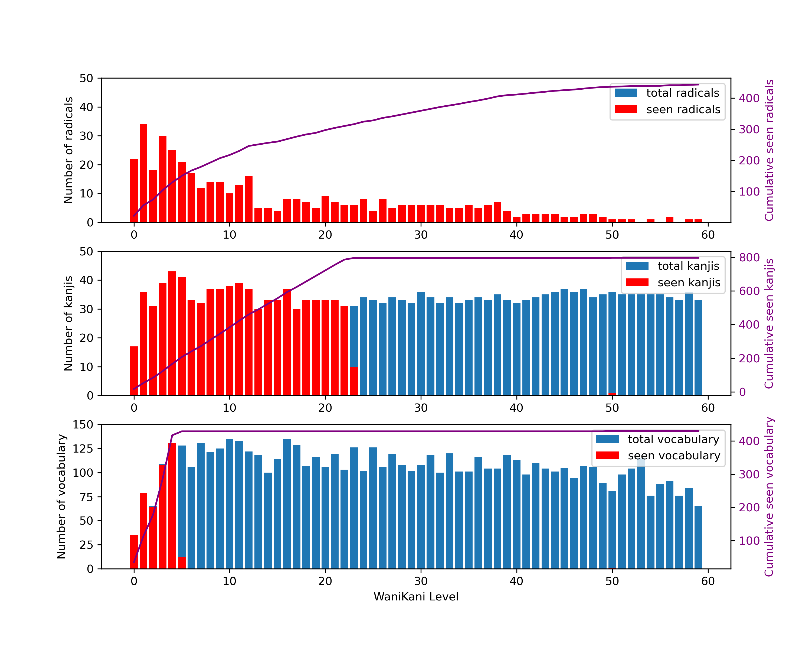

[Main](README.md) -
[Radicals](radicals.md) -
[Kanjis](kanjis.md) -
[Vocabulary](vocabulary.md) -
[Levels](levels.md) -
[Grammar](grammar.md) - 
[Progress](progress.md) -
[Resources](resources.md)

# Progress by level

## [Level 1](levels/wk_level1.md) 

| radicals | kanjis | vocabulary | 
| --- | --- | --- | 
|  22/22 (100 %) |  17/17 (100 %) |  35/35 (100 %) | 
|  [一](radicals/一.md) ,  [ハ](radicals/ハ.md) ,  [丶](radicals/丶.md) ,  [七](radicals/七.md) ,  [丿](radicals/丿.md) ,  [二](radicals/二.md) ,  [亠](radicals/亠.md) ,  [人](radicals/人.md) ,  [ト](radicals/ト.md) ,  [九](radicals/九.md) ,  [入](radicals/入.md) ,  [力](radicals/力.md) ,  [勹](radicals/勹.md) ,  [十](radicals/十.md) ,  [口](radicals/口.md) ,  [大](radicals/大.md) ,  [女](radicals/女.md) ,  [山](radicals/山.md) ,  [川](radicals/川.md) ,  [日](radicals/日.md) ,  [木](radicals/木.md) ,  [工](radicals/工.md) ,  |  [一](kanjis/一.md) ,  [二](kanjis/二.md) ,  [九](kanjis/九.md) ,  [七](kanjis/七.md) ,  [人](kanjis/人.md) ,  [入](kanjis/入.md) ,  [八](kanjis/八.md) ,  [力](kanjis/力.md) ,  [十](kanjis/十.md) ,  [三](kanjis/三.md) ,  [下](kanjis/下.md) ,  [口](kanjis/口.md) ,  [大](kanjis/大.md) ,  [女](kanjis/女.md) ,  [山](kanjis/山.md) ,  [川](kanjis/川.md) ,  [工](kanjis/工.md) ,  |  [一](vocabulary/一.md) ,  [一つ](vocabulary/一つ.md) ,  [七](vocabulary/七.md) ,  [七つ](vocabulary/七つ.md) ,  [九](vocabulary/九.md) ,  [九つ](vocabulary/九つ.md) ,  [二](vocabulary/二.md) ,  [二つ](vocabulary/二つ.md) ,  [人](vocabulary/人.md) ,  [二人](vocabulary/二人.md) ,  [一人](vocabulary/一人.md) ,  [入る](vocabulary/入る.md) ,  [八](vocabulary/八.md) ,  [八つ](vocabulary/八つ.md) ,  [力](vocabulary/力.md) ,  [十](vocabulary/十.md) ,  [三](vocabulary/三.md) ,  [三つ](vocabulary/三つ.md) ,  [三人](vocabulary/三人.md) ,  [上](vocabulary/上.md) ,  [上げる](vocabulary/上げる.md) ,  [下](vocabulary/下.md) ,  [下げる](vocabulary/下げる.md) ,  [下さい](vocabulary/下さい.md) ,  [口](vocabulary/口.md) ,  [入り口](vocabulary/入り口.md) ,  [大きい](vocabulary/大きい.md) ,  [大きさ](vocabulary/大きさ.md) ,  [大した](vocabulary/大した.md) ,  [女](vocabulary/女.md) ,  [山](vocabulary/山.md) ,  [ふじ山](vocabulary/ふじ山.md) ,  [川](vocabulary/川.md) ,  [人口](vocabulary/人口.md) ,  [人工](vocabulary/人工.md) ,  | 

## [Level 2](levels/wk_level2.md) 

| radicals | kanjis | vocabulary | 
| --- | --- | --- | 
|  34/34 (100 %) |  36/36 (100 %) |  79/79 (100 %) | 
|  [土](radicals/土.md) ,  [刀](radicals/刀.md) ,  [ナ](radicals/ナ.md) ,  [丁](radicals/丁.md) ,  [儿](radicals/儿.md) ,  [冂](radicals/冂.md) ,  [又](radicals/又.md) ,  [メ](radicals/メ.md) ,  [千](radicals/千.md) ,  [夕](radicals/夕.md) ,  [子](radicals/子.md) ,  [小](radicals/小.md) ,  [弓](radicals/弓.md) ,  [尸](radicals/尸.md) ,  [彡](radicals/彡.md) ,  [五](radicals/五.md) ,  [天](radicals/天.md) ,  [手](radicals/手.md) ,  [文](radicals/文.md) ,  [月](radicals/月.md) ,  [止](radicals/止.md) ,  [水](radicals/水.md) ,  [火](radicals/火.md) ,  [犬](radicals/犬.md) ,  [王](radicals/王.md) ,  [中](radicals/中.md) ,  [本](radicals/本.md) ,  [田](radicals/田.md) ,  [白](radicals/白.md) ,  [目](radicals/目.md) ,  [石](radicals/石.md) ,  [立](radicals/立.md) ,  [牛](radicals/牛.md) ,  [ム](radicals/ム.md) ,  |  [刀](kanjis/刀.md) ,  [土](kanjis/土.md) ,  [千](kanjis/千.md) ,  [夕](kanjis/夕.md) ,  [子](kanjis/子.md) ,  [小](kanjis/小.md) ,  [丁](kanjis/丁.md) ,  [了](kanjis/了.md) ,  [丸](kanjis/丸.md) ,  [才](kanjis/才.md) ,  [中](kanjis/中.md) ,  [五](kanjis/五.md) ,  [六](kanjis/六.md) ,  [円](kanjis/円.md) ,  [天](kanjis/天.md) ,  [手](kanjis/手.md) ,  [文](kanjis/文.md) ,  [日](kanjis/日.md) ,  [月](kanjis/月.md) ,  [木](kanjis/木.md) ,  [水](kanjis/水.md) ,  [火](kanjis/火.md) ,  [犬](kanjis/犬.md) ,  [王](kanjis/王.md) ,  [出](kanjis/出.md) ,  [右](kanjis/右.md) ,  [四](kanjis/四.md) ,  [左](kanjis/左.md) ,  [本](kanjis/本.md) ,  [正](kanjis/正.md) ,  [玉](kanjis/玉.md) ,  [田](kanjis/田.md) ,  [白](kanjis/白.md) ,  [目](kanjis/目.md) ,  [立](kanjis/立.md) ,  [々](kanjis/々.md) ,  |  [上る](vocabulary/上る.md) ,  [刀](vocabulary/刀.md) ,  [土](vocabulary/土.md) ,  [千](vocabulary/千.md) ,  [一千](vocabulary/一千.md) ,  [夕べ](vocabulary/夕べ.md) ,  [女の子](vocabulary/女の子.md) ,  [子](vocabulary/子.md) ,  [女子](vocabulary/女子.md) ,  [小さい](vocabulary/小さい.md) ,  [丸](vocabulary/丸.md) ,  [丸い](vocabulary/丸い.md) ,  [〜才](vocabulary/〜才.md) ,  [中](vocabulary/中.md) ,  [中々](vocabulary/中々.md) ,  [五月](vocabulary/五月.md) ,  [五日](vocabulary/五日.md) ,  [五十](vocabulary/五十.md) ,  [五つ](vocabulary/五つ.md) ,  [五](vocabulary/五.md) ,  [六つ](vocabulary/六つ.md) ,  [六月](vocabulary/六月.md) ,  [六日](vocabulary/六日.md) ,  [十六](vocabulary/十六.md) ,  [六](vocabulary/六.md) ,  [〜円](vocabulary/〜円.md) ,  [千円](vocabulary/千円.md) ,  [円い](vocabulary/円い.md) ,  [天](vocabulary/天.md) ,  [天才](vocabulary/天才.md) ,  [手](vocabulary/手.md) ,  [下手](vocabulary/下手.md) ,  [上手](vocabulary/上手.md) ,  [文](vocabulary/文.md) ,  [日](vocabulary/日.md) ,  [月](vocabulary/月.md) ,  [十月](vocabulary/十月.md) ,  [一月](vocabulary/一月.md) ,  [二月](vocabulary/二月.md) ,  [木](vocabulary/木.md) ,  [水](vocabulary/水.md) ,  [火](vocabulary/火.md) ,  [火山](vocabulary/火山.md) ,  [犬](vocabulary/犬.md) ,  [子犬](vocabulary/子犬.md) ,  [王](vocabulary/王.md) ,  [王子](vocabulary/王子.md) ,  [女王](vocabulary/女王.md) ,  [王女](vocabulary/王女.md) ,  [出る](vocabulary/出る.md) ,  [出口](vocabulary/出口.md) ,  [右](vocabulary/右.md) ,  [四](vocabulary/四.md) ,  [四月](vocabulary/四月.md) ,  [左](vocabulary/左.md) ,  [本](vocabulary/本.md) ,  [日本](vocabulary/日本.md) ,  [正しい](vocabulary/正しい.md) ,  [正す](vocabulary/正す.md) ,  [玉](vocabulary/玉.md) ,  [玉ねぎ](vocabulary/玉ねぎ.md) ,  [田](vocabulary/田.md) ,  [白](vocabulary/白.md) ,  [白人](vocabulary/白人.md) ,  [目](vocabulary/目.md) ,  [目玉](vocabulary/目玉.md) ,  [立つ](vocabulary/立つ.md) ,  [二日](vocabulary/二日.md) ,  [人々](vocabulary/人々.md) ,  [一日](vocabulary/一日.md) ,  [七日](vocabulary/七日.md) ,  [三日](vocabulary/三日.md) ,  [九日](vocabulary/九日.md) ,  [八日](vocabulary/八日.md) ,  [十日](vocabulary/十日.md) ,  [大いに](vocabulary/大いに.md) ,  [水中](vocabulary/水中.md) ,  [左右](vocabulary/左右.md) ,  [入力](vocabulary/入力.md) ,  | 

## [Level 3](levels/wk_level3.md) 

| radicals | kanjis | vocabulary | 
| --- | --- | --- | 
|  18/18 (100 %) |  31/31 (100 %) |  64/65 (98 %) | 
|  [匕](radicals/匕.md) ,  [夂](radicals/夂.md) ,  [干](radicals/干.md) ,  [广](radicals/广.md) ,  [扌](radicals/扌.md) ,  [元](radicals/元.md) ,  [心](radicals/心.md) ,  [方](radicals/方.md) ,  [毛](radicals/毛.md) ,  [父](radicals/父.md) ,  [古](radicals/古.md) ,  [用](radicals/用.md) ,  [矢](radicals/矢.md) ,  [戸](radicals/戸.md) ,  [幺](radicals/幺.md) ,  [巾](radicals/巾.md) ,  [生](radicals/生.md) ,  [今](radicals/今.md) ,  |  [万](kanjis/万.md) ,  [今](kanjis/今.md) ,  [元](kanjis/元.md) ,  [公](kanjis/公.md) ,  [内](kanjis/内.md) ,  [分](kanjis/分.md) ,  [切](kanjis/切.md) ,  [午](kanjis/午.md) ,  [友](kanjis/友.md) ,  [太](kanjis/太.md) ,  [少](kanjis/少.md) ,  [引](kanjis/引.md) ,  [心](kanjis/心.md) ,  [戸](kanjis/戸.md) ,  [方](kanjis/方.md) ,  [牛](kanjis/牛.md) ,  [父](kanjis/父.md) ,  [毛](kanjis/毛.md) ,  [止](kanjis/止.md) ,  [冬](kanjis/冬.md) ,  [北](kanjis/北.md) ,  [半](kanjis/半.md) ,  [古](kanjis/古.md) ,  [台](kanjis/台.md) ,  [外](kanjis/外.md) ,  [市](kanjis/市.md) ,  [広](kanjis/広.md) ,  [母](kanjis/母.md) ,  [用](kanjis/用.md) ,  [矢](kanjis/矢.md) ,  [生](kanjis/生.md) ,  |  [アメリカ人](vocabulary/アメリカ人.md) ,  [フランス人](vocabulary/フランス人.md) ,  [ビー玉](vocabulary/ビー玉.md) ,  [生まれる](vocabulary/生まれる.md) ,  [生](vocabulary/生.md) ,  [一万](vocabulary/一万.md) ,  [二万](vocabulary/二万.md) ,  [十万](vocabulary/十万.md) ,  [今](vocabulary/今.md) ,  [今日](vocabulary/今日.md) ,  [今月](vocabulary/今月.md) ,  [元](vocabulary/元.md) ,  [半分](vocabulary/半分.md) ,  [分かる](vocabulary/分かる.md) ,  [分](vocabulary/分.md) ,  [大切](vocabulary/大切.md) ,  [切る](vocabulary/切る.md) ,  [友人](vocabulary/友人.md) ,  [太い](vocabulary/太い.md) ,  [太る](vocabulary/太る.md) ,  [少し](vocabulary/少し.md) ,  [少ない](vocabulary/少ない.md) ,  [引く](vocabulary/引く.md) ,  [心](vocabulary/心.md) ,  [戸口](vocabulary/戸口.md) ,  [方](vocabulary/方.md) ,  [止める](vocabulary/止める.md) ,  [中止](vocabulary/中止.md) ,  [毛](vocabulary/毛.md) ,  [父](vocabulary/父.md) ,  [お父さん](vocabulary/お父さん.md) ,  [牛](vocabulary/牛.md) ,  [冬](vocabulary/冬.md) ,  [北](vocabulary/北.md) ,  [半](vocabulary/半.md) ,  [古い](vocabulary/古い.md) ,  [中古](vocabulary/中古.md) ,  [一台](vocabulary/一台.md) ,  [二台](vocabulary/二台.md) ,  [五台](vocabulary/五台.md) ,  [十台](vocabulary/十台.md) ,  [外](vocabulary/外.md) ,  [外人](vocabulary/外人.md) ,  [外れ](vocabulary/外れ.md) ,  [市](vocabulary/市.md) ,  [市立](vocabulary/市立.md) ,  [シアトル市](vocabulary/シアトル市.md) ,  [広い](vocabulary/広い.md) ,  [母](vocabulary/母.md) ,  [お母さん](vocabulary/お母さん.md) ,  [用いる](vocabulary/用いる.md) ,  [公用](vocabulary/公用.md) ,  [矢](vocabulary/矢.md) ,  [人生](vocabulary/人生.md) ,  [内](vocabulary/内.md) ,  [〜台](vocabulary/〜台.md) ,  [〜人](vocabulary/〜人.md) ,  [少女](vocabulary/少女.md) ,  [万](vocabulary/万.md) ,  [今日は](vocabulary/今日は.md) ,  [用](vocabulary/用.md) ,  [大人しい](vocabulary/大人しい.md) ,  [戸](vocabulary/戸.md) ,  [女の人](vocabulary/女の人.md) , [イギリス人](vocabulary/イギリス人.md),  | 

## [Level 4](levels/wk_level4.md) 

| radicals | kanjis | vocabulary | 
| --- | --- | --- | 
|  30/30 (100 %) |  39/39 (100 %) |  108/109 (99 %) | 
|  [寸](radicals/寸.md) ,  [ｲ](radicals/ｲ.md) ,  [冖](radicals/冖.md) ,  [也](radicals/也.md) ,  [宀](radicals/宀.md) ,  [弋](radicals/弋.md) ,  [ネ](radicals/ネ.md) ,  [支](radicals/支.md) ,  [气](radicals/气.md) ,  [世](radicals/世.md) ,  [皿](radicals/皿.md) ,  [竹](radicals/竹.md) ,  [糸](radicals/糸.md) ,  [耳](radicals/耳.md) ,  [虫](radicals/虫.md) ,  [艹](radicals/艹.md) ,  [見](radicals/見.md) ,  [赤](radicals/赤.md) ,  [車](radicals/車.md) ,  [貝](radicals/貝.md) ,  [足](radicals/足.md) ,  [不](radicals/不.md) ,  [士](radicals/士.md) ,  [米](radicals/米.md) ,  [彳](radicals/彳.md) ,  [巴](radicals/巴.md) ,  [兀](radicals/兀.md) ,  [厂](radicals/厂.md) ,  [主](radicals/主.md) ,  [乚](radicals/乚.md) ,  |  [石](kanjis/石.md) ,  [世](kanjis/世.md) ,  [主](kanjis/主.md) ,  [他](kanjis/他.md) ,  [代](kanjis/代.md) ,  [写](kanjis/写.md) ,  [去](kanjis/去.md) ,  [号](kanjis/号.md) ,  [央](kanjis/央.md) ,  [平](kanjis/平.md) ,  [打](kanjis/打.md) ,  [氷](kanjis/氷.md) ,  [申](kanjis/申.md) ,  [皿](kanjis/皿.md) ,  [礼](kanjis/礼.md) ,  [休](kanjis/休.md) ,  [先](kanjis/先.md) ,  [名](kanjis/名.md) ,  [字](kanjis/字.md) ,  [年](kanjis/年.md) ,  [早](kanjis/早.md) ,  [気](kanjis/気.md) ,  [百](kanjis/百.md) ,  [竹](kanjis/竹.md) ,  [糸](kanjis/糸.md) ,  [耳](kanjis/耳.md) ,  [虫](kanjis/虫.md) ,  [村](kanjis/村.md) ,  [男](kanjis/男.md) ,  [町](kanjis/町.md) ,  [花](kanjis/花.md) ,  [見](kanjis/見.md) ,  [貝](kanjis/貝.md) ,  [赤](kanjis/赤.md) ,  [足](kanjis/足.md) ,  [車](kanjis/車.md) ,  [不](kanjis/不.md) ,  [仕](kanjis/仕.md) ,  [宝](kanjis/宝.md) ,  |  [右手](vocabulary/右手.md) ,  [四日](vocabulary/四日.md) ,  [四つ](vocabulary/四つ.md) ,  [四千](vocabulary/四千.md) ,  [四十](vocabulary/四十.md) ,  [左手](vocabulary/左手.md) ,  [生きる](vocabulary/生きる.md) ,  [石](vocabulary/石.md) ,  [休み](vocabulary/休み.md) ,  [休む](vocabulary/休む.md) ,  [休止](vocabulary/休止.md) ,  [休日](vocabulary/休日.md) ,  [先ず](vocabulary/先ず.md) ,  [先](vocabulary/先.md) ,  [先々月](vocabulary/先々月.md) ,  [先月](vocabulary/先月.md) ,  [先日](vocabulary/先日.md) ,  [先生](vocabulary/先生.md) ,  [名人](vocabulary/名人.md) ,  [名字](vocabulary/名字.md) ,  [字](vocabulary/字.md) ,  [太字](vocabulary/太字.md) ,  [文字](vocabulary/文字.md) ,  [一文字](vocabulary/一文字.md) ,  [２０１１年](vocabulary/２０１１年.md) ,  [年内](vocabulary/年内.md) ,  [一年生](vocabulary/一年生.md) ,  [少年](vocabulary/少年.md) ,  [去年](vocabulary/去年.md) ,  [早い](vocabulary/早い.md) ,  [早々](vocabulary/早々.md) ,  [気](vocabulary/気.md) ,  [気に入る](vocabulary/気に入る.md) ,  [一気](vocabulary/一気.md) ,  [気分](vocabulary/気分.md) ,  [人気](vocabulary/人気.md) ,  [元気](vocabulary/元気.md) ,  [天気](vocabulary/天気.md) ,  [本気](vocabulary/本気.md) ,  [平気](vocabulary/平気.md) ,  [一本気](vocabulary/一本気.md) ,  [百万](vocabulary/百万.md) ,  [四百](vocabulary/四百.md) ,  [五百](vocabulary/五百.md) ,  [二百](vocabulary/二百.md) ,  [竹の子](vocabulary/竹の子.md) ,  [竹](vocabulary/竹.md) ,  [糸](vocabulary/糸.md) ,  [耳](vocabulary/耳.md) ,  [虫](vocabulary/虫.md) ,  [村](vocabulary/村.md) ,  [村人](vocabulary/村人.md) ,  [男](vocabulary/男.md) ,  [町](vocabulary/町.md) ,  [花](vocabulary/花.md) ,  [花火](vocabulary/花火.md) ,  [花見](vocabulary/花見.md) ,  [見る](vocabulary/見る.md) ,  [見せる](vocabulary/見せる.md) ,  [見方](vocabulary/見方.md) ,  [月見](vocabulary/月見.md) ,  [貝](vocabulary/貝.md) ,  [赤](vocabulary/赤.md) ,  [赤ちゃん](vocabulary/赤ちゃん.md) ,  [足りる](vocabulary/足りる.md) ,  [足](vocabulary/足.md) ,  [不足](vocabulary/不足.md) ,  [車](vocabulary/車.md) ,  [車内](vocabulary/車内.md) ,  [世](vocabulary/世.md) ,  [二世](vocabulary/二世.md) ,  [三世](vocabulary/三世.md) ,  [主に](vocabulary/主に.md) ,  [主人](vocabulary/主人.md) ,  [仕方](vocabulary/仕方.md) ,  [他](vocabulary/他.md) ,  [他人](vocabulary/他人.md) ,  [代わる](vocabulary/代わる.md) ,  [一代](vocabulary/一代.md) ,  [代用](vocabulary/代用.md) ,  [写す](vocabulary/写す.md) ,  [号](vocabulary/号.md) ,  [中央](vocabulary/中央.md) ,  [平ら](vocabulary/平ら.md) ,  [平日](vocabulary/平日.md) ,  [打つ](vocabulary/打つ.md) ,  [一打](vocabulary/一打.md) ,  [氷](vocabulary/氷.md) ,  [かき氷](vocabulary/かき氷.md) ,  [申す](vocabulary/申す.md) ,  [申し申し](vocabulary/申し申し.md) ,  [皿](vocabulary/皿.md) ,  [小皿](vocabulary/小皿.md) ,  [お礼](vocabulary/お礼.md) ,  [不正](vocabulary/不正.md) ,  [子牛](vocabulary/子牛.md) ,  [切手](vocabulary/切手.md) ,  [年](vocabulary/年.md) ,  [名](vocabulary/名.md) ,  [宝](vocabulary/宝.md) ,  [宝石](vocabulary/宝石.md) ,  [赤い](vocabulary/赤い.md) ,  [白い](vocabulary/白い.md) ,  [百](vocabulary/百.md) ,  [二十日](vocabulary/二十日.md) ,  [丸ごと](vocabulary/丸ごと.md) ,  [出かける](vocabulary/出かける.md) ,  [大気](vocabulary/大気.md) , [年中](vocabulary/年中.md),  | 

## [Level 5](levels/wk_level5.md) 

| radicals | kanjis | vocabulary | 
| --- | --- | --- | 
|  25/25 (100 %) |  43/43 (100 %) |  131/131 (100 %) | 
|  [氵](radicals/氵.md) ,  [耂](radicals/耂.md) ,  [ヨ](radicals/ヨ.md) ,  [廾](radicals/廾.md) ,  [毋](radicals/毋.md) ,  [肉](radicals/肉.md) ,  [自](radicals/自.md) ,  [色](radicals/色.md) ,  [行](radicals/行.md) ,  [西](radicals/西.md) ,  [可](radicals/可.md) ,  [⻌](radicals/⻌.md) ,  [斤](radicals/斤.md) ,  [言](radicals/言.md) ,  [金](radicals/金.md) ,  [雨](radicals/雨.md) ,  [青](radicals/青.md) ,  [冋](radicals/冋.md) ,  [乍](radicals/乍.md) ,  [冫](radicals/冫.md) ,  [走](radicals/走.md) ,  [里](radicals/里.md) ,  [会](radicals/会.md) ,  [开](radicals/开.md) ,  [羽](radicals/羽.md) ,  |  [兄](kanjis/兄.md) ,  [皮](kanjis/皮.md) ,  [交](kanjis/交.md) ,  [会](kanjis/会.md) ,  [光](kanjis/光.md) ,  [同](kanjis/同.md) ,  [回](kanjis/回.md) ,  [多](kanjis/多.md) ,  [当](kanjis/当.md) ,  [毎](kanjis/毎.md) ,  [米](kanjis/米.md) ,  [羽](kanjis/羽.md) ,  [考](kanjis/考.md) ,  [肉](kanjis/肉.md) ,  [自](kanjis/自.md) ,  [色](kanjis/色.md) ,  [行](kanjis/行.md) ,  [西](kanjis/西.md) ,  [何](kanjis/何.md) ,  [体](kanjis/体.md) ,  [作](kanjis/作.md) ,  [図](kanjis/図.md) ,  [声](kanjis/声.md) ,  [弟](kanjis/弟.md) ,  [形](kanjis/形.md) ,  [来](kanjis/来.md) ,  [社](kanjis/社.md) ,  [角](kanjis/角.md) ,  [言](kanjis/言.md) ,  [谷](kanjis/谷.md) ,  [走](kanjis/走.md) ,  [近](kanjis/近.md) ,  [里](kanjis/里.md) ,  [麦](kanjis/麦.md) ,  [学](kanjis/学.md) ,  [林](kanjis/林.md) ,  [空](kanjis/空.md) ,  [金](kanjis/金.md) ,  [雨](kanjis/雨.md) ,  [青](kanjis/青.md) ,  [草](kanjis/草.md) ,  [音](kanjis/音.md) ,  [斤](kanjis/斤.md) ,  |  [入れる](vocabulary/入れる.md) ,  [上がる](vocabulary/上がる.md) ,  [下がる](vocabulary/下がる.md) ,  [出す](vocabulary/出す.md) ,  [生む](vocabulary/生む.md) ,  [立てる](vocabulary/立てる.md) ,  [分ける](vocabulary/分ける.md) ,  [止まる](vocabulary/止まる.md) ,  [兄](vocabulary/兄.md) ,  [外れる](vocabulary/外れる.md) ,  [見える](vocabulary/見える.md) ,  [皮](vocabulary/皮.md) ,  [交ぜる](vocabulary/交ぜる.md) ,  [大会](vocabulary/大会.md) ,  [会う](vocabulary/会う.md) ,  [光](vocabulary/光.md) ,  [光年](vocabulary/光年.md) ,  [月光](vocabulary/月光.md) ,  [日光](vocabulary/日光.md) ,  [同じ](vocabulary/同じ.md) ,  [同日](vocabulary/同日.md) ,  [〜回](vocabulary/〜回.md) ,  [回る](vocabulary/回る.md) ,  [一回](vocabulary/一回.md) ,  [今回](vocabulary/今回.md) ,  [毎回](vocabulary/毎回.md) ,  [多い](vocabulary/多い.md) ,  [多分](vocabulary/多分.md) ,  [当たる](vocabulary/当たる.md) ,  [当たり](vocabulary/当たり.md) ,  [毎月](vocabulary/毎月.md) ,  [毎日](vocabulary/毎日.md) ,  [毎年](vocabulary/毎年.md) ,  [米](vocabulary/米.md) ,  [羽](vocabulary/羽.md) ,  [考える](vocabulary/考える.md) ,  [肉](vocabulary/肉.md) ,  [牛肉](vocabulary/牛肉.md) ,  [皮肉](vocabulary/皮肉.md) ,  [自分](vocabulary/自分.md) ,  [自立](vocabulary/自立.md) ,  [色](vocabulary/色.md) ,  [色々](vocabulary/色々.md) ,  [水色](vocabulary/水色.md) ,  [行く](vocabulary/行く.md) ,  [行き](vocabulary/行き.md) ,  [西](vocabulary/西.md) ,  [北西](vocabulary/北西.md) ,  [何千](vocabulary/何千.md) ,  [何](vocabulary/何.md) ,  [何人](vocabulary/何人.md) ,  [何月](vocabulary/何月.md) ,  [何日](vocabulary/何日.md) ,  [何年](vocabulary/何年.md) ,  [何回](vocabulary/何回.md) ,  [学ぶ](vocabulary/学ぶ.md) ,  [学生](vocabulary/学生.md) ,  [学年](vocabulary/学年.md) ,  [入学](vocabulary/入学.md) ,  [工学](vocabulary/工学.md) ,  [大学](vocabulary/大学.md) ,  [休学](vocabulary/休学.md) ,  [林](vocabulary/林.md) ,  [空気](vocabulary/空気.md) ,  [空](vocabulary/空.md) ,  [金](vocabulary/金.md) ,  [金玉](vocabulary/金玉.md) ,  [お金](vocabulary/お金.md) ,  [雨](vocabulary/雨.md) ,  [青い](vocabulary/青い.md) ,  [青年](vocabulary/青年.md) ,  [草](vocabulary/草.md) ,  [音](vocabulary/音.md) ,  [作る](vocabulary/作る.md) ,  [体](vocabulary/体.md) ,  [体力](vocabulary/体力.md) ,  [体内](vocabulary/体内.md) ,  [作文](vocabulary/作文.md) ,  [作用](vocabulary/作用.md) ,  [工作](vocabulary/工作.md) ,  [大作](vocabulary/大作.md) ,  [図](vocabulary/図.md) ,  [声](vocabulary/声.md) ,  [大声](vocabulary/大声.md) ,  [弟](vocabulary/弟.md) ,  [兄弟](vocabulary/兄弟.md) ,  [来る](vocabulary/来る.md) ,  [来月](vocabulary/来月.md) ,  [来年](vocabulary/来年.md) ,  [古来](vocabulary/古来.md) ,  [外来](vocabulary/外来.md) ,  [〜年来](vocabulary/〜年来.md) ,  [社内](vocabulary/社内.md) ,  [入社](vocabulary/入社.md) ,  [公社](vocabulary/公社.md) ,  [本社](vocabulary/本社.md) ,  [会社](vocabulary/会社.md) ,  [角](vocabulary/角.md) ,  [三角](vocabulary/三角.md) ,  [四角](vocabulary/四角.md) ,  [言う](vocabulary/言う.md) ,  [谷](vocabulary/谷.md) ,  [走る](vocabulary/走る.md) ,  [走行](vocabulary/走行.md) ,  [近い](vocabulary/近い.md) ,  [近日](vocabulary/近日.md) ,  [近年](vocabulary/近年.md) ,  [麦](vocabulary/麦.md) ,  [男の子](vocabulary/男の子.md) ,  [毛虫](vocabulary/毛虫.md) ,  [下町](vocabulary/下町.md) ,  [男の人](vocabulary/男の人.md) ,  [今まで](vocabulary/今まで.md) ,  [毛糸](vocabulary/毛糸.md) ,  [今すぐ](vocabulary/今すぐ.md) ,  [里](vocabulary/里.md) ,  [里心](vocabulary/里心.md) ,  [本当](vocabulary/本当.md) ,  [空車](vocabulary/空車.md) ,  [万人](vocabulary/万人.md) ,  [会](vocabulary/会.md) ,  [考古学](vocabulary/考古学.md) ,  [一生](vocabulary/一生.md) ,  [仕草](vocabulary/仕草.md) ,  [〜形](vocabulary/〜形.md) ,  [外交](vocabulary/外交.md) ,  [生まれ](vocabulary/生まれ.md) ,  [大体](vocabulary/大体.md) ,  [文学](vocabulary/文学.md) ,  [本来](vocabulary/本来.md) ,  [〜斤](vocabulary/〜斤.md) ,  | 

## [Level 6](levels/wk_level6.md) 

| radicals | kanjis | vocabulary | 
| --- | --- | --- | 
|  21/21 (100 %) |  41/41 (100 %) |  12/128 (9 %) | 
|  [L](radicals/L.md) ,  [凵](radicals/凵.md) ,  [刂](radicals/刂.md) ,  [斗](radicals/斗.md) ,  [ホ](radicals/ホ.md) ,  [灬](radicals/灬.md) ,  [歹](radicals/歹.md) ,  [未](radicals/未.md) ,  [禾](radicals/禾.md) ,  [羊](radicals/羊.md) ,  [血](radicals/血.md) ,  [長](radicals/長.md) ,  [食](radicals/食.md) ,  [マ](radicals/マ.md) ,  [欠](radicals/欠.md) ,  [占](radicals/占.md) ,  [犭](radicals/犭.md) ,  [首](radicals/首.md) ,  [舌](radicals/舌.md) ,  [亡](radicals/亡.md) ,  [市](radicals/市.md) ,  |  [化](kanjis/化.md) ,  [地](kanjis/地.md) ,  [両](kanjis/両.md) ,  [全](kanjis/全.md) ,  [向](kanjis/向.md) ,  [安](kanjis/安.md) ,  [州](kanjis/州.md) ,  [曲](kanjis/曲.md) ,  [有](kanjis/有.md) ,  [次](kanjis/次.md) ,  [死](kanjis/死.md) ,  [羊](kanjis/羊.md) ,  [血](kanjis/血.md) ,  [京](kanjis/京.md) ,  [国](kanjis/国.md) ,  [夜](kanjis/夜.md) ,  [妹](kanjis/妹.md) ,  [姉](kanjis/姉.md) ,  [店](kanjis/店.md) ,  [明](kanjis/明.md) ,  [東](kanjis/東.md) ,  [歩](kanjis/歩.md) ,  [画](kanjis/画.md) ,  [直](kanjis/直.md) ,  [知](kanjis/知.md) ,  [長](kanjis/長.md) ,  [前](kanjis/前.md) ,  [南](kanjis/南.md) ,  [室](kanjis/室.md) ,  [後](kanjis/後.md) ,  [思](kanjis/思.md) ,  [星](kanjis/星.md) ,  [活](kanjis/活.md) ,  [海](kanjis/海.md) ,  [点](kanjis/点.md) ,  [科](kanjis/科.md) ,  [茶](kanjis/茶.md) ,  [食](kanjis/食.md) ,  [首](kanjis/首.md) ,  [亡](kanjis/亡.md) ,  [私](kanjis/私.md) ,  |  [切れる](vocabulary/切れる.md) ,  [見分ける](vocabulary/見分ける.md) ,  [写る](vocabulary/写る.md) ,  [行う](vocabulary/行う.md) ,  [全て](vocabulary/全て.md) ,  [全日本](vocabulary/全日本.md) ,  [米国](vocabulary/米国.md) ,  [午前](vocabulary/午前.md) ,  [後で](vocabulary/後で.md) ,  [足首](vocabulary/足首.md) ,  [引き分け](vocabulary/引き分け.md) ,  [生える](vocabulary/生える.md) , [大文字](vocabulary/大文字.md), [耳打ち](vocabulary/耳打ち.md), [仕方がない](vocabulary/仕方がない.md), [文化](vocabulary/文化.md), [地](vocabulary/地.md), [地下](vocabulary/地下.md), [土地](vocabulary/土地.md), [地図](vocabulary/地図.md), [両手](vocabulary/両手.md), [両日](vocabulary/両日.md), [両方](vocabulary/両方.md), [全力](vocabulary/全力.md), [安全](vocabulary/安全.md), [方向](vocabulary/方向.md), [安い](vocabulary/安い.md), [安心](vocabulary/安心.md), [不安](vocabulary/不安.md), [平安](vocabulary/平安.md), [州](vocabulary/州.md), [九州](vocabulary/九州.md), [本州](vocabulary/本州.md), [曲](vocabulary/曲.md), [名曲](vocabulary/名曲.md), [有る](vocabulary/有る.md), [有名](vocabulary/有名.md), [次](vocabulary/次.md), [次回](vocabulary/次回.md), [目次](vocabulary/目次.md), [年次](vocabulary/年次.md), [死ぬ](vocabulary/死ぬ.md), [死体](vocabulary/死体.md), [死亡](vocabulary/死亡.md), [羊](vocabulary/羊.md), [羊毛](vocabulary/羊毛.md), [血](vocabulary/血.md), [出血](vocabulary/出血.md), [国](vocabulary/国.md), [中国](vocabulary/中国.md), [天国](vocabulary/天国.md), [全国](vocabulary/全国.md), [四国](vocabulary/四国.md), [外国](vocabulary/外国.md), [外国人](vocabulary/外国人.md), [夜](vocabulary/夜.md), [今夜](vocabulary/今夜.md), [姉妹](vocabulary/姉妹.md), [妹](vocabulary/妹.md), [お姉さん](vocabulary/お姉さん.md), [店](vocabulary/店.md), [明るい](vocabulary/明るい.md), [不明](vocabulary/不明.md), [東方](vocabulary/東方.md), [東北](vocabulary/東北.md), [中東](vocabulary/中東.md), [南東](vocabulary/南東.md), [歩く](vocabulary/歩く.md), [直す](vocabulary/直す.md), [正直](vocabulary/正直.md), [直行](vocabulary/直行.md), [長い](vocabulary/長い.md), [社長](vocabulary/社長.md), [前](vocabulary/前.md), [南](vocabulary/南.md), [後ろ](vocabulary/後ろ.md), [午後](vocabulary/午後.md), [思う](vocabulary/思う.md), [生活](vocabulary/生活.md), [海外](vocabulary/海外.md), [点](vocabulary/点.md), [科学](vocabulary/科学.md), [お茶](vocabulary/お茶.md), [茶色](vocabulary/茶色.md), [食べる](vocabulary/食べる.md), [首](vocabulary/首.md), [首になる](vocabulary/首になる.md), [四十二](vocabulary/四十二.md), [亡くなる](vocabulary/亡くなる.md), [小文字](vocabulary/小文字.md), [冬休み](vocabulary/冬休み.md), [出来る](vocabulary/出来る.md), [方言](vocabulary/方言.md), [東京](vocabulary/東京.md), [早口](vocabulary/早口.md), [足りない](vocabulary/足りない.md), [年上](vocabulary/年上.md), [世の中](vocabulary/世の中.md), [代わり](vocabulary/代わり.md), [今年](vocabulary/今年.md), [代える](vocabulary/代える.md), [年下](vocabulary/年下.md), [向く](vocabulary/向く.md), [東](vocabulary/東.md), [私](vocabulary/私.md), [私生活](vocabulary/私生活.md), [私立](vocabulary/私立.md), [国宝](vocabulary/国宝.md), [宝くじ](vocabulary/宝くじ.md), [一歩](vocabulary/一歩.md), [三百](vocabulary/三百.md), [足す](vocabulary/足す.md), [車両](vocabulary/車両.md), [早く](vocabulary/早く.md), [死](vocabulary/死.md), [姉](vocabulary/姉.md), [〜室](vocabulary/〜室.md), [草地](vocabulary/草地.md), [国王](vocabulary/国王.md), [水星](vocabulary/水星.md), [金星](vocabulary/金星.md), [土星](vocabulary/土星.md), [活気](vocabulary/活気.md), [点ける](vocabulary/点ける.md), [地中](vocabulary/地中.md), [活用](vocabulary/活用.md), [知る](vocabulary/知る.md), [手首](vocabulary/手首.md),  | 

## [Level 7](levels/wk_level7.md) 

| radicals | kanjis | vocabulary | 
| --- | --- | --- | 
|  17/17 (100 %) |  33/33 (100 %) |  0/106 (0 %) | 
|  [卩](radicals/卩.md) ,  [夫](radicals/夫.md) ,  [氏](radicals/氏.md) ,  [舟](radicals/舟.md) ,  [魚](radicals/魚.md) ,  [鳥](radicals/鳥.md) ,  [黄](radicals/黄.md) ,  [黒](radicals/黒.md) ,  [周](radicals/周.md) ,  [勿](radicals/勿.md) ,  [几](radicals/几.md) ,  [寺](radicals/寺.md) ,  [門](radicals/門.md) ,  [己](radicals/己.md) ,  [豕](radicals/豕.md) ,  [孝](radicals/孝.md) ,  [且](radicals/且.md) ,  |  [欠](kanjis/欠.md) ,  [氏](kanjis/氏.md) ,  [由](kanjis/由.md) ,  [札](kanjis/札.md) ,  [民](kanjis/民.md) ,  [辺](kanjis/辺.md) ,  [付](kanjis/付.md) ,  [以](kanjis/以.md) ,  [失](kanjis/失.md) ,  [必](kanjis/必.md) ,  [未](kanjis/未.md) ,  [末](kanjis/末.md) ,  [校](kanjis/校.md) ,  [夏](kanjis/夏.md) ,  [家](kanjis/家.md) ,  [弱](kanjis/弱.md) ,  [時](kanjis/時.md) ,  [紙](kanjis/紙.md) ,  [記](kanjis/記.md) ,  [通](kanjis/通.md) ,  [高](kanjis/高.md) ,  [強](kanjis/強.md) ,  [教](kanjis/教.md) ,  [理](kanjis/理.md) ,  [組](kanjis/組.md) ,  [船](kanjis/船.md) ,  [週](kanjis/週.md) ,  [雪](kanjis/雪.md) ,  [魚](kanjis/魚.md) ,  [鳥](kanjis/鳥.md) ,  [黄](kanjis/黄.md) ,  [黒](kanjis/黒.md) ,  [風](kanjis/風.md) ,  | [お兄さん](vocabulary/お兄さん.md), [考え](vocabulary/考え.md), [考え方](vocabulary/考え方.md), [形](vocabulary/形.md), [直る](vocabulary/直る.md), [欠点](vocabulary/欠点.md), [〜氏](vocabulary/〜氏.md), [氏名](vocabulary/氏名.md), [自由](vocabulary/自由.md), [理由](vocabulary/理由.md), [〜札](vocabulary/〜札.md), [国民](vocabulary/国民.md), [辺り](vocabulary/辺り.md), [この辺](vocabulary/この辺.md), [付ける](vocabulary/付ける.md), [以外](vocabulary/以外.md), [以上](vocabulary/以上.md), [以前](vocabulary/以前.md), [失う](vocabulary/失う.md), [失礼](vocabulary/失礼.md), [必ず](vocabulary/必ず.md), [必死](vocabulary/必死.md), [未だ](vocabulary/未だ.md), [未来](vocabulary/未来.md), [末](vocabulary/末.md), [年末](vocabulary/年末.md), [月末](vocabulary/月末.md), [高校](vocabulary/高校.md), [学校](vocabulary/学校.md), [夏](vocabulary/夏.md), [夏休み](vocabulary/夏休み.md), [家](vocabulary/家.md), [作家](vocabulary/作家.md), [弱い](vocabulary/弱い.md), [弱点](vocabulary/弱点.md), [時](vocabulary/時.md), [一時](vocabulary/一時.md), [二時半](vocabulary/二時半.md), [何時](vocabulary/何時.md), [同時](vocabulary/同時.md), [紙](vocabulary/紙.md), [手紙](vocabulary/手紙.md), [日記](vocabulary/日記.md), [通る](vocabulary/通る.md), [交通](vocabulary/交通.md), [高い](vocabulary/高い.md), [強い](vocabulary/強い.md), [強力](vocabulary/強力.md), [教える](vocabulary/教える.md), [教室](vocabulary/教室.md), [心理学](vocabulary/心理学.md), [地理](vocabulary/地理.md), [組](vocabulary/組.md), [船](vocabulary/船.md), [風船](vocabulary/風船.md), [先週](vocabulary/先週.md), [今週](vocabulary/今週.md), [週末](vocabulary/週末.md), [雪](vocabulary/雪.md), [魚](vocabulary/魚.md), [金魚](vocabulary/金魚.md), [海魚](vocabulary/海魚.md), [鳥](vocabulary/鳥.md), [白鳥](vocabulary/白鳥.md), [黄色](vocabulary/黄色.md), [黒い](vocabulary/黒い.md), [黒人](vocabulary/黒人.md), [人形](vocabulary/人形.md), [手作り](vocabulary/手作り.md), [風](vocabulary/風.md), [大学生](vocabulary/大学生.md), [言い方](vocabulary/言い方.md), [先回り](vocabulary/先回り.md), [近々](vocabulary/近々.md), [青空](vocabulary/青空.md), [小学生](vocabulary/小学生.md), [作り方](vocabulary/作り方.md), [中学生](vocabulary/中学生.md), [不人気](vocabulary/不人気.md), [心理](vocabulary/心理.md), [時代](vocabulary/時代.md), [本当に](vocabulary/本当に.md), [社会](vocabulary/社会.md), [〜丁目](vocabulary/〜丁目.md), [〜時](vocabulary/〜時.md), [大きく](vocabulary/大きく.md), [近く](vocabulary/近く.md), [台風](vocabulary/台風.md), [船体](vocabulary/船体.md), [〜号室](vocabulary/〜号室.md), [大空](vocabulary/大空.md), [見当たる](vocabulary/見当たる.md), [三角形](vocabulary/三角形.md), [活用形](vocabulary/活用形.md), [一体](vocabulary/一体.md), [小声](vocabulary/小声.md), [辺](vocabulary/辺.md), [海王星](vocabulary/海王星.md), [以下](vocabulary/以下.md), [町民](vocabulary/町民.md), [来週](vocabulary/来週.md), [光る](vocabulary/光る.md), [札](vocabulary/札.md), [以後](vocabulary/以後.md), [一斤](vocabulary/一斤.md), [二斤](vocabulary/二斤.md),  | 

## [Level 8](levels/wk_level8.md) 

| radicals | kanjis | vocabulary | 
| --- | --- | --- | 
|  12/12 (100 %) |  32/32 (100 %) |  0/131 (0 %) | 
|  [ユ](radicals/ユ.md) ,  [巳](radicals/巳.md) ,  [云](radicals/云.md) ,  [殳](radicals/殳.md) ,  [比](radicals/比.md) ,  [罒](radicals/罒.md) ,  [釆](radicals/釆.md) ,  [馬](radicals/馬.md) ,  [穴](radicals/穴.md) ,  [易](radicals/易.md) ,  [合](radicals/合.md) ,  [匚](radicals/匚.md) ,  |  [池](kanjis/池.md) ,  [支](kanjis/支.md) ,  [住](kanjis/住.md) ,  [助](kanjis/助.md) ,  [医](kanjis/医.md) ,  [君](kanjis/君.md) ,  [対](kanjis/対.md) ,  [局](kanjis/局.md) ,  [役](kanjis/役.md) ,  [投](kanjis/投.md) ,  [決](kanjis/決.md) ,  [究](kanjis/究.md) ,  [身](kanjis/身.md) ,  [者](kanjis/者.md) ,  [研](kanjis/研.md) ,  [馬](kanjis/馬.md) ,  [森](kanjis/森.md) ,  [場](kanjis/場.md) ,  [朝](kanjis/朝.md) ,  [番](kanjis/番.md) ,  [答](kanjis/答.md) ,  [絵](kanjis/絵.md) ,  [買](kanjis/買.md) ,  [道](kanjis/道.md) ,  [間](kanjis/間.md) ,  [雲](kanjis/雲.md) ,  [数](kanjis/数.md) ,  [楽](kanjis/楽.md) ,  [話](kanjis/話.md) ,  [電](kanjis/電.md) ,  [所](kanjis/所.md) ,  [反](kanjis/反.md) ,  | [池](vocabulary/池.md), [馬](vocabulary/馬.md), [馬力](vocabulary/馬力.md), [支える](vocabulary/支える.md), [支店](vocabulary/支店.md), [住む](vocabulary/住む.md), [住人](vocabulary/住人.md), [助ける](vocabulary/助ける.md), [助力](vocabulary/助力.md), [助言](vocabulary/助言.md), [医大](vocabulary/医大.md), [医学](vocabulary/医学.md), [医者](vocabulary/医者.md), [君主国](vocabulary/君主国.md), [君](vocabulary/君.md), [〜君](vocabulary/〜君.md), [対する](vocabulary/対する.md), [対外](vocabulary/対外.md), [対立](vocabulary/対立.md), [反対](vocabulary/反対.md), [局](vocabulary/局.md), [支局](vocabulary/支局.md), [役](vocabulary/役.md), [役人](vocabulary/役人.md), [役に立つ](vocabulary/役に立つ.md), [大役](vocabulary/大役.md), [決](vocabulary/決.md), [決める](vocabulary/決める.md), [決心](vocabulary/決心.md), [未決](vocabulary/未決.md), [自決](vocabulary/自決.md), [究明](vocabulary/究明.md), [研究](vocabulary/研究.md), [投げる](vocabulary/投げる.md), [心身](vocabulary/心身.md), [身体](vocabulary/身体.md), [全身](vocabulary/全身.md), [森](vocabulary/森.md), [両者](vocabulary/両者.md), [作者](vocabulary/作者.md), [学者](vocabulary/学者.md), [工学者](vocabulary/工学者.md), [場所](vocabulary/場所.md), [入場](vocabulary/入場.md), [工場](vocabulary/工場.md), [所](vocabulary/所.md), [入所](vocabulary/入所.md), [出所](vocabulary/出所.md), [他所](vocabulary/他所.md), [名所](vocabulary/名所.md), [住所](vocabulary/住所.md), [朝](vocabulary/朝.md), [朝ごはん](vocabulary/朝ごはん.md), [朝日](vocabulary/朝日.md), [番号](vocabulary/番号.md), [一番](vocabulary/一番.md), [二番](vocabulary/二番.md), [交番](vocabulary/交番.md), [答え](vocabulary/答え.md), [答える](vocabulary/答える.md), [絵](vocabulary/絵.md), [買う](vocabulary/買う.md), [道](vocabulary/道.md), [歩道](vocabulary/歩道.md), [〜道](vocabulary/〜道.md), [間](vocabulary/間.md), [時間](vocabulary/時間.md), [〜間](vocabulary/〜間.md), [人間](vocabulary/人間.md), [間もなく](vocabulary/間もなく.md), [空間](vocabulary/空間.md), [雲](vocabulary/雲.md), [数える](vocabulary/数える.md), [数](vocabulary/数.md), [数字](vocabulary/数字.md), [数学](vocabulary/数学.md), [人数](vocabulary/人数.md), [点数](vocabulary/点数.md), [楽しい](vocabulary/楽しい.md), [音楽](vocabulary/音楽.md), [楽](vocabulary/楽.md), [話す](vocabulary/話す.md), [電話](vocabulary/電話.md), [会話](vocabulary/会話.md), [電車](vocabulary/電車.md), [電気](vocabulary/電気.md), [電池](vocabulary/電池.md), [電子](vocabulary/電子.md), [電力](vocabulary/電力.md), [次々](vocabulary/次々.md), [向こう](vocabulary/向こう.md), [南米](vocabulary/南米.md), [全米](vocabulary/全米.md), [南口](vocabulary/南口.md), [思い出](vocabulary/思い出.md), [近づく](vocabulary/近づく.md), [思い出す](vocabulary/思い出す.md), [見直す](vocabulary/見直す.md), [全く](vocabulary/全く.md), [長さ](vocabulary/長さ.md), [この前](vocabulary/この前.md), [東口](vocabulary/東口.md), [お知らせ](vocabulary/お知らせ.md), [名前](vocabulary/名前.md), [出来上がる](vocabulary/出来上がる.md), [曲げる](vocabulary/曲げる.md), [交じる](vocabulary/交じる.md), [走り回る](vocabulary/走り回る.md), [当てる](vocabulary/当てる.md), [化ける](vocabulary/化ける.md), [回す](vocabulary/回す.md), [私自身](vocabulary/私自身.md), [私立大学](vocabulary/私立大学.md), [前回](vocabulary/前回.md), [身](vocabulary/身.md), [明日](vocabulary/明日.md), [地上](vocabulary/地上.md), [北海道](vocabulary/北海道.md), [向ける](vocabulary/向ける.md), [お前](vocabulary/お前.md), [地中海](vocabulary/地中海.md), [毎朝](vocabulary/毎朝.md), [当たり前](vocabulary/当たり前.md), [水道](vocabulary/水道.md), [役目](vocabulary/役目.md), [生地](vocabulary/生地.md), [番組](vocabulary/番組.md), [科目](vocabulary/科目.md), [数年](vocabulary/数年.md), [絵文字](vocabulary/絵文字.md), [投手](vocabulary/投手.md),  | 

## [Level 9](levels/wk_level9.md) 

| radicals | kanjis | vocabulary | 
| --- | --- | --- | 
|  14/14 (100 %) |  37/37 (100 %) |  0/121 (0 %) | 
|  [介](radicals/介.md) ,  [史](radicals/史.md) ,  [癶](radicals/癶.md) ,  [咅](radicals/咅.md) ,  [阝](radicals/阝.md) ,  [辛](radicals/辛.md) ,  [重](radicals/重.md) ,  [反](radicals/反.md) ,  [聿](radicals/聿.md) ,  [正](radicals/正.md) ,  [台](radicals/台.md) ,  [疋](radicals/疋.md) ,  [覀](radicals/覀.md) ,  [永](radicals/永.md) ,  |  [売](kanjis/売.md) ,  [事](kanjis/事.md) ,  [使](kanjis/使.md) ,  [具](kanjis/具.md) ,  [受](kanjis/受.md) ,  [和](kanjis/和.md) ,  [定](kanjis/定.md) ,  [実](kanjis/実.md) ,  [服](kanjis/服.md) ,  [泳](kanjis/泳.md) ,  [物](kanjis/物.md) ,  [苦](kanjis/苦.md) ,  [表](kanjis/表.md) ,  [部](kanjis/部.md) ,  [乗](kanjis/乗.md) ,  [客](kanjis/客.md) ,  [屋](kanjis/屋.md) ,  [度](kanjis/度.md) ,  [持](kanjis/持.md) ,  [界](kanjis/界.md) ,  [発](kanjis/発.md) ,  [相](kanjis/相.md) ,  [県](kanjis/県.md) ,  [美](kanjis/美.md) ,  [負](kanjis/負.md) ,  [送](kanjis/送.md) ,  [重](kanjis/重.md) ,  [談](kanjis/談.md) ,  [要](kanjis/要.md) ,  [勝](kanjis/勝.md) ,  [仮](kanjis/仮.md) ,  [予](kanjis/予.md) ,  [新](kanjis/新.md) ,  [返](kanjis/返.md) ,  [保](kanjis/保.md) ,  [試](kanjis/試.md) ,  [験](kanjis/験.md) ,  | [売る](vocabulary/売る.md), [ハート形](vocabulary/ハート形.md), [星](vocabulary/星.md), [海](vocabulary/海.md), [千円札](vocabulary/千円札.md), [住民](vocabulary/住民.md), [事](vocabulary/事.md), [用事](vocabulary/用事.md), [工事](vocabulary/工事.md), [大事](vocabulary/大事.md), [返事](vocabulary/返事.md), [食事](vocabulary/食事.md), [使う](vocabulary/使う.md), [道具](vocabulary/道具.md), [家具](vocabulary/家具.md), [受ける](vocabulary/受ける.md), [和風](vocabulary/和風.md), [平和](vocabulary/平和.md), [和食](vocabulary/和食.md), [和室](vocabulary/和室.md), [和服](vocabulary/和服.md), [予定](vocabulary/予定.md), [決定](vocabulary/決定.md), [実](vocabulary/実.md), [事実](vocabulary/事実.md), [実力](vocabulary/実力.md), [服](vocabulary/服.md), [泳ぐ](vocabulary/泳ぐ.md), [物](vocabulary/物.md), [名物](vocabulary/名物.md), [苦しい](vocabulary/苦しい.md), [乗る](vocabulary/乗る.md), [お客さん](vocabulary/お客さん.md), [客室](vocabulary/客室.md), [〜屋](vocabulary/〜屋.md), [部屋](vocabulary/部屋.md), [肉屋](vocabulary/肉屋.md), [茶屋](vocabulary/茶屋.md), [魚屋](vocabulary/魚屋.md), [名古屋](vocabulary/名古屋.md), [今度](vocabulary/今度.md), [丁度](vocabulary/丁度.md), [毎度](vocabulary/毎度.md), [角度](vocabulary/角度.md), [〜度](vocabulary/〜度.md), [持つ](vocabulary/持つ.md), [世界](vocabulary/世界.md), [発売](vocabulary/発売.md), [発音](vocabulary/発音.md), [発見](vocabulary/発見.md), [相談](vocabulary/相談.md), [相手](vocabulary/相手.md), [〜県](vocabulary/〜県.md), [美しい](vocabulary/美しい.md), [美人](vocabulary/美人.md), [負ける](vocabulary/負ける.md), [勝負](vocabulary/勝負.md), [勝つ](vocabulary/勝つ.md), [勝者](vocabulary/勝者.md), [必勝](vocabulary/必勝.md), [楽勝](vocabulary/楽勝.md), [送る](vocabulary/送る.md), [重い](vocabulary/重い.md), [重要](vocabulary/重要.md), [体重](vocabulary/体重.md), [二重](vocabulary/二重.md), [必要](vocabulary/必要.md), [要点](vocabulary/要点.md), [仮に](vocabulary/仮に.md), [仮名](vocabulary/仮名.md), [仮定](vocabulary/仮定.md), [曲がる](vocabulary/曲がる.md), [交わる](vocabulary/交わる.md), [小学校](vocabulary/小学校.md), [通り](vocabulary/通り.md), [気を付けて](vocabulary/気を付けて.md), [新しい](vocabulary/新しい.md), [高校生](vocabulary/高校生.md), [中学校](vocabulary/中学校.md), [付く](vocabulary/付く.md), [見付ける](vocabulary/見付ける.md), [弱虫](vocabulary/弱虫.md), [弱々しい](vocabulary/弱々しい.md), [欠ける](vocabulary/欠ける.md), [高さ](vocabulary/高さ.md), [白黒](vocabulary/白黒.md), [返す](vocabulary/返す.md), [保持](vocabulary/保持.md), [生保](vocabulary/生保.md), [保つ](vocabulary/保つ.md), [試みる](vocabulary/試みる.md), [試食](vocabulary/試食.md), [体験](vocabulary/体験.md), [受験](vocabulary/受験.md), [実験](vocabulary/実験.md), [試験](vocabulary/試験.md), [発表](vocabulary/発表.md), [表す](vocabulary/表す.md), [出発](vocabulary/出発.md), [本屋](vocabulary/本屋.md), [全部](vocabulary/全部.md), [天使](vocabulary/天使.md), [新年](vocabulary/新年.md), [要る](vocabulary/要る.md), [対談](vocabulary/対談.md), [〜部](vocabulary/〜部.md), [部分](vocabulary/部分.md), [不自由](vocabulary/不自由.md), [教え](vocabulary/教え.md), [表](vocabulary/表.md), [付近](vocabulary/付近.md), [何度](vocabulary/何度.md), [泳ぎ](vocabulary/泳ぎ.md), [記事](vocabulary/記事.md), [火事](vocabulary/火事.md), [通す](vocabulary/通す.md), [部室](vocabulary/部室.md), [生物](vocabulary/生物.md), [家事](vocabulary/家事.md), [部首](vocabulary/部首.md), [使用](vocabulary/使用.md),  | 

## [Level 10](levels/wk_level10.md) 

| radicals | kanjis | vocabulary | 
| --- | --- | --- | 
|  14/14 (100 %) |  37/37 (100 %) |  0/125 (0 %) | 
|  [圣](radicals/圣.md) ,  [各](radicals/各.md) ,  [豆](radicals/豆.md) ,  [酉](radicals/酉.md) ,  [辰](radicals/辰.md) ,  [頁](radicals/頁.md) ,  [曲](radicals/曲.md) ,  [丙](radicals/丙.md) ,  [疒](radicals/疒.md) ,  [乃](radicals/乃.md) ,  [束](radicals/束.md) ,  [隹](radicals/隹.md) ,  [失](radicals/失.md) ,  [売](radicals/売.md) ,  |  [始](kanjis/始.md) ,  [起](kanjis/起.md) ,  [速](kanjis/速.md) ,  [配](kanjis/配.md) ,  [酒](kanjis/酒.md) ,  [院](kanjis/院.md) ,  [終](kanjis/終.md) ,  [習](kanjis/習.md) ,  [転](kanjis/転.md) ,  [進](kanjis/進.md) ,  [落](kanjis/落.md) ,  [葉](kanjis/葉.md) ,  [軽](kanjis/軽.md) ,  [運](kanjis/運.md) ,  [開](kanjis/開.md) ,  [集](kanjis/集.md) ,  [飲](kanjis/飲.md) ,  [業](kanjis/業.md) ,  [漢](kanjis/漢.md) ,  [路](kanjis/路.md) ,  [農](kanjis/農.md) ,  [鉄](kanjis/鉄.md) ,  [歌](kanjis/歌.md) ,  [算](kanjis/算.md) ,  [聞](kanjis/聞.md) ,  [語](kanjis/語.md) ,  [読](kanjis/読.md) ,  [鳴](kanjis/鳴.md) ,  [線](kanjis/線.md) ,  [横](kanjis/横.md) ,  [調](kanjis/調.md) ,  [親](kanjis/親.md) ,  [頭](kanjis/頭.md) ,  [顔](kanjis/顔.md) ,  [病](kanjis/病.md) ,  [最](kanjis/最.md) ,  [求](kanjis/求.md) ,  | [助手](vocabulary/助手.md), [研究室](vocabulary/研究室.md), [始める](vocabulary/始める.md), [苦い](vocabulary/苦い.md), [乗せる](vocabulary/乗せる.md), [起きる](vocabulary/起きる.md), [早速](vocabulary/早速.md), [速度](vocabulary/速度.md), [配る](vocabulary/配る.md), [お酒](vocabulary/お酒.md), [日本酒](vocabulary/日本酒.md), [病院](vocabulary/病院.md), [学院](vocabulary/学院.md), [終わる](vocabulary/終わる.md), [終点](vocabulary/終点.md), [終了](vocabulary/終了.md), [最終](vocabulary/最終.md), [習う](vocabulary/習う.md), [転がる](vocabulary/転がる.md), [自転車](vocabulary/自転車.md), [運転する](vocabulary/運転する.md), [転送](vocabulary/転送.md), [回転](vocabulary/回転.md), [進む](vocabulary/進む.md), [進化](vocabulary/進化.md), [進行](vocabulary/進行.md), [落ちる](vocabulary/落ちる.md), [青葉](vocabulary/青葉.md), [軽い](vocabulary/軽い.md), [運ぶ](vocabulary/運ぶ.md), [運がいい](vocabulary/運がいい.md), [開ける](vocabulary/開ける.md), [公開](vocabulary/公開.md), [開業](vocabulary/開業.md), [開発](vocabulary/開発.md), [集める](vocabulary/集める.md), [集中](vocabulary/集中.md), [集金](vocabulary/集金.md), [飲む](vocabulary/飲む.md), [工業](vocabulary/工業.md), [漢字](vocabulary/漢字.md), [道路](vocabulary/道路.md), [線路](vocabulary/線路.md), [路地](vocabulary/路地.md), [農民](vocabulary/農民.md), [農業](vocabulary/農業.md), [地下鉄](vocabulary/地下鉄.md), [鉄人](vocabulary/鉄人.md), [電鉄](vocabulary/電鉄.md), [歌](vocabulary/歌.md), [歌手](vocabulary/歌手.md), [算数](vocabulary/算数.md), [算定する](vocabulary/算定する.md), [聞く](vocabulary/聞く.md), [新聞](vocabulary/新聞.md), [日本語](vocabulary/日本語.md), [フランス語](vocabulary/フランス語.md), [スペイン語](vocabulary/スペイン語.md), [主語](vocabulary/主語.md), [読む](vocabulary/読む.md), [読み方](vocabulary/読み方.md), [鳴く](vocabulary/鳴く.md), [線](vocabulary/線.md), [横](vocabulary/横.md), [調子](vocabulary/調子.md), [強調](vocabulary/強調.md), [調べる](vocabulary/調べる.md), [親](vocabulary/親.md), [親しい](vocabulary/親しい.md), [親切](vocabulary/親切.md), [親友](vocabulary/親友.md), [頭](vocabulary/頭.md), [顔](vocabulary/顔.md), [顔付き](vocabulary/顔付き.md), [病気](vocabulary/病気.md), [〜病](vocabulary/〜病.md), [病人](vocabulary/病人.md), [最も](vocabulary/最も.md), [最高](vocabulary/最高.md), [最後](vocabulary/最後.md), [最近](vocabulary/最近.md), [外来語](vocabulary/外来語.md), [当て字](vocabulary/当て字.md), [目医者](vocabulary/目医者.md), [一番目](vocabulary/一番目.md), [楽しみ](vocabulary/楽しみ.md), [〜向け](vocabulary/〜向け.md), [研究所](vocabulary/研究所.md), [近道](vocabulary/近道.md), [助かる](vocabulary/助かる.md), [楽しむ](vocabulary/楽しむ.md), [決まる](vocabulary/決まる.md), [投げ付ける](vocabulary/投げ付ける.md), [化かす](vocabulary/化かす.md), [話](vocabulary/話.md), [出会う](vocabulary/出会う.md), [心配](vocabulary/心配.md), [求める](vocabulary/求める.md), [求人](vocabulary/求人.md), [私鉄](vocabulary/私鉄.md), [要求](vocabulary/要求.md), [私大](vocabulary/私大.md), [開始](vocabulary/開始.md), [曲線](vocabulary/曲線.md), [言語](vocabulary/言語.md), [速い](vocabulary/速い.md), [千葉](vocabulary/千葉.md), [思わず](vocabulary/思わず.md), [立ち飲み](vocabulary/立ち飲み.md), [作業](vocabulary/作業.md), [病む](vocabulary/病む.md), [売れる](vocabulary/売れる.md), [入院](vocabulary/入院.md), [葉](vocabulary/葉.md), [役場](vocabulary/役場.md), [口調](vocabulary/口調.md), [語る](vocabulary/語る.md), [台所](vocabulary/台所.md), [農場](vocabulary/農場.md), [大学院](vocabulary/大学院.md), [今朝](vocabulary/今朝.md), [近所](vocabulary/近所.md), [足し算](vocabulary/足し算.md), [引き算](vocabulary/引き算.md), [番号札](vocabulary/番号札.md),  | 

## [Level 11](levels/wk_level11.md) 

| radicals | kanjis | vocabulary | 
| --- | --- | --- | 
|  10/10 (100 %) |  38/38 (100 %) |  0/135 (0 %) | 
|  [令](radicals/令.md) ,  [申](radicals/申.md) ,  [兄](radicals/兄.md) ,  [及](radicals/及.md) ,  [戈](radicals/戈.md) ,  [皮](radicals/皮.md) ,  [艮](radicals/艮.md) ,  [音](radicals/音.md) ,  [少](radicals/少.md) ,  [単](radicals/単.md) ,  |  [争](kanjis/争.md) ,  [仲](kanjis/仲.md) ,  [伝](kanjis/伝.md) ,  [共](kanjis/共.md) ,  [好](kanjis/好.md) ,  [成](kanjis/成.md) ,  [老](kanjis/老.md) ,  [位](kanjis/位.md) ,  [低](kanjis/低.md) ,  [初](kanjis/初.md) ,  [別](kanjis/別.md) ,  [利](kanjis/利.md) ,  [努](kanjis/努.md) ,  [労](kanjis/労.md) ,  [命](kanjis/命.md) ,  [岸](kanjis/岸.md) ,  [放](kanjis/放.md) ,  [昔](kanjis/昔.md) ,  [波](kanjis/波.md) ,  [注](kanjis/注.md) ,  [育](kanjis/育.md) ,  [拾](kanjis/拾.md) ,  [指](kanjis/指.md) ,  [洋](kanjis/洋.md) ,  [神](kanjis/神.md) ,  [秒](kanjis/秒.md) ,  [級](kanjis/級.md) ,  [追](kanjis/追.md) ,  [戦](kanjis/戦.md) ,  [競](kanjis/競.md) ,  [良](kanjis/良.md) ,  [功](kanjis/功.md) ,  [特](kanjis/特.md) ,  [便](kanjis/便.md) ,  [働](kanjis/働.md) ,  [令](kanjis/令.md) ,  [意](kanjis/意.md) ,  [味](kanjis/味.md) ,  | [売り上げ](vocabulary/売り上げ.md), [売り切れ](vocabulary/売り切れ.md), [売り手](vocabulary/売り手.md), [始めに](vocabulary/始めに.md), [本物](vocabulary/本物.md), [乗り物](vocabulary/乗り物.md), [金持ち](vocabulary/金持ち.md), [気持ち](vocabulary/気持ち.md), [放送する](vocabulary/放送する.md), [物語](vocabulary/物語.md), [争う](vocabulary/争う.md), [戦争](vocabulary/戦争.md), [競争](vocabulary/競争.md), [仲間](vocabulary/仲間.md), [仲](vocabulary/仲.md), [仲直り](vocabulary/仲直り.md), [伝える](vocabulary/伝える.md), [共通点](vocabulary/共通点.md), [共同](vocabulary/共同.md), [公共](vocabulary/公共.md), [共有](vocabulary/共有.md), [好き](vocabulary/好き.md), [友好](vocabulary/友好.md), [成る](vocabulary/成る.md), [成功](vocabulary/成功.md), [老人](vocabulary/老人.md), [〜位](vocabulary/〜位.md), [一位](vocabulary/一位.md), [首位](vocabulary/首位.md), [低い](vocabulary/低い.md), [最低](vocabulary/最低.md), [初回](vocabulary/初回.md), [最初](vocabulary/最初.md), [別の](vocabulary/別の.md), [別に](vocabulary/別に.md), [別人](vocabulary/別人.md), [別々](vocabulary/別々.md), [特別](vocabulary/特別.md), [利く](vocabulary/利く.md), [便利](vocabulary/便利.md), [努力](vocabulary/努力.md), [労働](vocabulary/労働.md), [苦労](vocabulary/苦労.md), [労働者](vocabulary/労働者.md), [命](vocabulary/命.md), [運命](vocabulary/運命.md), [命令](vocabulary/命令.md), [海岸](vocabulary/海岸.md), [放す](vocabulary/放す.md), [開放する](vocabulary/開放する.md), [昔](vocabulary/昔.md), [電波](vocabulary/電波.md), [注ぐ](vocabulary/注ぐ.md), [注意](vocabulary/注意.md), [注文](vocabulary/注文.md), [集中する](vocabulary/集中する.md), [育つ](vocabulary/育つ.md), [教育](vocabulary/教育.md), [拾う](vocabulary/拾う.md), [指す](vocabulary/指す.md), [指](vocabulary/指.md), [指定する](vocabulary/指定する.md), [洋風](vocabulary/洋風.md), [洋服](vocabulary/洋服.md), [太平洋](vocabulary/太平洋.md), [洋食](vocabulary/洋食.md), [洋室](vocabulary/洋室.md), [神](vocabulary/神.md), [神道](vocabulary/神道.md), [神社](vocabulary/神社.md), [秒](vocabulary/秒.md), [高級](vocabulary/高級.md), [初級](vocabulary/初級.md), [中級](vocabulary/中級.md), [上級](vocabulary/上級.md), [追う](vocabulary/追う.md), [戦い](vocabulary/戦い.md), [作戦](vocabulary/作戦.md), [戦車](vocabulary/戦車.md), [戦場](vocabulary/戦場.md), [競う](vocabulary/競う.md), [良い](vocabulary/良い.md), [特に](vocabulary/特に.md), [不便](vocabulary/不便.md), [便所](vocabulary/便所.md), [働く](vocabulary/働く.md), [意見](vocabulary/意見.md), [意味](vocabulary/意味.md), [味](vocabulary/味.md), [安売り](vocabulary/安売り.md), [仕返し](vocabulary/仕返し.md), [返る](vocabulary/返る.md), [乗り場](vocabulary/乗り場.md), [使い方](vocabulary/使い方.md), [仕事](vocabulary/仕事.md), [負け犬](vocabulary/負け犬.md), [勝ち](vocabulary/勝ち.md), [決定する](vocabulary/決定する.md), [苦しむ](vocabulary/苦しむ.md), [気付く](vocabulary/気付く.md), [見送る](vocabulary/見送る.md), [時々](vocabulary/時々.md), [受付](vocabulary/受付.md), [買い物](vocabulary/買い物.md), [苦手](vocabulary/苦手.md), [不良](vocabulary/不良.md), [気持ちいい](vocabulary/気持ちいい.md), [試す](vocabulary/試す.md), [入学試験](vocabulary/入学試験.md), [意外](vocabulary/意外.md), [〜付き](vocabulary/〜付き.md), [味方](vocabulary/味方.md), [発売中](vocabulary/発売中.md), [食べ物](vocabulary/食べ物.md), [波](vocabulary/波.md), [丁度いい](vocabulary/丁度いい.md), [保持する](vocabulary/保持する.md), [通う](vocabulary/通う.md), [屋上](vocabulary/屋上.md), [支度](vocabulary/支度.md), [用意](vocabulary/用意.md), [欠かす](vocabulary/欠かす.md), [見物](vocabulary/見物.md), [予め](vocabulary/予め.md), [平仮名](vocabulary/平仮名.md), [文字通り](vocabulary/文字通り.md), [初歩](vocabulary/初歩.md), [新た](vocabulary/新た.md), [西洋](vocabulary/西洋.md), [別](vocabulary/別.md), [心持ち](vocabulary/心持ち.md), [昔話](vocabulary/昔話.md), [見事](vocabulary/見事.md), [生物学](vocabulary/生物学.md), [伝記](vocabulary/伝記.md),  | 

## [Level 12](levels/wk_level12.md) 

| radicals | kanjis | vocabulary | 
| --- | --- | --- | 
|  13/13 (100 %) |  39/39 (100 %) |  0/133 (0 %) | 
|  [早](radicals/早.md) ,  [弟](radicals/弟.md) ,  [者](radicals/者.md) ,  [亜](radicals/亜.md) ,  [其](radicals/其.md) ,  [廴](radicals/廴.md) ,  [示](radicals/示.md) ,  [免](radicals/免.md) ,  [共](radicals/共.md) ,  [予](radicals/予.md) ,  [業](radicals/業.md) ,  [求](radicals/求.md) ,  [直](radicals/直.md) ,  |  [待](kanjis/待.md) ,  [勉](kanjis/勉.md) ,  [庭](kanjis/庭.md) ,  [息](kanjis/息.md) ,  [旅](kanjis/旅.md) ,  [根](kanjis/根.md) ,  [流](kanjis/流.md) ,  [消](kanjis/消.md) ,  [倍](kanjis/倍.md) ,  [員](kanjis/員.md) ,  [島](kanjis/島.md) ,  [祭](kanjis/祭.md) ,  [章](kanjis/章.md) ,  [第](kanjis/第.md) ,  [都](kanjis/都.md) ,  [動](kanjis/動.md) ,  [商](kanjis/商.md) ,  [悪](kanjis/悪.md) ,  [族](kanjis/族.md) ,  [深](kanjis/深.md) ,  [球](kanjis/球.md) ,  [童](kanjis/童.md) ,  [陽](kanjis/陽.md) ,  [階](kanjis/階.md) ,  [寒](kanjis/寒.md) ,  [暑](kanjis/暑.md) ,  [期](kanjis/期.md) ,  [植](kanjis/植.md) ,  [歯](kanjis/歯.md) ,  [温](kanjis/温.md) ,  [港](kanjis/港.md) ,  [湯](kanjis/湯.md) ,  [登](kanjis/登.md) ,  [着](kanjis/着.md) ,  [短](kanjis/短.md) ,  [野](kanjis/野.md) ,  [泉](kanjis/泉.md) ,  [合](kanjis/合.md) ,  [僕](kanjis/僕.md) ,  | [始まる](vocabulary/始まる.md), [待つ](vocabulary/待つ.md), [勉強](vocabulary/勉強.md), [家庭](vocabulary/家庭.md), [庭](vocabulary/庭.md), [息](vocabulary/息.md), [息子](vocabulary/息子.md), [利息](vocabulary/利息.md), [旅](vocabulary/旅.md), [旅行](vocabulary/旅行.md), [根](vocabulary/根.md), [根本](vocabulary/根本.md), [屋根](vocabulary/屋根.md), [根気](vocabulary/根気.md), [大根](vocabulary/大根.md), [流す](vocabulary/流す.md), [流行](vocabulary/流行.md), [一流](vocabulary/一流.md), [本流](vocabulary/本流.md), [消す](vocabulary/消す.md), [〜倍](vocabulary/〜倍.md), [二倍](vocabulary/二倍.md), [店員](vocabulary/店員.md), [全員](vocabulary/全員.md), [社員](vocabulary/社員.md), [会社員](vocabulary/会社員.md), [広島](vocabulary/広島.md), [祭](vocabulary/祭.md), [文章](vocabulary/文章.md), [第二章](vocabulary/第二章.md), [第一](vocabulary/第一.md), [第一位](vocabulary/第一位.md), [東京都](vocabulary/東京都.md), [京都](vocabulary/京都.md), [動く](vocabulary/動く.md), [動物](vocabulary/動物.md), [運動](vocabulary/運動.md), [商売](vocabulary/商売.md), [商人](vocabulary/商人.md), [悪い](vocabulary/悪い.md), [悪人](vocabulary/悪人.md), [悪女](vocabulary/悪女.md), [最悪](vocabulary/最悪.md), [家族](vocabulary/家族.md), [民族](vocabulary/民族.md), [血族](vocabulary/血族.md), [深い](vocabulary/深い.md), [深夜](vocabulary/深夜.md), [水深](vocabulary/水深.md), [最深](vocabulary/最深.md), [球](vocabulary/球.md), [野球](vocabulary/野球.md), [童話](vocabulary/童話.md), [太陽](vocabulary/太陽.md), [一階](vocabulary/一階.md), [二階](vocabulary/二階.md), [四十二階](vocabulary/四十二階.md), [寒い](vocabulary/寒い.md), [暑い](vocabulary/暑い.md), [期待](vocabulary/期待.md), [学期](vocabulary/学期.md), [時期](vocabulary/時期.md), [植物](vocabulary/植物.md), [歯医者](vocabulary/歯医者.md), [虫歯](vocabulary/虫歯.md), [歯](vocabulary/歯.md), [温かい](vocabulary/温かい.md), [温泉](vocabulary/温泉.md), [温度](vocabulary/温度.md), [空港](vocabulary/空港.md), [茶の湯](vocabulary/茶の湯.md), [湯気](vocabulary/湯気.md), [登る](vocabulary/登る.md), [登山](vocabulary/登山.md), [着る](vocabulary/着る.md), [短い](vocabulary/短い.md), [短刀](vocabulary/短刀.md), [短期](vocabulary/短期.md), [泉](vocabulary/泉.md), [合う](vocabulary/合う.md), [酒飲み](vocabulary/酒飲み.md), [鳴き声](vocabulary/鳴き声.md), [飲み物](vocabulary/飲み物.md), [聞こえる](vocabulary/聞こえる.md), [心配事](vocabulary/心配事.md), [音読み](vocabulary/音読み.md), [運転手](vocabulary/運転手.md), [落ち葉](vocabulary/落ち葉.md), [父親](vocabulary/父親.md), [母親](vocabulary/母親.md), [三番目](vocabulary/三番目.md), [話し方](vocabulary/話し方.md), [転ぶ](vocabulary/転ぶ.md), [集まる](vocabulary/集まる.md), [落とす](vocabulary/落とす.md), [終わり](vocabulary/終わり.md), [終電](vocabulary/終電.md), [開く](vocabulary/開く.md), [起こる](vocabulary/起こる.md), [心配する](vocabulary/心配する.md), [鳴る](vocabulary/鳴る.md), [歌う](vocabulary/歌う.md), [勝手](vocabulary/勝手.md), [伝わる](vocabulary/伝わる.md), [都合](vocabulary/都合.md), [要求する](vocabulary/要求する.md), [消化](vocabulary/消化.md), [運](vocabulary/運.md), [気温](vocabulary/気温.md), [〜階](vocabulary/〜階.md), [都市](vocabulary/都市.md), [言葉](vocabulary/言葉.md), [僕](vocabulary/僕.md), [地球](vocabulary/地球.md), [田代島](vocabulary/田代島.md), [会員](vocabulary/会員.md), [船員](vocabulary/船員.md), [都会](vocabulary/都会.md), [島](vocabulary/島.md), [落ち](vocabulary/落ち.md), [陽気](vocabulary/陽気.md), [期間](vocabulary/期間.md), [行動](vocabulary/行動.md), [集まり](vocabulary/集まり.md), [植える](vocabulary/植える.md), [親分](vocabulary/親分.md), [顔文字](vocabulary/顔文字.md), [大学院生](vocabulary/大学院生.md), [港](vocabulary/港.md), [湯](vocabulary/湯.md), [活動](vocabulary/活動.md), [祭日](vocabulary/祭日.md), [着々](vocabulary/着々.md),  | 

## [Level 13](levels/wk_level13.md) 

| radicals | kanjis | vocabulary | 
| --- | --- | --- | 
|  16/16 (100 %) |  37/37 (100 %) |  0/122 (0 %) | 
|  [尺](radicals/尺.md) ,  [意](radicals/意.md) ,  [坴](radicals/坴.md) ,  [丸](radicals/丸.md) ,  [東](radicals/東.md) ,  [冊](radicals/冊.md) ,  [品](radicals/品.md) ,  [原](radicals/原.md) ,  [央](radicals/央.md) ,  [忄](radicals/忄.md) ,  [身](radicals/身.md) ,  [果](radicals/果.md) ,  [百](radicals/百.md) ,  [良](radicals/良.md) ,  [象](radicals/象.md) ,  [畐](radicals/畐.md) ,  |  [問](kanjis/問.md) ,  [宿](kanjis/宿.md) ,  [想](kanjis/想.md) ,  [感](kanjis/感.md) ,  [整](kanjis/整.md) ,  [暗](kanjis/暗.md) ,  [様](kanjis/様.md) ,  [橋](kanjis/橋.md) ,  [福](kanjis/福.md) ,  [緑](kanjis/緑.md) ,  [練](kanjis/練.md) ,  [詩](kanjis/詩.md) ,  [銀](kanjis/銀.md) ,  [題](kanjis/題.md) ,  [館](kanjis/館.md) ,  [駅](kanjis/駅.md) ,  [億](kanjis/億.md) ,  [器](kanjis/器.md) ,  [士](kanjis/士.md) ,  [料](kanjis/料.md) ,  [標](kanjis/標.md) ,  [殺](kanjis/殺.md) ,  [然](kanjis/然.md) ,  [熱](kanjis/熱.md) ,  [課](kanjis/課.md) ,  [賞](kanjis/賞.md) ,  [輪](kanjis/輪.md) ,  [選](kanjis/選.md) ,  [鏡](kanjis/鏡.md) ,  [願](kanjis/願.md) ,  [養](kanjis/養.md) ,  [像](kanjis/像.md) ,  [情](kanjis/情.md) ,  [謝](kanjis/謝.md) ,  [映](kanjis/映.md) ,  [疑](kanjis/疑.md) ,  [皆](kanjis/皆.md) ,  | [仲良し](vocabulary/仲良し.md), [小指](vocabulary/小指.md), [仲良く](vocabulary/仲良く.md), [着く](vocabulary/着く.md), [酒好き](vocabulary/酒好き.md), [想像する](vocabulary/想像する.md), [映像](vocabulary/映像.md), [画像](vocabulary/画像.md), [一億](vocabulary/一億.md), [一億円](vocabulary/一億円.md), [億](vocabulary/億.md), [問題](vocabulary/問題.md), [疑問](vocabulary/疑問.md), [器](vocabulary/器.md), [器用](vocabulary/器用.md), [楽器](vocabulary/楽器.md), [食器](vocabulary/食器.md), [力士](vocabulary/力士.md), [宿題](vocabulary/宿題.md), [新宿](vocabulary/新宿.md), [事情](vocabulary/事情.md), [人情](vocabulary/人情.md), [情け](vocabulary/情け.md), [感情](vocabulary/感情.md), [予想](vocabulary/予想.md), [回想](vocabulary/回想.md), [思想](vocabulary/思想.md), [五感](vocabulary/五感.md), [同感](vocabulary/同感.md), [飲み会](vocabulary/飲み会.md), [見返る](vocabulary/見返る.md), [初めに](vocabulary/初めに.md), [初めて](vocabulary/初めて.md), [神風](vocabulary/神風.md), [手伝う](vocabulary/手伝う.md), [左利き](vocabulary/左利き.md), [体育](vocabulary/体育.md), [右利き](vocabulary/右利き.md), [育てる](vocabulary/育てる.md), [追い付く](vocabulary/追い付く.md), [戦う](vocabulary/戦う.md), [追いかける](vocabulary/追いかける.md), [注文する](vocabulary/注文する.md), [大好き](vocabulary/大好き.md), [放れる](vocabulary/放れる.md), [感じ](vocabulary/感じ.md), [感じる](vocabulary/感じる.md), [感動する](vocabulary/感動する.md), [感心](vocabulary/感心.md), [感想](vocabulary/感想.md), [感謝](vocabulary/感謝.md), [整然](vocabulary/整然.md), [入館料](vocabulary/入館料.md), [料金](vocabulary/料金.md), [映る](vocabulary/映る.md), [映画](vocabulary/映画.md), [暗い](vocabulary/暗い.md), [暗殺](vocabulary/暗殺.md), [暗記](vocabulary/暗記.md), [〜様](vocabulary/〜様.md), [様々](vocabulary/様々.md), [皆様](vocabulary/皆様.md), [目標](vocabulary/目標.md), [橋](vocabulary/橋.md), [殺す](vocabulary/殺す.md), [殺人](vocabulary/殺人.md), [自殺](vocabulary/自殺.md), [全然](vocabulary/全然.md), [当然](vocabulary/当然.md), [自然](vocabulary/自然.md), [情熱](vocabulary/情熱.md), [熱](vocabulary/熱.md), [熱い](vocabulary/熱い.md), [熱心](vocabulary/熱心.md), [皆さん](vocabulary/皆さん.md), [福島](vocabulary/福島.md), [緑](vocabulary/緑.md), [緑色](vocabulary/緑色.md), [練習](vocabulary/練習.md), [詩](vocabulary/詩.md), [詩人](vocabulary/詩人.md), [詩歌](vocabulary/詩歌.md), [課長](vocabulary/課長.md), [謝る](vocabulary/謝る.md), [賞金](vocabulary/賞金.md), [車輪](vocabulary/車輪.md), [輪](vocabulary/輪.md), [選ぶ](vocabulary/選ぶ.md), [選手](vocabulary/選手.md), [水銀](vocabulary/水銀.md), [銀](vocabulary/銀.md), [銀色](vocabulary/銀色.md), [銀行](vocabulary/銀行.md), [鏡](vocabulary/鏡.md), [〜放題](vocabulary/〜放題.md), [話題](vocabulary/話題.md), [お願いします](vocabulary/お願いします.md), [心願](vocabulary/心願.md), [養う](vocabulary/養う.md), [養子](vocabulary/養子.md), [旅館](vocabulary/旅館.md), [本館](vocabulary/本館.md), [駅](vocabulary/駅.md), [駅前](vocabulary/駅前.md), [駅員](vocabulary/駅員.md), [駅長](vocabulary/駅長.md), [温める](vocabulary/温める.md), [整理](vocabulary/整理.md), [宿](vocabulary/宿.md), [実感](vocabulary/実感.md), [別れる](vocabulary/別れる.md), [共有する](vocabulary/共有する.md), [表情](vocabulary/表情.md), [中指](vocabulary/中指.md), [女神](vocabulary/女神.md), [学問](vocabulary/学問.md), [想定](vocabulary/想定.md), [王様](vocabulary/王様.md), [親指](vocabulary/親指.md), [神様](vocabulary/神様.md), [指先](vocabulary/指先.md), [特選](vocabulary/特選.md),  | 

## [Level 14](levels/wk_level14.md) 

| radicals | kanjis | vocabulary | 
| --- | --- | --- | 
|  5/5 (100 %) |  30/30 (100 %) |  0/118 (0 %) | 
|  [勺](radicals/勺.md) ,  [公](radicals/公.md) ,  [井](radicals/井.md) ,  [分](radicals/分.md) ,  [才](radicals/才.md) ,  |  [例](kanjis/例.md) ,  [卒](kanjis/卒.md) ,  [協](kanjis/協.md) ,  [参](kanjis/参.md) ,  [周](kanjis/周.md) ,  [囲](kanjis/囲.md) ,  [固](kanjis/固.md) ,  [季](kanjis/季.md) ,  [完](kanjis/完.md) ,  [希](kanjis/希.md) ,  [念](kanjis/念.md) ,  [折](kanjis/折.md) ,  [望](kanjis/望.md) ,  [材](kanjis/材.md) ,  [束](kanjis/束.md) ,  [松](kanjis/松.md) ,  [残](kanjis/残.md) ,  [的](kanjis/的.md) ,  [約](kanjis/約.md) ,  [芸](kanjis/芸.md) ,  [基](kanjis/基.md) ,  [性](kanjis/性.md) ,  [技](kanjis/技.md) ,  [格](kanjis/格.md) ,  [能](kanjis/能.md) ,  [術](kanjis/術.md) ,  [骨](kanjis/骨.md) ,  [妥](kanjis/妥.md) ,  [雰](kanjis/雰.md) ,  [頑](kanjis/頑.md) ,  | [場合](vocabulary/場合.md), [待たせる](vocabulary/待たせる.md), [着物](vocabulary/着物.md), [下着](vocabulary/下着.md), [水着](vocabulary/水着.md), [間に合う](vocabulary/間に合う.md), [知り合い](vocabulary/知り合い.md), [待ちぼうけ](vocabulary/待ちぼうけ.md), [消しゴム](vocabulary/消しゴム.md), [悪気](vocabulary/悪気.md), [山登り](vocabulary/山登り.md), [流行語](vocabulary/流行語.md), [流行歌](vocabulary/流行歌.md), [例外](vocabulary/例外.md), [一例](vocabulary/一例.md), [例えば](vocabulary/例えば.md), [例文](vocabulary/例文.md), [悪例](vocabulary/悪例.md), [協会](vocabulary/協会.md), [協力](vocabulary/協力.md), [参る](vocabulary/参る.md), [一周](vocabulary/一周.md), [周囲](vocabulary/周囲.md), [周年](vocabulary/周年.md), [囲む](vocabulary/囲む.md), [雰囲気](vocabulary/雰囲気.md), [固い](vocabulary/固い.md), [頑固](vocabulary/頑固.md), [基本](vocabulary/基本.md), [四季](vocabulary/四季.md), [完了](vocabulary/完了.md), [完全](vocabulary/完全.md), [完成](vocabulary/完成.md), [念願](vocabulary/念願.md), [残念](vocabulary/残念.md), [人性](vocabulary/人性.md), [女性](vocabulary/女性.md), [性病](vocabulary/性病.md), [男性](vocabulary/男性.md), [技](vocabulary/技.md), [技能](vocabulary/技能.md), [特技](vocabulary/特技.md), [折る](vocabulary/折る.md), [折角](vocabulary/折角.md), [骨折](vocabulary/骨折.md), [失望](vocabulary/失望.md), [望み](vocabulary/望み.md), [望む](vocabulary/望む.md), [願望](vocabulary/願望.md), [木材](vocabulary/木材.md), [材料](vocabulary/材料.md), [材木](vocabulary/材木.md), [束](vocabulary/束.md), [約束](vocabulary/約束.md), [松](vocabulary/松.md), [松葉](vocabulary/松葉.md), [人格](vocabulary/人格.md), [合格する](vocabulary/合格する.md), [性格](vocabulary/性格.md), [格好](vocabulary/格好.md), [骨格](vocabulary/骨格.md), [残り](vocabulary/残り.md), [残る](vocabulary/残る.md), [残業](vocabulary/残業.md), [料理](vocabulary/料理.md), [〜的](vocabulary/〜的.md), [日本的](vocabulary/日本的.md), [目的](vocabulary/目的.md), [予約](vocabulary/予約.md), [約](vocabulary/約.md), [才能](vocabulary/才能.md), [能力](vocabulary/能力.md), [芸能界](vocabulary/芸能界.md), [芸人](vocabulary/芸人.md), [芸者](vocabulary/芸者.md), [芸術](vocabulary/芸術.md), [美術](vocabulary/美術.md), [骨](vocabulary/骨.md), [落ち着く](vocabulary/落ち着く.md), [消化する](vocabulary/消化する.md), [消える](vocabulary/消える.md), [気持ち悪い](vocabulary/気持ち悪い.md), [流れる](vocabulary/流れる.md), [動かす](vocabulary/動かす.md), [着ける](vocabulary/着ける.md), [勉強する](vocabulary/勉強する.md), [旅行する](vocabulary/旅行する.md), [起こす](vocabulary/起こす.md), [旅行者](vocabulary/旅行者.md), [悪口](vocabulary/悪口.md), [良好](vocabulary/良好.md), [自動](vocabulary/自動.md), [卒業](vocabulary/卒業.md), [希望](vocabulary/希望.md), [妥協](vocabulary/妥協.md), [消化不良](vocabulary/消化不良.md), [期待する](vocabulary/期待する.md), [回転ずし](vocabulary/回転ずし.md), [回転する](vocabulary/回転する.md), [試合](vocabulary/試合.md), [合わせる](vocabulary/合わせる.md), [性](vocabulary/性.md), [動き](vocabulary/動き.md), [周り](vocabulary/周り.md), [深さ](vocabulary/深さ.md), [周期](vocabulary/周期.md), [理性](vocabulary/理性.md), [待合](vocabulary/待合.md), [言葉つき](vocabulary/言葉つき.md), [具合](vocabulary/具合.md), [意図的](vocabulary/意図的.md), [近代的](vocabulary/近代的.md), [意地悪](vocabulary/意地悪.md), [合図](vocabulary/合図.md), [文化祭](vocabulary/文化祭.md), [本能](vocabulary/本能.md), [運動会](vocabulary/運動会.md), [人参](vocabulary/人参.md),  | 

## [Level 15](levels/wk_level15.md) 

| radicals | kanjis | vocabulary | 
| --- | --- | --- | 
|  5/5 (100 %) |  33/33 (100 %) |  0/100 (0 %) | 
|  [句](radicals/句.md) ,  [男](radicals/男.md) ,  [去](radicals/去.md) ,  [歩](radicals/歩.md) ,  [丈](radicals/丈.md) ,  |  [寺](kanjis/寺.md) ,  [岩](kanjis/岩.md) ,  [帰](kanjis/帰.md) ,  [春](kanjis/春.md) ,  [昼](kanjis/昼.md) ,  [晴](kanjis/晴.md) ,  [秋](kanjis/秋.md) ,  [計](kanjis/計.md) ,  [列](kanjis/列.md) ,  [区](kanjis/区.md) ,  [坂](kanjis/坂.md) ,  [式](kanjis/式.md) ,  [信](kanjis/信.md) ,  [勇](kanjis/勇.md) ,  [単](kanjis/単.md) ,  [司](kanjis/司.md) ,  [変](kanjis/変.md) ,  [夫](kanjis/夫.md) ,  [建](kanjis/建.md) ,  [昨](kanjis/昨.md) ,  [毒](kanjis/毒.md) ,  [法](kanjis/法.md) ,  [泣](kanjis/泣.md) ,  [浅](kanjis/浅.md) ,  [紀](kanjis/紀.md) ,  [英](kanjis/英.md) ,  [軍](kanjis/軍.md) ,  [飯](kanjis/飯.md) ,  [仏](kanjis/仏.md) ,  [築](kanjis/築.md) ,  [晩](kanjis/晩.md) ,  [猫](kanjis/猫.md) ,  [丈](kanjis/丈.md) ,  | [好む](vocabulary/好む.md), [映画館](vocabulary/映画館.md), [仏](vocabulary/仏.md), [仏教](vocabulary/仏教.md), [大仏](vocabulary/大仏.md), [信じる](vocabulary/信じる.md), [自信](vocabulary/自信.md), [信号](vocabulary/信号.md), [信心](vocabulary/信心.md), [信用](vocabulary/信用.md), [不信](vocabulary/不信.md), [返信](vocabulary/返信.md), [勇気](vocabulary/勇気.md), [区](vocabulary/区.md), [区分](vocabulary/区分.md), [地区](vocabulary/地区.md), [単に](vocabulary/単に.md), [単語](vocabulary/単語.md), [上司](vocabulary/上司.md), [坂](vocabulary/坂.md), [変](vocabulary/変.md), [変人](vocabulary/変人.md), [変化](vocabulary/変化.md), [変死](vocabulary/変死.md), [大変](vocabulary/大変.md), [事変](vocabulary/事変.md), [夫](vocabulary/夫.md), [岩](vocabulary/岩.md), [帰る](vocabulary/帰る.md), [建てる](vocabulary/建てる.md), [建築](vocabulary/建築.md), [式](vocabulary/式.md), [春](vocabulary/春.md), [春休み](vocabulary/春休み.md), [昨今](vocabulary/昨今.md), [昨日](vocabulary/昨日.md), [昼](vocabulary/昼.md), [晩](vocabulary/晩.md), [今晩は](vocabulary/今晩は.md), [毎晩](vocabulary/毎晩.md), [晴れる](vocabulary/晴れる.md), [毒](vocabulary/毒.md), [中毒](vocabulary/中毒.md), [有毒](vocabulary/有毒.md), [食中毒](vocabulary/食中毒.md), [毒ガス](vocabulary/毒ガス.md), [方法](vocabulary/方法.md), [文法](vocabulary/文法.md), [不法](vocabulary/不法.md), [泣く](vocabulary/泣く.md), [浅い](vocabulary/浅い.md), [猫](vocabulary/猫.md), [子猫](vocabulary/子猫.md), [秋](vocabulary/秋.md), [新築](vocabulary/新築.md), [世紀](vocabulary/世紀.md), [紀元後](vocabulary/紀元後.md), [英語](vocabulary/英語.md), [英会話](vocabulary/英会話.md), [英文](vocabulary/英文.md), [英国](vocabulary/英国.md), [英和](vocabulary/英和.md), [時計](vocabulary/時計.md), [合計](vocabulary/合計.md), [計画](vocabulary/計画.md), [計算](vocabulary/計算.md), [軍人](vocabulary/軍人.md), [海軍](vocabulary/海軍.md), [飯](vocabulary/飯.md), [ご飯](vocabulary/ご飯.md), [不器用](vocabulary/不器用.md), [お願い](vocabulary/お願い.md), [飲み放題](vocabulary/飲み放題.md), [食べ放題](vocabulary/食べ放題.md), [人殺し](vocabulary/人殺し.md), [殺人者](vocabulary/殺人者.md), [指輪](vocabulary/指輪.md), [輪ゴム](vocabulary/輪ゴム.md), [整理する](vocabulary/整理する.md), [暗記する](vocabulary/暗記する.md), [練習する](vocabulary/練習する.md), [映す](vocabulary/映す.md), [変事](vocabulary/変事.md), [同期中](vocabulary/同期中.md), [寺](vocabulary/寺.md), [美味しい](vocabulary/美味しい.md), [変える](vocabulary/変える.md), [丈夫](vocabulary/丈夫.md), [丈](vocabulary/丈.md), [頑丈](vocabulary/頑丈.md), [見返す](vocabulary/見返す.md), [軍](vocabulary/軍.md), [列](vocabulary/列.md), [伝](vocabulary/伝.md), [情けない](vocabulary/情けない.md), [放つ](vocabulary/放つ.md), [整える](vocabulary/整える.md), [昼休み](vocabulary/昼休み.md), [晴れ](vocabulary/晴れ.md), [昨年](vocabulary/昨年.md),  | 

## [Level 16](levels/wk_level16.md) 

| radicals | kanjis | vocabulary | 
| --- | --- | --- | 
|  4/4 (100 %) |  33/33 (100 %) |  0/114 (0 %) | 
|  [付](radicals/付.md) ,  [谷](radicals/谷.md) ,  [面](radicals/面.md) ,  [壴](radicals/壴.md) ,  |  [園](kanjis/園.md) ,  [曜](kanjis/曜.md) ,  [書](kanjis/書.md) ,  [遠](kanjis/遠.md) ,  [門](kanjis/門.md) ,  [係](kanjis/係.md) ,  [取](kanjis/取.md) ,  [品](kanjis/品.md) ,  [守](kanjis/守.md) ,  [幸](kanjis/幸.md) ,  [急](kanjis/急.md) ,  [真](kanjis/真.md) ,  [箱](kanjis/箱.md) ,  [荷](kanjis/荷.md) ,  [面](kanjis/面.md) ,  [典](kanjis/典.md) ,  [府](kanjis/府.md) ,  [治](kanjis/治.md) ,  [浴](kanjis/浴.md) ,  [笑](kanjis/笑.md) ,  [辞](kanjis/辞.md) ,  [関](kanjis/関.md) ,  [弁](kanjis/弁.md) ,  [政](kanjis/政.md) ,  [留](kanjis/留.md) ,  [証](kanjis/証.md) ,  [険](kanjis/険.md) ,  [危](kanjis/危.md) ,  [存](kanjis/存.md) ,  [専](kanjis/専.md) ,  [冒](kanjis/冒.md) ,  [冗](kanjis/冗.md) ,  [阪](kanjis/阪.md) ,  | [待合室](vocabulary/待合室.md), [取材](vocabulary/取材.md), [約束する](vocabulary/約束する.md), [仮面](vocabulary/仮面.md), [係わる](vocabulary/係わる.md), [保守的](vocabulary/保守的.md), [保存](vocabulary/保存.md), [保険](vocabulary/保険.md), [保証](vocabulary/保証.md), [仏像](vocabulary/仏像.md), [古典的](vocabulary/古典的.md), [仏典](vocabulary/仏典.md), [字典](vocabulary/字典.md), [事典](vocabulary/事典.md), [冒険](vocabulary/冒険.md), [冗談](vocabulary/冗談.md), [危険](vocabulary/危険.md), [危ない](vocabulary/危ない.md), [取る](vocabulary/取る.md), [下品](vocabulary/下品.md), [作品](vocabulary/作品.md), [品](vocabulary/品.md), [新品](vocabulary/新品.md), [商品](vocabulary/商品.md), [公園](vocabulary/公園.md), [園](vocabulary/園.md), [存じる](vocabulary/存じる.md), [生存](vocabulary/生存.md), [守る](vocabulary/守る.md), [留守](vocabulary/留守.md), [真実](vocabulary/真実.md), [専門](vocabulary/専門.md), [不幸](vocabulary/不幸.md), [幸せ](vocabulary/幸せ.md), [政府](vocabulary/政府.md), [弁当](vocabulary/弁当.md), [東京弁](vocabulary/東京弁.md), [〜弁](vocabulary/〜弁.md), [急ぐ](vocabulary/急ぐ.md), [急に](vocabulary/急に.md), [急死](vocabulary/急死.md), [急行](vocabulary/急行.md), [政治](vocabulary/政治.md), [書く](vocabulary/書く.md), [残品](vocabulary/残品.md), [全治](vocabulary/全治.md), [不治](vocabulary/不治.md), [明治](vocabulary/明治.md), [浴びる](vocabulary/浴びる.md), [日光浴](vocabulary/日光浴.md), [特急](vocabulary/特急.md), [留学](vocabulary/留学.md), [写真](vocabulary/写真.md), [真っ黒](vocabulary/真っ黒.md), [幸福](vocabulary/幸福.md), [笑う](vocabulary/笑う.md), [笑顔](vocabulary/笑顔.md), [ゴミ箱](vocabulary/ゴミ箱.md), [箱](vocabulary/箱.md), [荷物](vocabulary/荷物.md), [証](vocabulary/証.md), [証人](vocabulary/証人.md), [証言](vocabulary/証言.md), [辞書](vocabulary/辞書.md), [辞める](vocabulary/辞める.md), [世辞](vocabulary/世辞.md), [遠い](vocabulary/遠い.md), [入門](vocabulary/入門.md), [関する](vocabulary/関する.md), [関係](vocabulary/関係.md), [阪神](vocabulary/阪神.md), [前面](vocabulary/前面.md), [地面](vocabulary/地面.md), [外面](vocabulary/外面.md), [画面](vocabulary/画面.md), [面白い](vocabulary/面白い.md), [図書館](vocabulary/図書館.md), [料理人](vocabulary/料理人.md), [芸術家](vocabulary/芸術家.md), [自動的](vocabulary/自動的.md), [基本的](vocabulary/基本的.md), [折り目](vocabulary/折り目.md), [卒業式](vocabulary/卒業式.md), [不完全](vocabulary/不完全.md), [美術館](vocabulary/美術館.md), [折り紙](vocabulary/折り紙.md), [希望する](vocabulary/希望する.md), [技術](vocabulary/技術.md), [妥協する](vocabulary/妥協する.md), [不合格](vocabulary/不合格.md), [卒業する](vocabulary/卒業する.md), [残す](vocabulary/残す.md), [固める](vocabulary/固める.md), [証明](vocabulary/証明.md), [曜日](vocabulary/曜日.md), [関西](vocabulary/関西.md), [大阪](vocabulary/大阪.md), [取れる](vocabulary/取れる.md), [関心](vocabulary/関心.md), [自動車](vocabulary/自動車.md), [教科書](vocabulary/教科書.md), [顔面](vocabulary/顔面.md), [急](vocabulary/急.md), [動物園](vocabulary/動物園.md), [記念日](vocabulary/記念日.md), [場面](vocabulary/場面.md), [辞典](vocabulary/辞典.md), [幸運](vocabulary/幸運.md), [折れる](vocabulary/折れる.md), [門](vocabulary/門.md), [食料品](vocabulary/食料品.md), [治安](vocabulary/治安.md), [荷札](vocabulary/荷札.md), [遠足](vocabulary/遠足.md),  | 

## [Level 17](levels/wk_level17.md) 

| radicals | kanjis | vocabulary | 
| --- | --- | --- | 
|  8/8 (100 %) |  37/37 (100 %) |  0/135 (0 %) | 
|  [非](radicals/非.md) ,  [楽](radicals/楽.md) ,  [無](radicals/無.md) ,  [吉](radicals/吉.md) ,  [虍](radicals/虍.md) ,  [苟](radicals/苟.md) ,  [兑](radicals/兑.md) ,  [祭](radicals/祭.md) ,  |  [悲](kanjis/悲.md) ,  [喜](kanjis/喜.md) ,  [原](kanjis/原.md) ,  [細](kanjis/細.md) ,  [薬](kanjis/薬.md) ,  [鼻](kanjis/鼻.md) ,  [側](kanjis/側.md) ,  [兵](kanjis/兵.md) ,  [堂](kanjis/堂.md) ,  [塩](kanjis/塩.md) ,  [席](kanjis/席.md) ,  [敗](kanjis/敗.md) ,  [果](kanjis/果.md) ,  [栄](kanjis/栄.md) ,  [梅](kanjis/梅.md) ,  [無](kanjis/無.md) ,  [結](kanjis/結.md) ,  [因](kanjis/因.md) ,  [常](kanjis/常.md) ,  [識](kanjis/識.md) ,  [非](kanjis/非.md) ,  [干](kanjis/干.md) ,  [是](kanjis/是.md) ,  [渉](kanjis/渉.md) ,  [虚](kanjis/虚.md) ,  [官](kanjis/官.md) ,  [察](kanjis/察.md) ,  [底](kanjis/底.md) ,  [愛](kanjis/愛.md) ,  [署](kanjis/署.md) ,  [警](kanjis/警.md) ,  [恋](kanjis/恋.md) ,  [覚](kanjis/覚.md) ,  [説](kanjis/説.md) ,  [幻](kanjis/幻.md) ,  [詳](kanjis/詳.md) ,  [劇](kanjis/劇.md) ,  | [悲しむ](vocabulary/悲しむ.md), [喜ぶ](vocabulary/喜ぶ.md), [治す](vocabulary/治す.md), [建築家](vocabulary/建築家.md), [紀元前](vocabulary/紀元前.md), [朝ご飯](vocabulary/朝ご飯.md), [泣き虫](vocabulary/泣き虫.md), [泣き声](vocabulary/泣き声.md), [晩ご飯](vocabulary/晩ご飯.md), [昼ご飯](vocabulary/昼ご飯.md), [願い事](vocabulary/願い事.md), [右側](vocabulary/右側.md), [左側](vocabulary/左側.md), [内側](vocabulary/内側.md), [外側](vocabulary/外側.md), [両側](vocabulary/両側.md), [東側](vocabulary/東側.md), [西側](vocabulary/西側.md), [兵員](vocabulary/兵員.md), [兵器](vocabulary/兵器.md), [兵士](vocabulary/兵士.md), [米兵](vocabulary/米兵.md), [原因](vocabulary/原因.md), [原子](vocabulary/原子.md), [原作](vocabulary/原作.md), [内因](vocabulary/内因.md), [主因](vocabulary/主因.md), [悪因悪果](vocabulary/悪因悪果.md), [食堂](vocabulary/食堂.md), [塩](vocabulary/塩.md), [塩水](vocabulary/塩水.md), [塩味](vocabulary/塩味.md), [官金](vocabulary/官金.md), [外交官](vocabulary/外交官.md), [察する](vocabulary/察する.md), [察知](vocabulary/察知.md), [席](vocabulary/席.md), [欠席](vocabulary/欠席.md), [出席](vocabulary/出席.md), [空席](vocabulary/空席.md), [常に](vocabulary/常に.md), [日常](vocabulary/日常.md), [常識](vocabulary/常識.md), [干す](vocabulary/干す.md), [干天](vocabulary/干天.md), [干渉](vocabulary/干渉.md), [幻](vocabulary/幻.md), [幻覚](vocabulary/幻覚.md), [幻想](vocabulary/幻想.md), [底](vocabulary/底.md), [心底](vocabulary/心底.md), [川底](vocabulary/川底.md), [建つ](vocabulary/建つ.md), [建物](vocabulary/建物.md), [建前](vocabulary/建前.md), [恋](vocabulary/恋.md), [失恋](vocabulary/失恋.md), [愛](vocabulary/愛.md), [愛国心](vocabulary/愛国心.md), [恋愛](vocabulary/恋愛.md), [自愛](vocabulary/自愛.md), [性愛](vocabulary/性愛.md), [愛知県](vocabulary/愛知県.md), [敗れる](vocabulary/敗れる.md), [失敗](vocabulary/失敗.md), [勝敗](vocabulary/勝敗.md), [敗者](vocabulary/敗者.md), [是非](vocabulary/是非.md), [果物](vocabulary/果物.md), [結果](vocabulary/結果.md), [栄える](vocabulary/栄える.md), [光栄](vocabulary/光栄.md), [栄光](vocabulary/栄光.md), [梅](vocabulary/梅.md), [梅酒](vocabulary/梅酒.md), [交渉](vocabulary/交渉.md), [無力](vocabulary/無力.md), [無休](vocabulary/無休.md), [無名](vocabulary/無名.md), [無事](vocabulary/無事.md), [無知](vocabulary/無知.md), [無茶](vocabulary/無茶.md), [無料](vocabulary/無料.md), [細い](vocabulary/細い.md), [結局](vocabulary/結局.md), [署名](vocabulary/署名.md), [薬](vocabulary/薬.md), [薬学](vocabulary/薬学.md), [薬方](vocabulary/薬方.md), [薬物](vocabulary/薬物.md), [薬用](vocabulary/薬用.md), [虚栄心](vocabulary/虚栄心.md), [虚弱](vocabulary/虚弱.md), [自覚](vocabulary/自覚.md), [感覚](vocabulary/感覚.md), [説明](vocabulary/説明.md), [小説](vocabulary/小説.md), [伝説](vocabulary/伝説.md), [仮説](vocabulary/仮説.md), [図説](vocabulary/図説.md), [知識](vocabulary/知識.md), [意識](vocabulary/意識.md), [警察](vocabulary/警察.md), [非常](vocabulary/非常.md), [鼻](vocabulary/鼻.md), [鼻くそ](vocabulary/鼻くそ.md), [鼻先](vocabulary/鼻先.md), [鼻歌](vocabulary/鼻歌.md), [鼻血](vocabulary/鼻血.md), [水兵](vocabulary/水兵.md), [詳しい](vocabulary/詳しい.md), [詳細](vocabulary/詳細.md), [不詳](vocabulary/不詳.md), [劇](vocabulary/劇.md), [喜劇](vocabulary/喜劇.md), [悲劇](vocabulary/悲劇.md), [劇的](vocabulary/劇的.md), [劇場](vocabulary/劇場.md), [歌劇](vocabulary/歌劇.md), [不味い](vocabulary/不味い.md), [兵](vocabulary/兵.md), [無理](vocabulary/無理.md), [側](vocabulary/側.md), [変わる](vocabulary/変わる.md), [勇む](vocabulary/勇む.md), [無し](vocabulary/無し.md), [完結](vocabulary/完結.md), [無言](vocabulary/無言.md), [愛する](vocabulary/愛する.md), [相変わらず](vocabulary/相変わらず.md), [愛人](vocabulary/愛人.md), [虚しい](vocabulary/虚しい.md), [果てる](vocabulary/果てる.md), [愛情](vocabulary/愛情.md), [一昨日](vocabulary/一昨日.md),  | 

## [Level 18](levels/wk_level18.md) 

| radicals | kanjis | vocabulary | 
| --- | --- | --- | 
|  8/8 (100 %) |  30/30 (100 %) |  0/129 (0 %) | 
|  [昔](radicals/昔.md) ,  [尭](radicals/尭.md) ,  [先](radicals/先.md) ,  [曽](radicals/曽.md) ,  [幸](radicals/幸.md) ,  [争](radicals/争.md) ,  [凶](radicals/凶.md) ,  [午](radicals/午.md) ,  |  [訓](kanjis/訓.md) ,  [弓](kanjis/弓.md) ,  [告](kanjis/告.md) ,  [種](kanjis/種.md) ,  [達](kanjis/達.md) ,  [類](kanjis/類.md) ,  [報](kanjis/報.md) ,  [祈](kanjis/祈.md) ,  [等](kanjis/等.md) ,  [汽](kanjis/汽.md) ,  [借](kanjis/借.md) ,  [焼](kanjis/焼.md) ,  [座](kanjis/座.md) ,  [忘](kanjis/忘.md) ,  [洗](kanjis/洗.md) ,  [胸](kanjis/胸.md) ,  [脳](kanjis/脳.md) ,  [僧](kanjis/僧.md) ,  [禅](kanjis/禅.md) ,  [可](kanjis/可.md) ,  [許](kanjis/許.md) ,  [枚](kanjis/枚.md) ,  [静](kanjis/静.md) ,  [句](kanjis/句.md) ,  [禁](kanjis/禁.md) ,  [喫](kanjis/喫.md) ,  [煙](kanjis/煙.md) ,  [喉](kanjis/喉.md) ,  [叩](kanjis/叩.md) ,  [飴](kanjis/飴.md) ,  | [上品](vocabulary/上品.md), [大阪弁](vocabulary/大阪弁.md), [関西弁](vocabulary/関西弁.md), [土曜日](vocabulary/土曜日.md), [日曜日](vocabulary/日曜日.md), [月曜日](vocabulary/月曜日.md), [木曜日](vocabulary/木曜日.md), [水曜日](vocabulary/水曜日.md), [留学生](vocabulary/留学生.md), [お笑い](vocabulary/お笑い.md), [手荷物](vocabulary/手荷物.md), [証明書](vocabulary/証明書.md), [笑い](vocabulary/笑い.md), [借用](vocabulary/借用.md), [借りる](vocabulary/借りる.md), [借金](vocabulary/借金.md), [借家](vocabulary/借家.md), [僧院](vocabulary/僧院.md), [仏僧](vocabulary/仏僧.md), [切り取る](vocabulary/切り取る.md), [取り出す](vocabulary/取り出す.md), [取り分け](vocabulary/取り分け.md), [取り決め](vocabulary/取り決め.md), [文句](vocabulary/文句.md), [禁句](vocabulary/禁句.md), [可愛い](vocabulary/可愛い.md), [許可](vocabulary/許可.md), [可分](vocabulary/可分.md), [不可欠](vocabulary/不可欠.md), [告白](vocabulary/告白.md), [告げる](vocabulary/告げる.md), [広告](vocabulary/広告.md), [予告](vocabulary/予告.md), [報告](vocabulary/報告.md), [喫煙](vocabulary/喫煙.md), [喫茶店](vocabulary/喫茶店.md), [情報](vocabulary/情報.md), [予報](vocabulary/予報.md), [報じる](vocabulary/報じる.md), [報道](vocabulary/報道.md), [お守り](vocabulary/お守り.md), [留守番](vocabulary/留守番.md), [正座](vocabulary/正座.md), [座禅](vocabulary/座禅.md), [座席](vocabulary/座席.md), [銀座](vocabulary/銀座.md), [駅弁](vocabulary/駅弁.md), [弓](vocabulary/弓.md), [弓道](vocabulary/弓道.md), [忘れる](vocabulary/忘れる.md), [忘年会](vocabulary/忘年会.md), [下書き](vocabulary/下書き.md), [書き入れる](vocabulary/書き入れる.md), [書き方](vocabulary/書き方.md), [書き直す](vocabulary/書き直す.md), [何枚](vocabulary/何枚.md), [枚数](vocabulary/枚数.md), [五枚](vocabulary/五枚.md), [洗う](vocabulary/洗う.md), [洗車](vocabulary/洗車.md), [洗練](vocabulary/洗練.md), [焼く](vocabulary/焼く.md), [日焼け](vocabulary/日焼け.md), [焼き鳥](vocabulary/焼き鳥.md), [焼き肉](vocabulary/焼き肉.md), [夕焼け](vocabulary/夕焼け.md), [煙](vocabulary/煙.md), [黒煙](vocabulary/黒煙.md), [祈る](vocabulary/祈る.md), [祈念](vocabulary/祈念.md), [祈願](vocabulary/祈願.md), [禁煙](vocabulary/禁煙.md), [禁止](vocabulary/禁止.md), [禅寺](vocabulary/禅寺.md), [禅僧](vocabulary/禅僧.md), [人種](vocabulary/人種.md), [等しい](vocabulary/等しい.md), [等号](vocabulary/等号.md), [一等](vocabulary/一等.md), [不等](vocabulary/不等.md), [訓練](vocabulary/訓練.md), [胸](vocabulary/胸.md), [脳](vocabulary/脳.md), [脳死](vocabulary/脳死.md), [脳みそ](vocabulary/脳みそ.md), [洗脳](vocabulary/洗脳.md), [落書き](vocabulary/落書き.md), [葉書](vocabulary/葉書.md), [訓読み](vocabulary/訓読み.md), [教訓](vocabulary/教訓.md), [許す](vocabulary/許す.md), [友達](vocabulary/友達.md), [配達する](vocabulary/配達する.md), [達人](vocabulary/達人.md), [伝達](vocabulary/伝達.md), [静か](vocabulary/静か.md), [静止](vocabulary/静止.md), [平静](vocabulary/平静.md), [人類](vocabulary/人類.md), [分類](vocabulary/分類.md), [種類](vocabulary/種類.md), [親類](vocabulary/親類.md), [汽車](vocabulary/汽車.md), [汽船](vocabulary/汽船.md), [書類](vocabulary/書類.md), [火曜日](vocabulary/火曜日.md), [金曜日](vocabulary/金曜日.md), [可能](vocabulary/可能.md), [大丈夫](vocabulary/大丈夫.md), [〜枚](vocabulary/〜枚.md), [座る](vocabulary/座る.md), [〜達](vocabulary/〜達.md), [警告](vocabulary/警告.md), [固まる](vocabulary/固まる.md), [達する](vocabulary/達する.md), [遠く](vocabulary/遠く.md), [子守歌](vocabulary/子守歌.md), [高等](vocabulary/高等.md), [辞書形](vocabulary/辞書形.md), [対等](vocabulary/対等.md), [幸い](vocabulary/幸い.md), [禁じる](vocabulary/禁じる.md), [品物](vocabulary/品物.md), [喉](vocabulary/喉.md), [喉頭](vocabulary/喉頭.md), [叩く](vocabulary/叩く.md), [叩頭](vocabulary/叩頭.md), [飴](vocabulary/飴.md), [飴細工](vocabulary/飴細工.md),  | 

## [Level 19](levels/wk_level19.md) 

| radicals | kanjis | vocabulary | 
| --- | --- | --- | 
|  7/7 (100 %) |  33/33 (100 %) |  0/107 (0 %) | 
|  [成](radicals/成.md) ,  [复](radicals/复.md) ,  [司](radicals/司.md) ,  [由](radicals/由.md) ,  [我](radicals/我.md) ,  [右](radicals/右.md) ,  [感](radicals/感.md) ,  |  [加](kanjis/加.md) ,  [節](kanjis/節.md) ,  [減](kanjis/減.md) ,  [順](kanjis/順.md) ,  [容](kanjis/容.md) ,  [布](kanjis/布.md) ,  [易](kanjis/易.md) ,  [財](kanjis/財.md) ,  [若](kanjis/若.md) ,  [詞](kanjis/詞.md) ,  [昆](kanjis/昆.md) ,  [閥](kanjis/閥.md) ,  [歴](kanjis/歴.md) ,  [舌](kanjis/舌.md) ,  [冊](kanjis/冊.md) ,  [宇](kanjis/宇.md) ,  [宙](kanjis/宙.md) ,  [忙](kanjis/忙.md) ,  [履](kanjis/履.md) ,  [団](kanjis/団.md) ,  [暴](kanjis/暴.md) ,  [混](kanjis/混.md) ,  [乱](kanjis/乱.md) ,  [徒](kanjis/徒.md) ,  [得](kanjis/得.md) ,  [改](kanjis/改.md) ,  [続](kanjis/続.md) ,  [連](kanjis/連.md) ,  [善](kanjis/善.md) ,  [絡](kanjis/絡.md) ,  [比](kanjis/比.md) ,  [笛](kanjis/笛.md) ,  [史](kanjis/史.md) ,  | [悲しい](vocabulary/悲しい.md), [二枚舌](vocabulary/二枚舌.md), [乱れる](vocabulary/乱れる.md), [乱戦](vocabulary/乱戦.md), [混乱](vocabulary/混乱.md), [乱交](vocabulary/乱交.md), [〜冊](vocabulary/〜冊.md), [三冊](vocabulary/三冊.md), [八冊](vocabulary/八冊.md), [一冊](vocabulary/一冊.md), [別冊](vocabulary/別冊.md), [いい加減](vocabulary/いい加減.md), [原子力](vocabulary/原子力.md), [改善](vocabulary/改善.md), [善悪](vocabulary/善悪.md), [集団](vocabulary/集団.md), [入団](vocabulary/入団.md), [季節](vocabulary/季節.md), [宇宙](vocabulary/宇宙.md), [警官](vocabulary/警官.md), [内容](vocabulary/内容.md), [容疑](vocabulary/容疑.md), [形容詞](vocabulary/形容詞.md), [履歴書](vocabulary/履歴書.md), [履く](vocabulary/履く.md), [若布](vocabulary/若布.md), [布](vocabulary/布.md), [財布](vocabulary/財布.md), [布団](vocabulary/布団.md), [毛布](vocabulary/毛布.md), [生徒](vocabulary/生徒.md), [仏教徒](vocabulary/仏教徒.md), [信徒](vocabulary/信徒.md), [得る](vocabulary/得る.md), [得](vocabulary/得.md), [得意](vocabulary/得意.md), [説得](vocabulary/説得.md), [忙しい](vocabulary/忙しい.md), [恋人](vocabulary/恋人.md), [改正](vocabulary/改正.md), [大失敗](vocabulary/大失敗.md), [昆布](vocabulary/昆布.md), [易しい](vocabulary/易しい.md), [容易](vocabulary/容易.md), [暴れる](vocabulary/暴れる.md), [暴力](vocabulary/暴力.md), [乱暴](vocabulary/乱暴.md), [暴走](vocabulary/暴走.md), [梅干](vocabulary/梅干.md), [歴史](vocabulary/歴史.md), [学歴](vocabulary/学歴.md), [比べる](vocabulary/比べる.md), [比例](vocabulary/比例.md), [対比](vocabulary/対比.md), [混ぜる](vocabulary/混ぜる.md), [減る](vocabulary/減る.md), [減法](vocabulary/減法.md), [節句](vocabulary/節句.md), [絡む](vocabulary/絡む.md), [続く](vocabulary/続く.md), [続々](vocabulary/続々.md), [舌](vocabulary/舌.md), [猫舌](vocabulary/猫舌.md), [若い](vocabulary/若い.md), [若者](vocabulary/若者.md), [若々しい](vocabulary/若々しい.md), [名詞](vocabulary/名詞.md), [動詞](vocabulary/動詞.md), [歌詞](vocabulary/歌詞.md), [助詞](vocabulary/助詞.md), [数詞](vocabulary/数詞.md), [自動詞](vocabulary/自動詞.md), [無意識](vocabulary/無意識.md), [私財](vocabulary/私財.md), [借財](vocabulary/借財.md), [連続](vocabulary/連続.md), [連れる](vocabulary/連れる.md), [財閥](vocabulary/財閥.md), [非常に](vocabulary/非常に.md), [非常口](vocabulary/非常口.md), [順位](vocabulary/順位.md), [順番](vocabulary/順番.md), [大きい順](vocabulary/大きい順.md), [小さい順](vocabulary/小さい順.md), [席順](vocabulary/席順.md), [年代順](vocabulary/年代順.md), [五十音順](vocabulary/五十音順.md), [果たして](vocabulary/果たして.md), [細かい](vocabulary/細かい.md), [警察署](vocabulary/警察署.md), [説明書](vocabulary/説明書.md), [笛](vocabulary/笛.md), [汽笛](vocabulary/汽笛.md), [加える](vocabulary/加える.md), [参加](vocabulary/参加.md), [連絡する](vocabulary/連絡する.md), [劇団](vocabulary/劇団.md), [品詞](vocabulary/品詞.md), [覚える](vocabulary/覚える.md), [連中](vocabulary/連中.md), [多忙](vocabulary/多忙.md), [喜び](vocabulary/喜び.md), [連日](vocabulary/連日.md), [関連](vocabulary/関連.md), [悲しみ](vocabulary/悲しみ.md), [宙](vocabulary/宙.md), [混血](vocabulary/混血.md),  | 

## [Level 20](levels/wk_level20.md) 

| radicals | kanjis | vocabulary | 
| --- | --- | --- | 
|  5/5 (100 %) |  33/33 (100 %) |  0/116 (0 %) | 
|  [飛](radicals/飛.md) ,  [兼](radicals/兼.md) ,  [巛](radicals/巛.md) ,  [至](radicals/至.md) ,  [義](radicals/義.md) ,  |  [困](kanjis/困.md) ,  [災](kanjis/災.md) ,  [機](kanjis/機.md) ,  [率](kanjis/率.md) ,  [飛](kanjis/飛.md) ,  [害](kanjis/害.md) ,  [余](kanjis/余.md) ,  [難](kanjis/難.md) ,  [妨](kanjis/妨.md) ,  [被](kanjis/被.md) ,  [裕](kanjis/裕.md) ,  [震](kanjis/震.md) ,  [尻](kanjis/尻.md) ,  [尾](kanjis/尾.md) ,  [械](kanjis/械.md) ,  [確](kanjis/確.md) ,  [嫌](kanjis/嫌.md) ,  [個](kanjis/個.md) ,  [圧](kanjis/圧.md) ,  [在](kanjis/在.md) ,  [夢](kanjis/夢.md) ,  [産](kanjis/産.md) ,  [倒](kanjis/倒.md) ,  [臭](kanjis/臭.md) ,  [厚](kanjis/厚.md) ,  [妻](kanjis/妻.md) ,  [議](kanjis/議.md) ,  [犯](kanjis/犯.md) ,  [罪](kanjis/罪.md) ,  [防](kanjis/防.md) ,  [穴](kanjis/穴.md) ,  [論](kanjis/論.md) ,  [経](kanjis/経.md) ,  | [皿洗い](vocabulary/皿洗い.md), [困る](vocabulary/困る.md), [改まる](vocabulary/改まる.md), [混ざる](vocabulary/混ざる.md), [余る](vocabulary/余る.md), [余計](vocabulary/余計.md), [残余](vocabulary/残余.md), [個人](vocabulary/個人.md), [一個](vocabulary/一個.md), [個室](vocabulary/個室.md), [三個](vocabulary/三個.md), [倒す](vocabulary/倒す.md), [面倒](vocabulary/面倒.md), [倒産](vocabulary/倒産.md), [借り手](vocabulary/借り手.md), [厚い](vocabulary/厚い.md), [圧力](vocabulary/圧力.md), [血圧](vocabulary/血圧.md), [指圧](vocabulary/指圧.md), [存在](vocabulary/存在.md), [実在](vocabulary/実在.md), [在外](vocabulary/在外.md), [夢中](vocabulary/夢中.md), [悪夢](vocabulary/悪夢.md), [夢](vocabulary/夢.md), [妨害](vocabulary/妨害.md), [妨げる](vocabulary/妨げる.md), [被る](vocabulary/被る.md), [妻](vocabulary/妻.md), [夫妻](vocabulary/夫妻.md), [妻子](vocabulary/妻子.md), [一夫多妻](vocabulary/一夫多妻.md), [嫌](vocabulary/嫌.md), [嫌い](vocabulary/嫌い.md), [機嫌](vocabulary/機嫌.md), [嫌疑](vocabulary/嫌疑.md), [留守番電話](vocabulary/留守番電話.md), [公害](vocabulary/公害.md), [水害](vocabulary/水害.md), [無害](vocabulary/無害.md), [お尻](vocabulary/お尻.md), [弓矢](vocabulary/弓矢.md), [忘れ物](vocabulary/忘れ物.md), [機械](vocabulary/機械.md), [飛行機](vocabulary/飛行機.md), [危機](vocabulary/危機.md), [災い](vocabulary/災い.md), [災害](vocabulary/災害.md), [火災](vocabulary/火災.md), [災難](vocabulary/災難.md), [震災](vocabulary/震災.md), [煙い](vocabulary/煙い.md), [犯す](vocabulary/犯す.md), [犯人](vocabulary/犯人.md), [共犯者](vocabulary/共犯者.md), [確率](vocabulary/確率.md), [比率](vocabulary/比率.md), [確かに](vocabulary/確かに.md), [正確](vocabulary/正確.md), [立入禁止](vocabulary/立入禁止.md), [穴](vocabulary/穴.md), [穴場](vocabulary/穴場.md), [鼻の穴](vocabulary/鼻の穴.md), [穴子](vocabulary/穴子.md), [経つ](vocabulary/経つ.md), [経験](vocabulary/経験.md), [罪](vocabulary/罪.md), [有罪](vocabulary/有罪.md), [犯罪](vocabulary/犯罪.md), [臭い](vocabulary/臭い.md), [被害](vocabulary/被害.md), [余裕](vocabulary/余裕.md), [裕福](vocabulary/裕福.md), [論文](vocabulary/論文.md), [理論](vocabulary/理論.md), [論理](vocabulary/論理.md), [会議](vocabulary/会議.md), [議論](vocabulary/議論.md), [不思議](vocabulary/不思議.md), [防止](vocabulary/防止.md), [防ぐ](vocabulary/防ぐ.md), [防水](vocabulary/防水.md), [防火](vocabulary/防火.md), [予防](vocabulary/予防.md), [困難](vocabulary/困難.md), [非難](vocabulary/非難.md), [難しい](vocabulary/難しい.md), [地震](vocabulary/地震.md), [震度](vocabulary/震度.md), [余震](vocabulary/余震.md), [人類学](vocabulary/人類学.md), [飛ぶ](vocabulary/飛ぶ.md), [手洗い](vocabulary/手洗い.md), [胸焼け](vocabulary/胸焼け.md), [不可分](vocabulary/不可分.md), [可能性](vocabulary/可能性.md), [音訓](vocabulary/音訓.md), [人達](vocabulary/人達.md), [静々](vocabulary/静々.md), [焼ける](vocabulary/焼ける.md), [電子機器](vocabulary/電子機器.md), [経路](vocabulary/経路.md), [読者](vocabulary/読者.md), [在留](vocabulary/在留.md), [機](vocabulary/機.md), [自在](vocabulary/自在.md), [議会](vocabulary/議会.md), [会議室](vocabulary/会議室.md), [議員](vocabulary/議員.md), [尾](vocabulary/尾.md), [最後尾](vocabulary/最後尾.md), [天気予報](vocabulary/天気予報.md), [嫌悪](vocabulary/嫌悪.md), [議長](vocabulary/議長.md), [高等学校](vocabulary/高等学校.md), [喉飴](vocabulary/喉飴.md),  | 

## [Level 21](levels/wk_level21.md) 

| radicals | kanjis | vocabulary | 
| --- | --- | --- | 
|  9/9 (100 %) |  33/33 (100 %) |  0/106 (0 %) | 
|  [矛](radicals/矛.md) ,  [啇](radicals/啇.md) ,  [斉](radicals/斉.md) ,  [次](radicals/次.md) ,  [平](radicals/平.md) ,  [番](radicals/番.md) ,  [角](radicals/角.md) ,  [半](radicals/半.md) ,  [刃](radicals/刃.md) ,  |  [敵](kanjis/敵.md) ,  [済](kanjis/済.md) ,  [委](kanjis/委.md) ,  [挙](kanjis/挙.md) ,  [判](kanjis/判.md) ,  [制](kanjis/制.md) ,  [務](kanjis/務.md) ,  [査](kanjis/査.md) ,  [総](kanjis/総.md) ,  [設](kanjis/設.md) ,  [資](kanjis/資.md) ,  [権](kanjis/権.md) ,  [件](kanjis/件.md) ,  [派](kanjis/派.md) ,  [岡](kanjis/岡.md) ,  [素](kanjis/素.md) ,  [断](kanjis/断.md) ,  [評](kanjis/評.md) ,  [批](kanjis/批.md) ,  [任](kanjis/任.md) ,  [検](kanjis/検.md) ,  [審](kanjis/審.md) ,  [条](kanjis/条.md) ,  [責](kanjis/責.md) ,  [省](kanjis/省.md) ,  [増](kanjis/増.md) ,  [税](kanjis/税.md) ,  [解](kanjis/解.md) ,  [際](kanjis/際.md) ,  [認](kanjis/認.md) ,  [企](kanjis/企.md) ,  [義](kanjis/義.md) ,  [羨](kanjis/羨.md) ,  | [産む](vocabulary/産む.md), [口笛](vocabulary/口笛.md), [参加する](vocabulary/参加する.md), [参加者](vocabulary/参加者.md), [警察官](vocabulary/警察官.md), [乱す](vocabulary/乱す.md), [宇宙人](vocabulary/宇宙人.md), [宇宙船](vocabulary/宇宙船.md), [履き物](vocabulary/履き物.md), [説得する](vocabulary/説得する.md), [混乱する](vocabulary/混乱する.md), [減らす](vocabulary/減らす.md), [続ける](vocabulary/続ける.md), [固有名詞](vocabulary/固有名詞.md), [他動詞](vocabulary/他動詞.md), [暴力団](vocabulary/暴力団.md), [容疑者](vocabulary/容疑者.md), [暴走族](vocabulary/暴走族.md), [経済](vocabulary/経済.md), [いい加減にしろ](vocabulary/いい加減にしろ.md), [手続き](vocabulary/手続き.md), [敵](vocabulary/敵.md), [素敵](vocabulary/素敵.md), [大敵](vocabulary/大敵.md), [無敵](vocabulary/無敵.md), [済む](vocabulary/済む.md), [委員](vocabulary/委員.md), [挙がる](vocabulary/挙がる.md), [選挙](vocabulary/選挙.md), [判子](vocabulary/判子.md), [評判](vocabulary/評判.md), [制服](vocabulary/制服.md), [制度](vocabulary/制度.md), [強制](vocabulary/強制.md), [自制](vocabulary/自制.md), [務める](vocabulary/務める.md), [事務所](vocabulary/事務所.md), [義務](vocabulary/義務.md), [任務](vocabulary/任務.md), [審査](vocabulary/審査.md), [総合](vocabulary/総合.md), [総理](vocabulary/総理.md), [総体的](vocabulary/総体的.md), [設ける](vocabulary/設ける.md), [設定する](vocabulary/設定する.md), [公設](vocabulary/公設.md), [建設](vocabulary/建設.md), [資本](vocabulary/資本.md), [資金](vocabulary/資金.md), [資料](vocabulary/資料.md), [投資](vocabulary/投資.md), [人権](vocabulary/人権.md), [権利](vocabulary/権利.md), [女権](vocabulary/女権.md), [条件](vocabulary/条件.md), [事件](vocabulary/事件.md), [派手](vocabulary/派手.md), [立派](vocabulary/立派.md), [岡山県](vocabulary/岡山県.md), [素材](vocabulary/素材.md), [断る](vocabulary/断る.md), [判断](vocabulary/判断.md), [評論](vocabulary/評論.md), [書評](vocabulary/書評.md), [批判](vocabulary/批判.md), [任意](vocabulary/任意.md), [検査](vocabulary/検査.md), [検問する](vocabulary/検問する.md), [審判](vocabulary/審判.md), [条約](vocabulary/条約.md), [責める](vocabulary/責める.md), [責任](vocabulary/責任.md), [省く](vocabulary/省く.md), [反省](vocabulary/反省.md), [増える](vocabulary/増える.md), [増加](vocabulary/増加.md), [急増](vocabulary/急増.md), [増税](vocabulary/増税.md), [税金](vocabulary/税金.md), [無税](vocabulary/無税.md), [解ける](vocabulary/解ける.md), [解決](vocabulary/解決.md), [理解](vocabulary/理解.md), [正解](vocabulary/正解.md), [分解](vocabulary/分解.md), [実際](vocabulary/実際.md), [国際](vocabulary/国際.md), [際](vocabulary/際.md), [認める](vocabulary/認める.md), [確認](vocabulary/確認.md), [企てる](vocabulary/企てる.md), [企画](vocabulary/企画.md), [正義](vocabulary/正義.md), [主義](vocabulary/主義.md), [義理](vocabulary/義理.md), [定義](vocabulary/定義.md), [〜務省](vocabulary/〜務省.md), [形容動詞](vocabulary/形容動詞.md), [解説](vocabulary/解説.md), [布地](vocabulary/布地.md), [得体](vocabulary/得体.md), [心得](vocabulary/心得.md), [目覚める](vocabulary/目覚める.md), [資格](vocabulary/資格.md), [羨む](vocabulary/羨む.md), [羨望](vocabulary/羨望.md),  | 

## [Level 22](levels/wk_level22.md) 

| radicals | kanjis | vocabulary | 
| --- | --- | --- | 
|  7/7 (100 %) |  33/33 (100 %) |  0/119 (0 %) | 
|  [呂](radicals/呂.md) ,  [安](radicals/安.md) ,  [弗](radicals/弗.md) ,  [充](radicals/充.md) ,  [爰](radicals/爰.md) ,  [能](radicals/能.md) ,  [丬](radicals/丬.md) ,  |  [罰](kanjis/罰.md) ,  [誕](kanjis/誕.md) ,  [脱](kanjis/脱.md) ,  [過](kanjis/過.md) ,  [坊](kanjis/坊.md) ,  [寝](kanjis/寝.md) ,  [宮](kanjis/宮.md) ,  [各](kanjis/各.md) ,  [案](kanjis/案.md) ,  [置](kanjis/置.md) ,  [費](kanjis/費.md) ,  [価](kanjis/価.md) ,  [勢](kanjis/勢.md) ,  [営](kanjis/営.md) ,  [示](kanjis/示.md) ,  [統](kanjis/統.md) ,  [領](kanjis/領.md) ,  [策](kanjis/策.md) ,  [藤](kanjis/藤.md) ,  [副](kanjis/副.md) ,  [観](kanjis/観.md) ,  [値](kanjis/値.md) ,  [吸](kanjis/吸.md) ,  [域](kanjis/域.md) ,  [姿](kanjis/姿.md) ,  [応](kanjis/応.md) ,  [提](kanjis/提.md) ,  [援](kanjis/援.md) ,  [状](kanjis/状.md) ,  [態](kanjis/態.md) ,  [賀](kanjis/賀.md) ,  [諦](kanjis/諦.md) ,  [袖](kanjis/袖.md) ,  | [尻尾](vocabulary/尻尾.md), [経験者](vocabulary/経験者.md), [混む](vocabulary/混む.md), [評価](vocabulary/評価.md), [圧倒する](vocabulary/圧倒する.md), [高血圧](vocabulary/高血圧.md), [存在する](vocabulary/存在する.md), [嫌味](vocabulary/嫌味.md), [機会](vocabulary/機会.md), [防犯](vocabulary/防犯.md), [産業](vocabulary/産業.md), [被害者](vocabulary/被害者.md), [寝る](vocabulary/寝る.md), [昼寝](vocabulary/昼寝.md), [寝不足](vocabulary/寝不足.md), [寝坊](vocabulary/寝坊.md), [過ぎる](vocabulary/過ぎる.md), [過去](vocabulary/過去.md), [罰](vocabulary/罰.md), [罰金](vocabulary/罰金.md), [罰ゲーム](vocabulary/罰ゲーム.md), [罰する](vocabulary/罰する.md), [誕生](vocabulary/誕生.md), [脱ぐ](vocabulary/脱ぐ.md), [脱線](vocabulary/脱線.md), [脱字](vocabulary/脱字.md), [脱走する](vocabulary/脱走する.md), [脱税](vocabulary/脱税.md), [坊さん](vocabulary/坊さん.md), [赤ん坊](vocabulary/赤ん坊.md), [坊主](vocabulary/坊主.md), [宮](vocabulary/宮.md), [各々](vocabulary/各々.md), [各〜](vocabulary/各〜.md), [各地](vocabulary/各地.md), [各自](vocabulary/各自.md), [案内](vocabulary/案内.md), [案外](vocabulary/案外.md), [置く](vocabulary/置く.md), [位置](vocabulary/位置.md), [費用](vocabulary/費用.md), [消費](vocabulary/消費.md), [社費](vocabulary/社費.md), [価](vocabulary/価.md), [物価](vocabulary/物価.md), [地価](vocabulary/地価.md), [勢い](vocabulary/勢い.md), [勢力](vocabulary/勢力.md), [姿勢](vocabulary/姿勢.md), [大勢](vocabulary/大勢.md), [営む](vocabulary/営む.md), [営業](vocabulary/営業.md), [公営](vocabulary/公営.md), [私営](vocabulary/私営.md), [市営](vocabulary/市営.md), [官営](vocabulary/官営.md), [県営](vocabulary/県営.md), [示す](vocabulary/示す.md), [指示](vocabulary/指示.md), [公示](vocabulary/公示.md), [大統領](vocabulary/大統領.md), [伝統](vocabulary/伝統.md), [統合](vocabulary/統合.md), [受領書](vocabulary/受領書.md), [領域](vocabulary/領域.md), [領土](vocabulary/領土.md), [策](vocabulary/策.md), [政策](vocabulary/政策.md), [藤](vocabulary/藤.md), [副詞](vocabulary/副詞.md), [副業](vocabulary/副業.md), [副題](vocabulary/副題.md), [値](vocabulary/値.md), [価値](vocabulary/価値.md), [観る](vocabulary/観る.md), [観光](vocabulary/観光.md), [観客](vocabulary/観客.md), [外観](vocabulary/外観.md), [主観](vocabulary/主観.md), [観念](vocabulary/観念.md), [姿](vocabulary/姿.md), [区域](vocabulary/区域.md), [地域](vocabulary/地域.md), [吸う](vocabulary/吸う.md), [応じる](vocabulary/応じる.md), [一応](vocabulary/一応.md), [反応](vocabulary/反応.md), [提案](vocabulary/提案.md), [提出](vocabulary/提出.md), [援助](vocabulary/援助.md), [支援](vocabulary/支援.md), [状態](vocabulary/状態.md), [変態](vocabulary/変態.md), [態と](vocabulary/態と.md), [態度](vocabulary/態度.md), [失態](vocabulary/失態.md), [年賀状](vocabulary/年賀状.md), [不可能](vocabulary/不可能.md), [非難する](vocabulary/非難する.md), [大嫌い](vocabulary/大嫌い.md), [倒れる](vocabulary/倒れる.md), [飛ばす](vocabulary/飛ばす.md), [確かめる](vocabulary/確かめる.md), [面倒臭い](vocabulary/面倒臭い.md), [応援](vocabulary/応援.md), [お手洗い](vocabulary/お手洗い.md), [在留する](vocabulary/在留する.md), [不機嫌](vocabulary/不機嫌.md), [震える](vocabulary/震える.md), [価格](vocabulary/価格.md), [嫌悪感](vocabulary/嫌悪感.md), [対応](vocabulary/対応.md), [待機](vocabulary/待機.md), [有り難う](vocabulary/有り難う.md), [お土産](vocabulary/お土産.md), [諦観](vocabulary/諦観.md), [諦める](vocabulary/諦める.md), [袖](vocabulary/袖.md), [領袖](vocabulary/領袖.md),  | 

## [Level 23](levels/wk_level23.md) 

| radicals | kanjis | vocabulary | 
| --- | --- | --- | 
|  6/6 (100 %) |  31/31 (100 %) |  0/103 (0 %) | 
|  [革](radicals/革.md) ,  [丩](radicals/丩.md) ,  [亭](radicals/亭.md) ,  [道](radicals/道.md) ,  [鬼](radicals/鬼.md) ,  [衣](radicals/衣.md) ,  |  [収](kanjis/収.md) ,  [停](kanjis/停.md) ,  [革](kanjis/革.md) ,  [職](kanjis/職.md) ,  [鬼](kanjis/鬼.md) ,  [規](kanjis/規.md) ,  [護](kanjis/護.md) ,  [割](kanjis/割.md) ,  [裁](kanjis/裁.md) ,  [崎](kanjis/崎.md) ,  [演](kanjis/演.md) ,  [律](kanjis/律.md) ,  [師](kanjis/師.md) ,  [看](kanjis/看.md) ,  [準](kanjis/準.md) ,  [則](kanjis/則.md) ,  [備](kanjis/備.md) ,  [導](kanjis/導.md) ,  [幹](kanjis/幹.md) ,  [張](kanjis/張.md) ,  [優](kanjis/優.md) ,  [宅](kanjis/宅.md) ,  [沢](kanjis/沢.md) ,  [贅](kanjis/贅.md) ,  [施](kanjis/施.md) ,  [現](kanjis/現.md) ,  [乳](kanjis/乳.md) ,  [呼](kanjis/呼.md) ,  [城](kanjis/城.md) ,  [俳](kanjis/俳.md) ,  [秀](kanjis/秀.md) ,  | [現在](vocabulary/現在.md), [混じる](vocabulary/混じる.md), [保守主義](vocabulary/保守主義.md), [素晴らしい](vocabulary/素晴らしい.md), [各駅停車](vocabulary/各駅停車.md), [確認する](vocabulary/確認する.md), [済ます](vocabulary/済ます.md), [経済的](vocabulary/経済的.md), [委員会](vocabulary/委員会.md), [選挙する](vocabulary/選挙する.md), [判断する](vocabulary/判断する.md), [責任感](vocabulary/責任感.md), [バス停](vocabulary/バス停.md), [停止](vocabulary/停止.md), [停電](vocabulary/停電.md), [吸血鬼](vocabulary/吸血鬼.md), [吸収](vocabulary/吸収.md), [領収書](vocabulary/領収書.md), [収入](vocabulary/収入.md), [革](vocabulary/革.md), [革命](vocabulary/革命.md), [皮革](vocabulary/皮革.md), [無職](vocabulary/無職.md), [職場](vocabulary/職場.md), [職業](vocabulary/職業.md), [職員](vocabulary/職員.md), [有職](vocabulary/有職.md), [求職](vocabulary/求職.md), [辞職](vocabulary/辞職.md), [鬼](vocabulary/鬼.md), [規則](vocabulary/規則.md), [規律](vocabulary/規律.md), [看護師](vocabulary/看護師.md), [弁護士](vocabulary/弁護士.md), [保護する](vocabulary/保護する.md), [教師](vocabulary/教師.md), [医師](vocabulary/医師.md), [法律](vocabulary/法律.md), [律動](vocabulary/律動.md), [不文律](vocabulary/不文律.md), [割る](vocabulary/割る.md), [役割](vocabulary/役割.md), [一割](vocabulary/一割.md), [割合](vocabulary/割合.md), [裁く](vocabulary/裁く.md), [裁判](vocabulary/裁判.md), [崎](vocabulary/崎.md), [川崎](vocabulary/川崎.md), [長崎](vocabulary/長崎.md), [基準](vocabulary/基準.md), [反則](vocabulary/反則.md), [法則](vocabulary/法則.md), [備える](vocabulary/備える.md), [準備](vocabulary/準備.md), [導く](vocabulary/導く.md), [指導](vocabulary/指導.md), [幹](vocabulary/幹.md), [新幹線](vocabulary/新幹線.md), [張る](vocabulary/張る.md), [優しい](vocabulary/優しい.md), [男優](vocabulary/男優.md), [優先](vocabulary/優先.md), [優勝](vocabulary/優勝.md), [宅](vocabulary/宅.md), [自宅](vocabulary/自宅.md), [住宅](vocabulary/住宅.md), [沢](vocabulary/沢.md), [贅沢](vocabulary/贅沢.md), [施行](vocabulary/施行.md), [現れる](vocabulary/現れる.md), [表現](vocabulary/表現.md), [現実](vocabulary/現実.md), [現場](vocabulary/現場.md), [牛乳](vocabulary/牛乳.md), [乳首](vocabulary/乳首.md), [呼ぶ](vocabulary/呼ぶ.md), [城](vocabulary/城.md), [俳優](vocabulary/俳優.md), [俳句](vocabulary/俳句.md), [秀でる](vocabulary/秀でる.md), [優秀](vocabulary/優秀.md), [経済学](vocabulary/経済学.md), [検査する](vocabulary/検査する.md), [挙げる](vocabulary/挙げる.md), [理解する](vocabulary/理解する.md), [批判する](vocabulary/批判する.md), [増やす](vocabulary/増やす.md), [解く](vocabulary/解く.md), [断つ](vocabulary/断つ.md), [施設](vocabulary/施設.md), [総理府](vocabulary/総理府.md), [了解](vocabulary/了解.md), [演技](vocabulary/演技.md), [演ずる](vocabulary/演ずる.md), [演芸](vocabulary/演芸.md), [上演](vocabulary/上演.md), [台詞](vocabulary/台詞.md), [心得る](vocabulary/心得る.md), [楽天主義](vocabulary/楽天主義.md), [沢山](vocabulary/沢山.md), [現に](vocabulary/現に.md), [割り算](vocabulary/割り算.md), [羨ましい](vocabulary/羨ましい.md),  | 

## [Level 24](levels/wk_level24.md) 

| radicals | kanjis | vocabulary | 
| --- | --- | --- | 
|  6/6 (100 %) |  10/31 (32 %) |  0/126 (0 %) | 
|  [旦](radicals/旦.md) ,  [韋](radicals/韋.md) ,  [客](radicals/客.md) ,  [制](radicals/制.md) ,  [然](radicals/然.md) ,  [受](radicals/受.md) ,  |  [担](kanjis/担.md) ,  [額](kanjis/額.md) ,  [違](kanjis/違.md) ,  [燃](kanjis/燃.md) ,  [祝](kanjis/祝.md) ,  [届](kanjis/届.md) ,  [腕](kanjis/腕.md) ,  [庁](kanjis/庁.md) ,  [差](kanjis/差.md) ,  [境](kanjis/境.md) , [製](kanjis/製.md), [輸](kanjis/輸.md), [狭](kanjis/狭.md), [肩](kanjis/肩.md), [腰](kanjis/腰.md), [触](kanjis/触.md), [載](kanjis/載.md), [層](kanjis/層.md), [型](kanjis/型.md), [視](kanjis/視.md), [管](kanjis/管.md), [象](kanjis/象.md), [量](kanjis/量.md), [環](kanjis/環.md), [武](kanjis/武.md), [質](kanjis/質.md), [述](kanjis/述.md), [供](kanjis/供.md), [展](kanjis/展.md), [販](kanjis/販.md), [株](kanjis/株.md),  | [安値](vocabulary/安値.md), [高値](vocabulary/高値.md), [違い](vocabulary/違い.md), [違う](vocabulary/違う.md), [可燃ゴミ](vocabulary/可燃ゴミ.md), [営業する](vocabulary/営業する.md), [伝統的](vocabulary/伝統的.md), [誕生日](vocabulary/誕生日.md), [寝坊する](vocabulary/寝坊する.md), [過去形](vocabulary/過去形.md), [過ぎ](vocabulary/過ぎ.md), [対策](vocabulary/対策.md), [価値観](vocabulary/価値観.md), [応援団](vocabulary/応援団.md), [規準](vocabulary/規準.md), [法規](vocabulary/法規.md), [担ぐ](vocabulary/担ぐ.md), [担当](vocabulary/担当.md), [負担](vocabulary/負担.md), [半額](vocabulary/半額.md), [多額](vocabulary/多額.md), [年額](vocabulary/年額.md), [月額](vocabulary/月額.md), [定額](vocabulary/定額.md), [残額](vocabulary/残額.md), [製品](vocabulary/製品.md), [製作](vocabulary/製作.md), [木製](vocabulary/木製.md), [日本製](vocabulary/日本製.md), [中国製](vocabulary/中国製.md), [アメリカ製](vocabulary/アメリカ製.md), [自家製](vocabulary/自家製.md), [輸出](vocabulary/輸出.md), [輸血](vocabulary/輸血.md), [不燃ゴミ](vocabulary/不燃ゴミ.md), [祝う](vocabulary/祝う.md), [祝日](vocabulary/祝日.md), [届く](vocabulary/届く.md), [狭い](vocabulary/狭い.md), [肩](vocabulary/肩.md), [腕](vocabulary/腕.md), [腕時計](vocabulary/腕時計.md), [腰](vocabulary/腰.md), [触る](vocabulary/触る.md), [触角](vocabulary/触角.md), [感触](vocabulary/感触.md), [所載](vocabulary/所載.md), [記載](vocabulary/記載.md), [載る](vocabulary/載る.md), [一層](vocabulary/一層.md), [〜層](vocabulary/〜層.md), [型](vocabulary/型.md), [典型的](vocabulary/典型的.md), [原型](vocabulary/原型.md), [都庁](vocabulary/都庁.md), [警視庁](vocabulary/警視庁.md), [警察庁](vocabulary/警察庁.md), [官庁](vocabulary/官庁.md), [無視する](vocabulary/無視する.md), [視覚](vocabulary/視覚.md), [近視](vocabulary/近視.md), [遠視](vocabulary/遠視.md), [差す](vocabulary/差す.md), [差別](vocabulary/差別.md), [交差点](vocabulary/交差点.md), [時差](vocabulary/時差.md), [管](vocabulary/管.md), [管理](vocabulary/管理.md), [血管](vocabulary/血管.md), [象](vocabulary/象.md), [対象](vocabulary/対象.md), [現象](vocabulary/現象.md), [気象](vocabulary/気象.md), [量る](vocabulary/量る.md), [量](vocabulary/量.md), [大量](vocabulary/大量.md), [定量](vocabulary/定量.md), [境](vocabulary/境.md), [国境](vocabulary/国境.md), [境界](vocabulary/境界.md), [環境](vocabulary/環境.md), [武器](vocabulary/武器.md), [武道](vocabulary/武道.md), [武士](vocabulary/武士.md), [質](vocabulary/質.md), [質問](vocabulary/質問.md), [品質](vocabulary/品質.md), [良質](vocabulary/良質.md), [特質](vocabulary/特質.md), [述べる](vocabulary/述べる.md), [記述](vocabulary/記述.md), [上述](vocabulary/上述.md), [提供](vocabulary/提供.md), [供える](vocabulary/供える.md), [子供](vocabulary/子供.md), [展示会](vocabulary/展示会.md), [発展する](vocabulary/発展する.md), [展開](vocabulary/展開.md), [親展](vocabulary/親展.md), [販売](vocabulary/販売.md), [自動販売機](vocabulary/自動販売機.md), [通販](vocabulary/通販.md), [株](vocabulary/株.md), [株式](vocabulary/株式.md), [朝寝坊](vocabulary/朝寝坊.md), [営業中](vocabulary/営業中.md), [置き場](vocabulary/置き場.md), [主観的](vocabulary/主観的.md), [援助する](vocabulary/援助する.md), [応援する](vocabulary/応援する.md), [副大統領](vocabulary/副大統領.md), [提案する](vocabulary/提案する.md), [支援する](vocabulary/支援する.md), [観光客](vocabulary/観光客.md), [燃やす](vocabulary/燃やす.md), [全額](vocabulary/全額.md), [左腕](vocabulary/左腕.md), [額](vocabulary/額.md), [指差す](vocabulary/指差す.md), [本質](vocabulary/本質.md), [燃料](vocabulary/燃料.md), [両腕](vocabulary/両腕.md), [輸送](vocabulary/輸送.md), [値札](vocabulary/値札.md), [半袖](vocabulary/半袖.md), [長袖](vocabulary/長袖.md),  | 

## [Level 25](levels/wk_level25.md) 

| radicals | kanjis | vocabulary | 
| --- | --- | --- | 
|  8/8 (100 %) |  0/34 (0 %) |  0/102 (0 %) | 
|  [京](radicals/京.md) ,  [甫](radicals/甫.md) ,  [友](radicals/友.md) ,  [交](radicals/交.md) ,  [冓](radicals/冓.md) ,  [両](radicals/両.md) ,  [莫](radicals/莫.md) ,  [禹](radicals/禹.md) ,  | [限](kanjis/限.md), [与](kanjis/与.md), [含](kanjis/含.md), [影](kanjis/影.md), [況](kanjis/況.md), [渡](kanjis/渡.md), [響](kanjis/響.md), [票](kanjis/票.md), [景](kanjis/景.md), [抜](kanjis/抜.md), [訴](kanjis/訴.md), [訟](kanjis/訟.md), [逮](kanjis/逮.md), [補](kanjis/補.md), [候](kanjis/候.md), [構](kanjis/構.md), [模](kanjis/模.md), [捕](kanjis/捕.md), [鮮](kanjis/鮮.md), [効](kanjis/効.md), [属](kanjis/属.md), [慣](kanjis/慣.md), [豊](kanjis/豊.md), [満](kanjis/満.md), [肥](kanjis/肥.md), [巻](kanjis/巻.md), [捜](kanjis/捜.md), [絞](kanjis/絞.md), [輩](kanjis/輩.md), [隠](kanjis/隠.md), [掛](kanjis/掛.md), [替](kanjis/替.md), [居](kanjis/居.md), [捉](kanjis/捉.md),  | [状況](vocabulary/状況.md), [限界](vocabulary/限界.md), [限定](vocabulary/限定.md), [限度](vocabulary/限度.md), [限る](vocabulary/限る.md), [時限](vocabulary/時限.md), [期限](vocabulary/期限.md), [無限](vocabulary/無限.md), [吸収する](vocabulary/吸収する.md), [割れる](vocabulary/割れる.md), [割引](vocabulary/割引.md), [準備する](vocabulary/準備する.md), [頑張る](vocabulary/頑張る.md), [抜く](vocabulary/抜く.md), [捕まる](vocabulary/捕まる.md), [模型](vocabulary/模型.md), [与える](vocabulary/与える.md), [賞与金](vocabulary/賞与金.md), [含む](vocabulary/含む.md), [含意](vocabulary/含意.md), [影](vocabulary/影.md), [不況](vocabulary/不況.md), [渡る](vocabulary/渡る.md), [響く](vocabulary/響く.md), [影響](vocabulary/影響.md), [票](vocabulary/票.md), [投票する](vocabulary/投票する.md), [光景](vocabulary/光景.md), [景況](vocabulary/景況.md), [景観](vocabulary/景観.md), [全景](vocabulary/全景.md), [前景](vocabulary/前景.md), [訴える](vocabulary/訴える.md), [告訴](vocabulary/告訴.md), [訴訟](vocabulary/訴訟.md), [逮捕](vocabulary/逮捕.md), [補う](vocabulary/補う.md), [候補者](vocabulary/候補者.md), [気候](vocabulary/気候.md), [天候](vocabulary/天候.md), [時候](vocabulary/時候.md), [構う](vocabulary/構う.md), [構成](vocabulary/構成.md), [結構](vocabulary/結構.md), [模様](vocabulary/模様.md), [規模](vocabulary/規模.md), [新鮮](vocabulary/新鮮.md), [鮮やか](vocabulary/鮮やか.md), [鮮魚](vocabulary/鮮魚.md), [効く](vocabulary/効く.md), [効果](vocabulary/効果.md), [効率](vocabulary/効率.md), [効力](vocabulary/効力.md), [所属](vocabulary/所属.md), [属する](vocabulary/属する.md), [金属](vocabulary/金属.md), [慣れる](vocabulary/慣れる.md), [習慣](vocabulary/習慣.md), [豊か](vocabulary/豊か.md), [豊満](vocabulary/豊満.md), [満足](vocabulary/満足.md), [満月](vocabulary/満月.md), [満員](vocabulary/満員.md), [満点](vocabulary/満点.md), [肥満](vocabulary/肥満.md), [肥料](vocabulary/肥料.md), [巻く](vocabulary/巻く.md), [一巻](vocabulary/一巻.md), [下巻](vocabulary/下巻.md), [上巻](vocabulary/上巻.md), [二巻](vocabulary/二巻.md), [捜す](vocabulary/捜す.md), [捜査](vocabulary/捜査.md), [絞殺](vocabulary/絞殺.md), [絞る](vocabulary/絞る.md), [先輩](vocabulary/先輩.md), [後輩](vocabulary/後輩.md), [年輩](vocabulary/年輩.md), [隠す](vocabulary/隠す.md), [隠居](vocabulary/隠居.md), [掛ける](vocabulary/掛ける.md), [替える](vocabulary/替える.md), [女優](vocabulary/女優.md), [革命家](vocabulary/革命家.md), [革ジャン](vocabulary/革ジャン.md), [長崎県](vocabulary/長崎県.md), [呼ばれる](vocabulary/呼ばれる.md), [現す](vocabulary/現す.md), [景色](vocabulary/景色.md), [居る](vocabulary/居る.md), [律動的](vocabulary/律動的.md), [見渡す](vocabulary/見渡す.md), [規則正しい](vocabulary/規則正しい.md), [家庭教師](vocabulary/家庭教師.md), [不規則](vocabulary/不規則.md), [反響](vocabulary/反響.md), [収める](vocabulary/収める.md), [増す](vocabulary/増す.md), [掛け算](vocabulary/掛け算.md), [優れる](vocabulary/優れる.md), [捉える](vocabulary/捉える.md), [絞める](vocabulary/絞める.md),  | 

## [Level 26](levels/wk_level26.md) 

| radicals | kanjis | vocabulary | 
| --- | --- | --- | 
|  4/4 (100 %) |  0/33 (0 %) |  0/126 (0 %) | 
|  [告](radicals/告.md) ,  [万](radicals/万.md) ,  [倉](radicals/倉.md) ,  [章](radicals/章.md) ,  | [造](kanjis/造.md), [授](kanjis/授.md), [印](kanjis/印.md), [創](kanjis/創.md), [復](kanjis/復.md), [往](kanjis/往.md), [較](kanjis/較.md), [筆](kanjis/筆.md), [鉛](kanjis/鉛.md), [貯](kanjis/貯.md), [故](kanjis/故.md), [障](kanjis/障.md), [従](kanjis/従.md), [我](kanjis/我.md), [激](kanjis/激.md), [刺](kanjis/刺.md), [励](kanjis/励.md), [討](kanjis/討.md), [郵](kanjis/郵.md), [針](kanjis/針.md), [徴](kanjis/徴.md), [怪](kanjis/怪.md), [獣](kanjis/獣.md), [突](kanjis/突.md), [菓](kanjis/菓.md), [河](kanjis/河.md), [振](kanjis/振.md), [汗](kanjis/汗.md), [豚](kanjis/豚.md), [再](kanjis/再.md), [接](kanjis/接.md), [独](kanjis/独.md), [占](kanjis/占.md),  | [渡す](vocabulary/渡す.md), [替わる](vocabulary/替わる.md), [間違い](vocabulary/間違い.md), [載せる](vocabulary/載せる.md), [気象庁](vocabulary/気象庁.md), [構造](vocabulary/構造.md), [再び](vocabulary/再び.md), [再来月](vocabulary/再来月.md), [再来年](vocabulary/再来年.md), [再来週](vocabulary/再来週.md), [再開](vocabulary/再開.md), [再建](vocabulary/再建.md), [再度](vocabulary/再度.md), [刺激](vocabulary/刺激.md), [刺す](vocabulary/刺す.md), [名刺](vocabulary/名刺.md), [創造](vocabulary/創造.md), [独創](vocabulary/独創.md), [創立](vocabulary/創立.md), [激励](vocabulary/激励.md), [励ます](vocabulary/励ます.md), [占い](vocabulary/占い.md), [占める](vocabulary/占める.md), [独占](vocabulary/独占.md), [印](vocabulary/印.md), [第一印象](vocabulary/第一印象.md), [届ける](vocabulary/届ける.md), [差別する](vocabulary/差別する.md), [人差し指](vocabulary/人差し指.md), [差し上げる](vocabulary/差し上げる.md), [往復](vocabulary/往復.md), [従う](vocabulary/従う.md), [従業](vocabulary/従業.md), [従来](vocabulary/従来.md), [復習](vocabulary/復習.md), [回復](vocabulary/回復.md), [特徴](vocabulary/特徴.md), [象徴](vocabulary/象徴.md), [怪しい](vocabulary/怪しい.md), [怪事件](vocabulary/怪事件.md), [怪談](vocabulary/怪談.md), [我](vocabulary/我.md), [無我](vocabulary/無我.md), [担う](vocabulary/担う.md), [振る](vocabulary/振る.md), [振動](vocabulary/振動.md), [不振](vocabulary/不振.md), [授業](vocabulary/授業.md), [教授](vocabulary/教授.md), [直接](vocabulary/直接.md), [間接](vocabulary/間接.md), [面接](vocabulary/面接.md), [事故](vocabulary/事故.md), [故障](vocabulary/故障.md), [故意](vocabulary/故意.md), [株式会社](vocabulary/株式会社.md), [株式市場](vocabulary/株式市場.md), [比較](vocabulary/比較.md), [汗](vocabulary/汗.md), [汗臭い](vocabulary/汗臭い.md), [河](vocabulary/河.md), [河童](vocabulary/河童.md), [氷河](vocabulary/氷河.md), [運河](vocabulary/運河.md), [河豚](vocabulary/河豚.md), [激しい](vocabulary/激しい.md), [燃える](vocabulary/燃える.md), [燃え付く](vocabulary/燃え付く.md), [独り](vocabulary/独り.md), [独身](vocabulary/独身.md), [独特](vocabulary/独特.md), [独立](vocabulary/独立.md), [独学](vocabulary/独学.md), [獣](vocabulary/獣.md), [怪獣](vocabulary/怪獣.md), [獣医](vocabulary/獣医.md), [獣類](vocabulary/獣類.md), [野獣](vocabulary/野獣.md), [突く](vocabulary/突く.md), [突然](vocabulary/突然.md), [筆](vocabulary/筆.md), [鉛筆](vocabulary/鉛筆.md), [管理人](vocabulary/管理人.md), [お菓子](vocabulary/お菓子.md), [触れる](vocabulary/触れる.md), [検討する](vocabulary/検討する.md), [討論](vocabulary/討論.md), [お誕生日おめでとう](vocabulary/お誕生日おめでとう.md), [豚](vocabulary/豚.md), [豚肉](vocabulary/豚肉.md), [自販機](vocabulary/自販機.md), [貯える](vocabulary/貯える.md), [貯金](vocabulary/貯金.md), [輸入](vocabulary/輸入.md), [輸出する](vocabulary/輸出する.md), [造る](vocabulary/造る.md), [製造](vocabulary/製造.md), [造園](vocabulary/造園.md), [改造](vocabulary/改造.md), [人造](vocabulary/人造.md), [酒造](vocabulary/酒造.md), [気違い](vocabulary/気違い.md), [人違い](vocabulary/人違い.md), [読み違い](vocabulary/読み違い.md), [大違い](vocabulary/大違い.md), [針医](vocabulary/針医.md), [秒針](vocabulary/秒針.md), [鉛](vocabulary/鉛.md), [鉛管](vocabulary/鉛管.md), [鉛毒](vocabulary/鉛毒.md), [障る](vocabulary/障る.md), [障子](vocabulary/障子.md), [障害](vocabulary/障害.md), [保障](vocabulary/保障.md), [過ごす](vocabulary/過ごす.md), [郵便](vocabulary/郵便.md), [故](vocabulary/故.md), [従順](vocabulary/従順.md), [何故](vocabulary/何故.md), [怪物](vocabulary/怪物.md), [お祝い](vocabulary/お祝い.md), [独裁](vocabulary/独裁.md), [万年筆](vocabulary/万年筆.md), [狭める](vocabulary/狭める.md), [違反](vocabulary/違反.md), [右腕](vocabulary/右腕.md),  | 

## [Level 27](levels/wk_level27.md) 

| radicals | kanjis | vocabulary | 
| --- | --- | --- | 
|  8/8 (100 %) |  0/32 (0 %) |  0/106 (0 %) | 
|  [農](radicals/農.md) ,  [而](radicals/而.md) ,  [代](radicals/代.md) ,  [化](radicals/化.md) ,  [民](radicals/民.md) ,  [余](radicals/余.md) ,  [召](radicals/召.md) ,  [出](radicals/出.md) ,  | [招](kanjis/招.md), [段](kanjis/段.md), [胃](kanjis/胃.md), [腹](kanjis/腹.md), [痛](kanjis/痛.md), [退](kanjis/退.md), [屈](kanjis/屈.md), [悩](kanjis/悩.md), [暇](kanjis/暇.md), [織](kanjis/織.md), [貸](kanjis/貸.md), [迷](kanjis/迷.md), [惑](kanjis/惑.md), [誘](kanjis/誘.md), [就](kanjis/就.md), [訪](kanjis/訪.md), [怒](kanjis/怒.md), [昇](kanjis/昇.md), [眠](kanjis/眠.md), [睡](kanjis/睡.md), [症](kanjis/症.md), [締](kanjis/締.md), [迫](kanjis/迫.md), [靴](kanjis/靴.md), [濃](kanjis/濃.md), [端](kanjis/端.md), [極](kanjis/極.md), [途](kanjis/途.md), [健](kanjis/健.md), [康](kanjis/康.md), [郎](kanjis/郎.md), [給](kanjis/給.md),  | [限定販売](vocabulary/限定販売.md), [腰抜け](vocabulary/腰抜け.md), [抜ける](vocabulary/抜ける.md), [捕える](vocabulary/捕える.md), [掛かる](vocabulary/掛かる.md), [隠れる](vocabulary/隠れる.md), [値段](vocabulary/値段.md), [健康](vocabulary/健康.md), [健忘症](vocabulary/健忘症.md), [効果的](vocabulary/効果的.md), [就く](vocabulary/就く.md), [就職](vocabulary/就職.md), [就業](vocabulary/就業.md), [退屈](vocabulary/退屈.md), [巻きずし](vocabulary/巻きずし.md), [春巻き](vocabulary/春巻き.md), [頑張れ](vocabulary/頑張れ.md), [怒る](vocabulary/怒る.md), [怒鳴る](vocabulary/怒鳴る.md), [悩み](vocabulary/悩み.md), [悩む](vocabulary/悩む.md), [惑う](vocabulary/惑う.md), [迷惑](vocabulary/迷惑.md), [誘惑](vocabulary/誘惑.md), [見抜く](vocabulary/見抜く.md), [間抜け](vocabulary/間抜け.md), [抜き出す](vocabulary/抜き出す.md), [招く](vocabulary/招く.md), [招待する](vocabulary/招待する.md), [手掛かり](vocabulary/手掛かり.md), [昇る](vocabulary/昇る.md), [昇進](vocabulary/昇進.md), [暇](vocabulary/暇.md), [休暇](vocabulary/休暇.md), [両替](vocabulary/両替.md), [取り替える](vocabulary/取り替える.md), [着替え](vocabulary/着替え.md), [究極](vocabulary/究極.md), [極める](vocabulary/極める.md), [極楽](vocabulary/極楽.md), [南極](vocabulary/南極.md), [構え](vocabulary/構え.md), [結構です](vocabulary/結構です.md), [お構いなく](vocabulary/お構いなく.md), [大規模](vocabulary/大規模.md), [小規模](vocabulary/小規模.md), [階段](vocabulary/階段.md), [段々](vocabulary/段々.md), [段階](vocabulary/段階.md), [第一段](vocabulary/第一段.md), [濃い](vocabulary/濃い.md), [濃度](vocabulary/濃度.md), [〜症](vocabulary/〜症.md), [症状](vocabulary/症状.md), [不眠症](vocabulary/不眠症.md), [痛い](vocabulary/痛い.md), [頭痛](vocabulary/頭痛.md), [眠い](vocabulary/眠い.md), [睡眠](vocabulary/睡眠.md), [端](vocabulary/端.md), [先端](vocabulary/先端.md), [中途半端](vocabulary/中途半端.md), [極端](vocabulary/極端.md), [給料](vocabulary/給料.md), [給与](vocabulary/給与.md), [供給](vocabulary/供給.md), [減給](vocabulary/減給.md), [昇給](vocabulary/昇給.md), [締結する](vocabulary/締結する.md), [締める](vocabulary/締める.md), [組織](vocabulary/組織.md), [織る](vocabulary/織る.md), [胃痛](vocabulary/胃痛.md), [腹](vocabulary/腹.md), [切腹](vocabulary/切腹.md), [訪ねる](vocabulary/訪ねる.md), [訪問](vocabulary/訪問.md), [誘う](vocabulary/誘う.md), [貸す](vocabulary/貸す.md), [貸し切り](vocabulary/貸し切り.md), [迫る](vocabulary/迫る.md), [圧迫](vocabulary/圧迫.md), [迫害](vocabulary/迫害.md), [切迫](vocabulary/切迫.md), [迷う](vocabulary/迷う.md), [迷子](vocabulary/迷子.md), [迷路](vocabulary/迷路.md), [迷信](vocabulary/迷信.md), [退院する](vocabulary/退院する.md), [早退](vocabulary/早退.md), [途中](vocabulary/途中.md), [逮捕する](vocabulary/逮捕する.md), [野郎](vocabulary/野郎.md), [靴](vocabulary/靴.md), [靴下](vocabulary/靴下.md), [靴屋](vocabulary/靴屋.md), [長靴](vocabulary/長靴.md), [悪影響](vocabulary/悪影響.md), [隠居する](vocabulary/隠居する.md), [居酒屋](vocabulary/居酒屋.md), [居間](vocabulary/居間.md), [屈む](vocabulary/屈む.md), [引退](vocabulary/引退.md), [手渡す](vocabulary/手渡す.md), [理屈](vocabulary/理屈.md), [胃](vocabulary/胃.md),  | 

## [Level 28](levels/wk_level28.md) 

| radicals | kanjis | vocabulary | 
| --- | --- | --- | 
|  5/5 (100 %) |  0/34 (0 %) |  0/119 (0 %) | 
|  [巨](radicals/巨.md) ,  [屯](radicals/屯.md) ,  [専](radicals/専.md) ,  [麗](radicals/麗.md) ,  [奇](radicals/奇.md) ,  | [逆](kanjis/逆.md), [巨](kanjis/巨.md), [庫](kanjis/庫.md), [児](kanjis/児.md), [冷](kanjis/冷.md), [凍](kanjis/凍.md), [幼](kanjis/幼.md), [稚](kanjis/稚.md), [処](kanjis/処.md), [博](kanjis/博.md), [清](kanjis/清.md), [潔](kanjis/潔.md), [録](kanjis/録.md), [隊](kanjis/隊.md), [修](kanjis/修.md), [券](kanjis/券.md), [婦](kanjis/婦.md), [奇](kanjis/奇.md), [妙](kanjis/妙.md), [麗](kanjis/麗.md), [微](kanjis/微.md), [益](kanjis/益.md), [移](kanjis/移.md), [程](kanjis/程.md), [精](kanjis/精.md), [絶](kanjis/絶.md), [並](kanjis/並.md), [憲](kanjis/憲.md), [衆](kanjis/衆.md), [傘](kanjis/傘.md), [浜](kanjis/浜.md), [撃](kanjis/撃.md), [攻](kanjis/攻.md), [綺](kanjis/綺.md),  | [故に](vocabulary/故に.md), [針金](vocabulary/針金.md), [巨大](vocabulary/巨大.md), [巨人](vocabulary/巨人.md), [退く](vocabulary/退く.md), [矢印](vocabulary/矢印.md), [絶景](vocabulary/絶景.md), [並列](vocabulary/並列.md), [並行](vocabulary/並行.md), [並ぶ](vocabulary/並ぶ.md), [並](vocabulary/並.md), [修士](vocabulary/修士.md), [修理](vocabulary/修理.md), [研修](vocabulary/研修.md), [修辞学](vocabulary/修辞学.md), [傘](vocabulary/傘.md), [傘立て](vocabulary/傘立て.md), [児童](vocabulary/児童.md), [幼児](vocabulary/幼児.md), [冷たい](vocabulary/冷たい.md), [冷静](vocabulary/冷静.md), [冷凍庫](vocabulary/冷凍庫.md), [凍る](vocabulary/凍る.md), [凍死](vocabulary/凍死.md), [凍結](vocabulary/凍結.md), [処理](vocabulary/処理.md), [処分](vocabulary/処分.md), [処置](vocabulary/処置.md), [〜券](vocabulary/〜券.md), [旅券](vocabulary/旅券.md), [前売り券](vocabulary/前売り券.md), [回数券](vocabulary/回数券.md), [刺身](vocabulary/刺身.md), [創造力](vocabulary/創造力.md), [創造的](vocabulary/創造的.md), [博物館](vocabulary/博物館.md), [博打](vocabulary/博打.md), [星占い](vocabulary/星占い.md), [微妙](vocabulary/微妙.md), [妙](vocabulary/妙.md), [妙薬](vocabulary/妙薬.md), [婦人](vocabulary/婦人.md), [夫婦](vocabulary/夫婦.md), [主婦](vocabulary/主婦.md), [幼い](vocabulary/幼い.md), [幼年時代](vocabulary/幼年時代.md), [庫](vocabulary/庫.md), [金庫](vocabulary/金庫.md), [車庫](vocabulary/車庫.md), [回復する](vocabulary/回復する.md), [微か](vocabulary/微か.md), [微生物](vocabulary/微生物.md), [憲法](vocabulary/憲法.md), [憲政](vocabulary/憲政.md), [無我夢中](vocabulary/無我夢中.md), [身振り](vocabulary/身振り.md), [振り仮名](vocabulary/振り仮名.md), [面接する](vocabulary/面接する.md), [撃つ](vocabulary/撃つ.md), [攻撃](vocabulary/攻撃.md), [攻める](vocabulary/攻める.md), [専攻](vocabulary/専攻.md), [反攻](vocabulary/反攻.md), [浜](vocabulary/浜.md), [横浜](vocabulary/横浜.md), [清い](vocabulary/清い.md), [清潔](vocabulary/清潔.md), [潔い](vocabulary/潔い.md), [不潔](vocabulary/不潔.md), [独り言](vocabulary/独り言.md), [利益](vocabulary/利益.md), [有益](vocabulary/有益.md), [公益](vocabulary/公益.md), [国益](vocabulary/国益.md), [移す](vocabulary/移す.md), [移民](vocabulary/移民.md), [移住](vocabulary/移住.md), [程](vocabulary/程.md), [程度](vocabulary/程度.md), [過程](vocabulary/過程.md), [日程](vocabulary/日程.md), [幼稚](vocabulary/幼稚.md), [精神](vocabulary/精神.md), [精度](vocabulary/精度.md), [絶対](vocabulary/絶対.md), [絶つ](vocabulary/絶つ.md), [絶望](vocabulary/絶望.md), [菓子屋](vocabulary/菓子屋.md), [大衆](vocabulary/大衆.md), [衆議院](vocabulary/衆議院.md), [貯金箱](vocabulary/貯金箱.md), [比較的](vocabulary/比較的.md), [比較する](vocabulary/比較する.md), [逆](vocabulary/逆.md), [逆効果](vocabulary/逆効果.md), [逆らう](vocabulary/逆らう.md), [逆説](vocabulary/逆説.md), [大間違い](vocabulary/大間違い.md), [郵便局](vocabulary/郵便局.md), [郵便番号](vocabulary/郵便番号.md), [郵便箱](vocabulary/郵便箱.md), [録音](vocabulary/録音.md), [登録](vocabulary/登録.md), [記録](vocabulary/記録.md), [軍隊](vocabulary/軍隊.md), [〜隊](vocabulary/〜隊.md), [兵隊](vocabulary/兵隊.md), [入隊](vocabulary/入隊.md), [痛む](vocabulary/痛む.md), [輸入する](vocabulary/輸入する.md), [我々](vocabulary/我々.md), [直接的](vocabulary/直接的.md), [進撃](vocabulary/進撃.md), [家政婦](vocabulary/家政婦.md), [従兄弟](vocabulary/従兄弟.md), [浜辺](vocabulary/浜辺.md), [何故なら](vocabulary/何故なら.md), [間違える](vocabulary/間違える.md), [移動](vocabulary/移動.md),  | 

## [Level 29](levels/wk_level29.md) 

| radicals | kanjis | vocabulary | 
| --- | --- | --- | 
|  6/6 (100 %) |  0/33 (0 %) |  0/108 (0 %) | 
|  [尞](radicals/尞.md) ,  [責](radicals/責.md) ,  [区](radicals/区.md) ,  [臣](radicals/臣.md) ,  [乙](radicals/乙.md) ,  [上](radicals/上.md) ,  | [監](kanjis/監.md), [杯](kanjis/杯.md), [乾](kanjis/乾.md), [催](kanjis/催.md), [促](kanjis/促.md), [欧](kanjis/欧.md), [江](kanjis/江.md), [請](kanjis/請.md), [雄](kanjis/雄.md), [韓](kanjis/韓.md), [壊](kanjis/壊.md), [診](kanjis/診.md), [閣](kanjis/閣.md), [僚](kanjis/僚.md), [積](kanjis/積.md), [督](kanjis/督.md), [臣](kanjis/臣.md), [略](kanjis/略.md), [航](kanjis/航.md), [寄](kanjis/寄.md), [板](kanjis/板.md), [街](kanjis/街.md), [宗](kanjis/宗.md), [緊](kanjis/緊.md), [娘](kanjis/娘.md), [宴](kanjis/宴.md), [怖](kanjis/怖.md), [恐](kanjis/恐.md), [添](kanjis/添.md), [猛](kanjis/猛.md), [烈](kanjis/烈.md), [索](kanjis/索.md), [詰](kanjis/詰.md),  | [お腹](vocabulary/お腹.md), [腹立つ](vocabulary/腹立つ.md), [腹切り](vocabulary/腹切り.md), [同僚](vocabulary/同僚.md), [官僚](vocabulary/官僚.md), [診断](vocabulary/診断.md), [乾く](vocabulary/乾く.md), [乾季](vocabulary/乾季.md), [乾杯](vocabulary/乾杯.md), [促す](vocabulary/促す.md), [催促](vocabulary/催促.md), [催告](vocabulary/催告.md), [主催](vocabulary/主催.md), [壊す](vocabulary/壊す.md), [全壊](vocabulary/全壊.md), [倒壊](vocabulary/倒壊.md), [娘](vocabulary/娘.md), [一人娘](vocabulary/一人娘.md), [宗教](vocabulary/宗教.md), [宗派](vocabulary/宗派.md), [禅宗](vocabulary/禅宗.md), [宴会](vocabulary/宴会.md), [宴](vocabulary/宴.md), [不健康](vocabulary/不健康.md), [緊張](vocabulary/緊張.md), [怒り](vocabulary/怒り.md), [怖い](vocabulary/怖い.md), [恐怖](vocabulary/恐怖.md), [恐怖症](vocabulary/恐怖症.md), [恐ろしい](vocabulary/恐ろしい.md), [一杯](vocabulary/一杯.md), [二杯](vocabulary/二杯.md), [三杯](vocabulary/三杯.md), [板](vocabulary/板.md), [看板](vocabulary/看板.md), [見極める](vocabulary/見極める.md), [極めて](vocabulary/極めて.md), [欧米](vocabulary/欧米.md), [中欧](vocabulary/中欧.md), [日欧](vocabulary/日欧.md), [江戸](vocabulary/江戸.md), [入り江](vocabulary/入り江.md), [添える](vocabulary/添える.md), [添付](vocabulary/添付.md), [強烈](vocabulary/強烈.md), [猛烈](vocabulary/猛烈.md), [熱烈](vocabulary/熱烈.md), [猛〜](vocabulary/猛〜.md), [略す](vocabulary/略す.md), [省略](vocabulary/省略.md), [略語](vocabulary/略語.md), [略図](vocabulary/略図.md), [大略](vocabulary/大略.md), [痛み](vocabulary/痛み.md), [痛み止め](vocabulary/痛み止め.md), [眠る](vocabulary/眠る.md), [眠り薬](vocabulary/眠り薬.md), [睡眠薬](vocabulary/睡眠薬.md), [積もる](vocabulary/積もる.md), [面積](vocabulary/面積.md), [体積](vocabulary/体積.md), [検索](vocabulary/検索.md), [索引](vocabulary/索引.md), [緊急](vocabulary/緊急.md), [締切](vocabulary/締切.md), [締まる](vocabulary/締まる.md), [大臣](vocabulary/大臣.md), [航法](vocabulary/航法.md), [航空](vocabulary/航空.md), [直航](vocabulary/直航.md), [商店街](vocabulary/商店街.md), [街道](vocabulary/街道.md), [診る](vocabulary/診る.md), [診察](vocabulary/診察.md), [詰める](vocabulary/詰める.md), [誘惑する](vocabulary/誘惑する.md), [請求](vocabulary/請求.md), [請願](vocabulary/請願.md), [要請](vocabulary/要請.md), [請ける](vocabulary/請ける.md), [貸し](vocabulary/貸し.md), [道に迷う](vocabulary/道に迷う.md), [閣僚](vocabulary/閣僚.md), [閣議](vocabulary/閣議.md), [英雄](vocabulary/英雄.md), [韓国](vocabulary/韓国.md), [日韓](vocabulary/日韓.md), [好奇心](vocabulary/好奇心.md), [奇数](vocabulary/奇数.md), [奇妙](vocabulary/奇妙.md), [織物](vocabulary/織物.md), [怒気](vocabulary/怒気.md), [腹が減った](vocabulary/腹が減った.md), [招き猫](vocabulary/招き猫.md), [構える](vocabulary/構える.md), [訪れる](vocabulary/訪れる.md), [監視](vocabulary/監視.md), [監督](vocabulary/監督.md), [綺麗](vocabulary/綺麗.md), [黒板](vocabulary/黒板.md), [迷惑メール](vocabulary/迷惑メール.md), [寄与](vocabulary/寄与.md), [寄付](vocabulary/寄付.md), [居眠り](vocabulary/居眠り.md), [怒らせる](vocabulary/怒らせる.md), [寄る](vocabulary/寄る.md), [迷い](vocabulary/迷い.md), [捜索](vocabulary/捜索.md),  | 

## [Level 30](levels/wk_level30.md) 

| radicals | kanjis | vocabulary | 
| --- | --- | --- | 
|  6/6 (100 %) |  0/32 (0 %) |  0/102 (0 %) | 
|  [片](radicals/片.md) ,  [北](radicals/北.md) ,  [監](radicals/監.md) ,  [系](radicals/系.md) ,  [甲](radicals/甲.md) ,  [冘](radicals/冘.md) ,  | [魅](kanjis/魅.md), [渇](kanjis/渇.md), [系](kanjis/系.md), [婚](kanjis/婚.md), [遊](kanjis/遊.md), [旗](kanjis/旗.md), [照](kanjis/照.md), [快](kanjis/快.md), [版](kanjis/版.md), [貧](kanjis/貧.md), [乏](kanjis/乏.md), [適](kanjis/適.md), [預](kanjis/預.md), [延](kanjis/延.md), [翌](kanjis/翌.md), [覧](kanjis/覧.md), [懐](kanjis/懐.md), [押](kanjis/押.md), [更](kanjis/更.md), [枕](kanjis/枕.md), [浮](kanjis/浮.md), [漏](kanjis/漏.md), [符](kanjis/符.md), [購](kanjis/購.md), [越](kanjis/越.md), [飾](kanjis/飾.md), [騒](kanjis/騒.md), [背](kanjis/背.md), [撮](kanjis/撮.md), [盗](kanjis/盗.md), [匂](kanjis/匂.md), [濡](kanjis/濡.md),  | [博覧会](vocabulary/博覧会.md), [移住者](vocabulary/移住者.md), [詰まる](vocabulary/詰まる.md), [魅力](vocabulary/魅力.md), [並べる](vocabulary/並べる.md), [乏しい](vocabulary/乏しい.md), [欠乏](vocabulary/欠乏.md), [冷やす](vocabulary/冷やす.md), [結婚](vocabulary/結婚.md), [求婚](vocabulary/求婚.md), [新婚旅行](vocabulary/新婚旅行.md), [未婚](vocabulary/未婚.md), [延ばす](vocabulary/延ばす.md), [延長](vocabulary/延長.md), [延期する](vocabulary/延期する.md), [快い](vocabulary/快い.md), [快感](vocabulary/快感.md), [快速](vocabulary/快速.md), [不快](vocabulary/不快.md), [懐かしい](vocabulary/懐かしい.md), [押す](vocabulary/押す.md), [撮る](vocabulary/撮る.md), [撮影](vocabulary/撮影.md), [盗撮](vocabulary/盗撮.md), [診断する](vocabulary/診断する.md), [旗](vocabulary/旗.md), [国旗](vocabulary/国旗.md), [背景](vocabulary/背景.md), [更に](vocabulary/更に.md), [更生](vocabulary/更生.md), [更新](vocabulary/更新.md), [変更](vocabulary/変更.md), [枕](vocabulary/枕.md), [浮く](vocabulary/浮く.md), [浮世絵](vocabulary/浮世絵.md), [浮気](vocabulary/浮気.md), [渇く](vocabulary/渇く.md), [漏水](vocabulary/漏水.md), [漏出](vocabulary/漏出.md), [漏れる](vocabulary/漏れる.md), [照れる](vocabulary/照れる.md), [照明](vocabulary/照明.md), [出版](vocabulary/出版.md), [版権](vocabulary/版権.md), [初版](vocabulary/初版.md), [盗む](vocabulary/盗む.md), [強盗](vocabulary/強盗.md), [盗作](vocabulary/盗作.md), [盗品](vocabulary/盗品.md), [幼稚園](vocabulary/幼稚園.md), [切符](vocabulary/切符.md), [精一杯](vocabulary/精一杯.md), [精神的](vocabulary/精神的.md), [精神病](vocabulary/精神病.md), [〜系](vocabulary/〜系.md), [日系](vocabulary/日系.md), [太陽系](vocabulary/太陽系.md), [体系的](vocabulary/体系的.md), [絶える](vocabulary/絶える.md), [翌日](vocabulary/翌日.md), [翌月](vocabulary/翌月.md), [翌朝](vocabulary/翌朝.md), [翌年](vocabulary/翌年.md), [背](vocabulary/背.md), [一覧](vocabulary/一覧.md), [ご覧](vocabulary/ご覧.md), [観覧](vocabulary/観覧.md), [貧しい](vocabulary/貧しい.md), [貧乏](vocabulary/貧乏.md), [購入](vocabulary/購入.md), [購買](vocabulary/購買.md), [購読](vocabulary/購読.md), [越える](vocabulary/越える.md), [越権](vocabulary/越権.md), [逆さま](vocabulary/逆さま.md), [遊ぶ](vocabulary/遊ぶ.md), [遊園地](vocabulary/遊園地.md), [適当](vocabulary/適当.md), [不適](vocabulary/不適.md), [登録する](vocabulary/登録する.md), [預ける](vocabulary/預ける.md), [預金](vocabulary/預金.md), [飾る](vocabulary/飾る.md), [服飾](vocabulary/服飾.md), [電飾](vocabulary/電飾.md), [騒ぐ](vocabulary/騒ぐ.md), [騒音](vocabulary/騒音.md), [攻撃する](vocabulary/攻撃する.md), [先程](vocabulary/先程.md), [官僚的](vocabulary/官僚的.md), [移る](vocabulary/移る.md), [怖がる](vocabulary/怖がる.md), [主](vocabulary/主.md), [研修生](vocabulary/研修生.md), [背後](vocabulary/背後.md), [快楽](vocabulary/快楽.md), [快適](vocabulary/快適.md), [成程](vocabulary/成程.md), [押し](vocabulary/押し.md), [程よく](vocabulary/程よく.md), [匂う](vocabulary/匂う.md), [濡らす](vocabulary/濡らす.md),  | 

## [Level 31](levels/wk_level31.md) 

| radicals | kanjis | vocabulary | 
| --- | --- | --- | 
|  6/6 (100 %) |  0/36 (0 %) |  0/108 (0 %) | 
|  [牙](radicals/牙.md) ,  [並](radicals/並.md) ,  [鬲](radicals/鬲.md) ,  [离](radicals/离.md) ,  [扁](radicals/扁.md) ,  [郎](radicals/郎.md) ,  | [離](kanjis/離.md), [融](kanjis/融.md), [編](kanjis/編.md), [華](kanjis/華.md), [既](kanjis/既.md), [普](kanjis/普.md), [豪](kanjis/豪.md), [鑑](kanjis/鑑.md), [除](kanjis/除.md), [尋](kanjis/尋.md), [幾](kanjis/幾.md), [廊](kanjis/廊.md), [掃](kanjis/掃.md), [泥](kanjis/泥.md), [棒](kanjis/棒.md), [驚](kanjis/驚.md), [嘆](kanjis/嘆.md), [倉](kanjis/倉.md), [孫](kanjis/孫.md), [巣](kanjis/巣.md), [帯](kanjis/帯.md), [径](kanjis/径.md), [救](kanjis/救.md), [散](kanjis/散.md), [粉](kanjis/粉.md), [脈](kanjis/脈.md), [菜](kanjis/菜.md), [貨](kanjis/貨.md), [陸](kanjis/陸.md), [似](kanjis/似.md), [均](kanjis/均.md), [墓](kanjis/墓.md), [富](kanjis/富.md), [徳](kanjis/徳.md), [探](kanjis/探.md), [偵](kanjis/偵.md),  | [照らす](vocabulary/照らす.md), [航空券](vocabulary/航空券.md), [鼻詰まり](vocabulary/鼻詰まり.md), [思い詰める](vocabulary/思い詰める.md), [見詰める](vocabulary/見詰める.md), [雄犬](vocabulary/雄犬.md), [絶やす](vocabulary/絶やす.md), [緊張する](vocabulary/緊張する.md), [融合](vocabulary/融合.md), [融資](vocabulary/融資.md), [離れる](vocabulary/離れる.md), [離婚](vocabulary/離婚.md), [分離](vocabulary/分離.md), [印鑑](vocabulary/印鑑.md), [壊れる](vocabulary/壊れる.md), [壊れ物](vocabulary/壊れ物.md), [既に](vocabulary/既に.md), [既存](vocabulary/既存.md), [既決](vocabulary/既決.md), [普通](vocabulary/普通.md), [普段](vocabulary/普段.md), [編む](vocabulary/編む.md), [編集](vocabulary/編集.md), [編者](vocabulary/編者.md), [外務大臣](vocabulary/外務大臣.md), [総理大臣](vocabulary/総理大臣.md), [華やか](vocabulary/華やか.md), [中華](vocabulary/中華.md), [地下街](vocabulary/地下街.md), [豪華](vocabulary/豪華.md), [鑑定](vocabulary/鑑定.md), [除く](vocabulary/除く.md), [掃除](vocabulary/掃除.md), [除外](vocabulary/除外.md), [尋ねる](vocabulary/尋ねる.md), [尋問](vocabulary/尋問.md), [幾ら](vocabulary/幾ら.md), [幾つ](vocabulary/幾つ.md), [幾何学](vocabulary/幾何学.md), [廊下](vocabulary/廊下.md), [画廊](vocabulary/画廊.md), [掃く](vocabulary/掃く.md), [泥](vocabulary/泥.md), [泥水](vocabulary/泥水.md), [棒](vocabulary/棒.md), [驚く](vocabulary/驚く.md), [驚嘆](vocabulary/驚嘆.md), [嘆く](vocabulary/嘆く.md), [嘆息](vocabulary/嘆息.md), [感嘆符](vocabulary/感嘆符.md), [倉庫](vocabulary/倉庫.md), [倉](vocabulary/倉.md), [子孫](vocabulary/子孫.md), [孫](vocabulary/孫.md), [巣](vocabulary/巣.md), [巣立ち](vocabulary/巣立ち.md), [ハチの巣](vocabulary/ハチの巣.md), [クモの巣](vocabulary/クモの巣.md), [帯](vocabulary/帯.md), [地帯](vocabulary/地帯.md), [直径](vocabulary/直径.md), [半径](vocabulary/半径.md), [救急車](vocabulary/救急車.md), [救う](vocabulary/救う.md), [散る](vocabulary/散る.md), [散歩](vocabulary/散歩.md), [解散](vocabulary/解散.md), [粉](vocabulary/粉.md), [花粉症](vocabulary/花粉症.md), [粉状](vocabulary/粉状.md), [人脈](vocabulary/人脈.md), [山脈](vocabulary/山脈.md), [血脈](vocabulary/血脈.md), [野菜](vocabulary/野菜.md), [菜食](vocabulary/菜食.md), [貨物](vocabulary/貨物.md), [通貨](vocabulary/通貨.md), [大陸](vocabulary/大陸.md), [陸軍](vocabulary/陸軍.md), [似る](vocabulary/似る.md), [真似](vocabulary/真似.md), [平均](vocabulary/平均.md), [均等](vocabulary/均等.md), [均整](vocabulary/均整.md), [墓](vocabulary/墓.md), [墓地](vocabulary/墓地.md), [富士山](vocabulary/富士山.md), [富む](vocabulary/富む.md), [富](vocabulary/富.md), [富裕](vocabulary/富裕.md), [道徳](vocabulary/道徳.md), [徳川](vocabulary/徳川.md), [徳島県](vocabulary/徳島県.md), [探す](vocabulary/探す.md), [探究](vocabulary/探究.md), [探偵](vocabulary/探偵.md), [内偵](vocabulary/内偵.md), [恐れる](vocabulary/恐れる.md), [迷わす](vocabulary/迷わす.md), [積む](vocabulary/積む.md), [主催する](vocabulary/主催する.md), [催促する](vocabulary/催促する.md), [幾度](vocabulary/幾度.md), [恐らく](vocabulary/恐らく.md), [恐れ](vocabulary/恐れ.md), [用心棒](vocabulary/用心棒.md), [華道](vocabulary/華道.md), [華美](vocabulary/華美.md),  | 

## [Level 32](levels/wk_level32.md) 

| radicals | kanjis | vocabulary | 
| --- | --- | --- | 
|  6/6 (100 %) |  0/34 (0 %) |  0/118 (0 %) | 
|  [卬](radicals/卬.md) ,  [同](radicals/同.md) ,  [夜](radicals/夜.md) ,  [必](radicals/必.md) ,  [夋](radicals/夋.md) ,  [舎](radicals/舎.md) ,  | [久](kanjis/久.md), [序](kanjis/序.md), [迎](kanjis/迎.md), [志](kanjis/志.md), [恩](kanjis/恩.md), [採](kanjis/採.md), [桜](kanjis/桜.md), [永](kanjis/永.md), [液](kanjis/液.md), [眼](kanjis/眼.md), [祖](kanjis/祖.md), [績](kanjis/績.md), [興](kanjis/興.md), [衛](kanjis/衛.md), [複](kanjis/複.md), [雑](kanjis/雑.md), [賛](kanjis/賛.md), [酸](kanjis/酸.md), [銭](kanjis/銭.md), [飼](kanjis/飼.md), [傷](kanjis/傷.md), [党](kanjis/党.md), [卵](kanjis/卵.md), [厳](kanjis/厳.md), [捨](kanjis/捨.md), [込](kanjis/込.md), [密](kanjis/密.md), [汚](kanjis/汚.md), [欲](kanjis/欲.md), [暖](kanjis/暖.md), [机](kanjis/机.md), [秘](kanjis/秘.md), [訳](kanjis/訳.md), [染](kanjis/染.md),  | [久しい](vocabulary/久しい.md), [白旗](vocabulary/白旗.md), [結婚式](vocabulary/結婚式.md), [押しボタン](vocabulary/押しボタン.md), [押入れ](vocabulary/押入れ.md), [出版する](vocabulary/出版する.md), [出版社](vocabulary/出版社.md), [貧乏人](vocabulary/貧乏人.md), [冷える](vocabulary/冷える.md), [結婚する](vocabulary/結婚する.md), [撮影禁止](vocabulary/撮影禁止.md), [照り焼き](vocabulary/照り焼き.md), [背中](vocabulary/背中.md), [購読する](vocabulary/購読する.md), [迎える](vocabulary/迎える.md), [大騒ぎ](vocabulary/大騒ぎ.md), [序文](vocabulary/序文.md), [順序](vocabulary/順序.md), [志](vocabulary/志.md), [意志](vocabulary/意志.md), [志望](vocabulary/志望.md), [恩人](vocabulary/恩人.md), [恩賞](vocabulary/恩賞.md), [採る](vocabulary/採る.md), [採用](vocabulary/採用.md), [採決](vocabulary/採決.md), [採算](vocabulary/採算.md), [桜](vocabulary/桜.md), [桜んぼ](vocabulary/桜んぼ.md), [桜肉](vocabulary/桜肉.md), [桜色](vocabulary/桜色.md), [永遠](vocabulary/永遠.md), [永久](vocabulary/永久.md), [液体](vocabulary/液体.md), [血液](vocabulary/血液.md), [眼](vocabulary/眼.md), [眼球](vocabulary/眼球.md), [老眼](vocabulary/老眼.md), [先祖](vocabulary/先祖.md), [祖父](vocabulary/祖父.md), [祖母](vocabulary/祖母.md), [功績](vocabulary/功績.md), [成績](vocabulary/成績.md), [興味](vocabulary/興味.md), [自衛](vocabulary/自衛.md), [衛生](vocabulary/衛生.md), [複雑](vocabulary/複雑.md), [衛星](vocabulary/衛星.md), [複数](vocabulary/複数.md), [複写](vocabulary/複写.md), [雑音](vocabulary/雑音.md), [雑費](vocabulary/雑費.md), [酸っぱい](vocabulary/酸っぱい.md), [賛成](vocabulary/賛成.md), [酸素](vocabulary/酸素.md), [銭](vocabulary/銭.md), [銭湯](vocabulary/銭湯.md), [飼う](vocabulary/飼う.md), [傷](vocabulary/傷.md), [傷心](vocabulary/傷心.md), [傷者](vocabulary/傷者.md), [自民党](vocabulary/自民党.md), [共産党](vocabulary/共産党.md), [政党](vocabulary/政党.md), [党員](vocabulary/党員.md), [社会党](vocabulary/社会党.md), [卵](vocabulary/卵.md), [生卵](vocabulary/生卵.md), [ゆで卵](vocabulary/ゆで卵.md), [厳しい](vocabulary/厳しい.md), [厳禁](vocabulary/厳禁.md), [捨てる](vocabulary/捨てる.md), [込む](vocabulary/込む.md), [密か](vocabulary/密か.md), [密会](vocabulary/密会.md), [密告](vocabulary/密告.md), [秘密](vocabulary/秘密.md), [密輸](vocabulary/密輸.md), [染める](vocabulary/染める.md), [感染](vocabulary/感染.md), [伝染病](vocabulary/伝染病.md), [汚れる](vocabulary/汚れる.md), [汚染](vocabulary/汚染.md), [汚水](vocabulary/汚水.md), [汚点](vocabulary/汚点.md), [欲しい](vocabulary/欲しい.md), [欲求](vocabulary/欲求.md), [肉欲](vocabulary/肉欲.md), [食欲](vocabulary/食欲.md), [暖かい](vocabulary/暖かい.md), [温暖](vocabulary/温暖.md), [机](vocabulary/机.md), [秘める](vocabulary/秘める.md), [便秘](vocabulary/便秘.md), [訳](vocabulary/訳.md), [訳す](vocabulary/訳す.md), [訳者](vocabulary/訳者.md), [訳語](vocabulary/訳語.md), [通訳](vocabulary/通訳.md), [英訳](vocabulary/英訳.md), [和訳](vocabulary/和訳.md), [延長する](vocabulary/延長する.md), [今更](vocabulary/今更.md), [漏らす](vocabulary/漏らす.md), [越す](vocabulary/越す.md), [浮かれる](vocabulary/浮かれる.md), [背丈](vocabulary/背丈.md), [火傷](vocabulary/火傷.md), [意欲](vocabulary/意欲.md), [恐い](vocabulary/恐い.md), [背が高い](vocabulary/背が高い.md), [飾り](vocabulary/飾り.md), [飾り気](vocabulary/飾り気.md), [遊び](vocabulary/遊び.md), [火照る](vocabulary/火照る.md), [背広](vocabulary/背広.md), [匂い](vocabulary/匂い.md), [濡れる](vocabulary/濡れる.md),  | 

## [Level 33](levels/wk_level33.md) 

| radicals | kanjis | vocabulary | 
| --- | --- | --- | 
|  6/6 (100 %) |  0/32 (0 %) |  0/100 (0 %) | 
|  [間](radicals/間.md) ,  [享](radicals/享.md) ,  [内](radicals/内.md) ,  [蔵](radicals/蔵.md) ,  [広](radicals/広.md) ,  [喿](radicals/喿.md) ,  | [簡](kanjis/簡.md), [閉](kanjis/閉.md), [誌](kanjis/誌.md), [窓](kanjis/窓.md), [否](kanjis/否.md), [筋](kanjis/筋.md), [垂](kanjis/垂.md), [宣](kanjis/宣.md), [尊](kanjis/尊.md), [忠](kanjis/忠.md), [拡](kanjis/拡.md), [操](kanjis/操.md), [敬](kanjis/敬.md), [暮](kanjis/暮.md), [灰](kanjis/灰.md), [熟](kanjis/熟.md), [異](kanjis/異.md), [皇](kanjis/皇.md), [盛](kanjis/盛.md), [砂](kanjis/砂.md), [漠](kanjis/漠.md), [糖](kanjis/糖.md), [納](kanjis/納.md), [肺](kanjis/肺.md), [著](kanjis/著.md), [蒸](kanjis/蒸.md), [蔵](kanjis/蔵.md), [装](kanjis/装.md), [裏](kanjis/裏.md), [諸](kanjis/諸.md), [賃](kanjis/賃.md), [噂](kanjis/噂.md),  | [簡易](vocabulary/簡易.md), [編集する](vocabulary/編集する.md), [掃除機](vocabulary/掃除機.md), [散歩する](vocabulary/散歩する.md), [華々しい](vocabulary/華々しい.md), [除いて](vocabulary/除いて.md), [物真似](vocabulary/物真似.md), [墓場](vocabulary/墓場.md), [閉める](vocabulary/閉める.md), [閉店](vocabulary/閉店.md), [開閉](vocabulary/開閉.md), [雑誌](vocabulary/雑誌.md), [窓口](vocabulary/窓口.md), [窓](vocabulary/窓.md), [否](vocabulary/否.md), [否定](vocabulary/否定.md), [否決](vocabulary/否決.md), [筋](vocabulary/筋.md), [筋肉](vocabulary/筋肉.md), [垂らす](vocabulary/垂らす.md), [垂直](vocabulary/垂直.md), [宣伝](vocabulary/宣伝.md), [宣言](vocabulary/宣言.md), [尊い](vocabulary/尊い.md), [尊敬](vocabulary/尊敬.md), [忠実](vocabulary/忠実.md), [忠告](vocabulary/忠告.md), [拡がる](vocabulary/拡がる.md), [拡張](vocabulary/拡張.md), [拡大](vocabulary/拡大.md), [操る](vocabulary/操る.md), [操](vocabulary/操.md), [操作](vocabulary/操作.md), [体操](vocabulary/体操.md), [敬語](vocabulary/敬語.md), [暮らす](vocabulary/暮らす.md), [野暮](vocabulary/野暮.md), [灰](vocabulary/灰.md), [灰色](vocabulary/灰色.md), [灰皿](vocabulary/灰皿.md), [熟れる](vocabulary/熟れる.md), [熟語](vocabulary/熟語.md), [未熟](vocabulary/未熟.md), [成熟](vocabulary/成熟.md), [異なる](vocabulary/異なる.md), [異状](vocabulary/異状.md), [異性](vocabulary/異性.md), [異義](vocabulary/異義.md), [天皇](vocabulary/天皇.md), [皇太子](vocabulary/皇太子.md), [皇族](vocabulary/皇族.md), [皇室](vocabulary/皇室.md), [盛る](vocabulary/盛る.md), [砂糖](vocabulary/砂糖.md), [砂漠](vocabulary/砂漠.md), [漠然](vocabulary/漠然.md), [果糖](vocabulary/果糖.md), [無糖](vocabulary/無糖.md), [納める](vocabulary/納める.md), [収納](vocabulary/収納.md), [納入](vocabulary/納入.md), [肺](vocabulary/肺.md), [肺がん](vocabulary/肺がん.md), [肺病](vocabulary/肺病.md), [著しい](vocabulary/著しい.md), [著者](vocabulary/著者.md), [著作](vocabulary/著作.md), [蒸れる](vocabulary/蒸れる.md), [蒸気](vocabulary/蒸気.md), [蔵](vocabulary/蔵.md), [冷蔵庫](vocabulary/冷蔵庫.md), [地蔵](vocabulary/地蔵.md), [装い](vocabulary/装い.md), [装置](vocabulary/装置.md), [変装](vocabulary/変装.md), [服装](vocabulary/服装.md), [裏口](vocabulary/裏口.md), [裏切る](vocabulary/裏切る.md), [裏切り](vocabulary/裏切り.md), [裏通り](vocabulary/裏通り.md), [裏](vocabulary/裏.md), [諸君](vocabulary/諸君.md), [諸〜](vocabulary/諸〜.md), [家賃](vocabulary/家賃.md), [賃貸](vocabulary/賃貸.md), [貨物船](vocabulary/貨物船.md), [小麦粉](vocabulary/小麦粉.md), [泥棒](vocabulary/泥棒.md), [似合う](vocabulary/似合う.md), [驚かす](vocabulary/驚かす.md), [掃除する](vocabulary/掃除する.md), [乾かす](vocabulary/乾かす.md), [散らかす](vocabulary/散らかす.md), [離す](vocabulary/離す.md), [簡単](vocabulary/簡単.md), [編集者](vocabulary/編集者.md), [散らし](vocabulary/散らし.md), [武装](vocabulary/武装.md), [異常](vocabulary/異常.md), [噂](vocabulary/噂.md),  | 

## [Level 34](levels/wk_level34.md) 

| radicals | kanjis | vocabulary | 
| --- | --- | --- | 
|  5/5 (100 %) |  0/34 (0 %) |  0/120 (0 %) | 
|  [呉](radicals/呉.md) ,  [員](radicals/員.md) ,  [爪](radicals/爪.md) ,  [亥](radicals/亥.md) ,  [堇](radicals/堇.md) ,  | [誤](kanjis/誤.md), [臓](kanjis/臓.md), [貴](kanjis/貴.md), [降](kanjis/降.md), [丼](kanjis/丼.md), [吐](kanjis/吐.md), [奴](kanjis/奴.md), [隷](kanjis/隷.md), [芋](kanjis/芋.md), [縮](kanjis/縮.md), [純](kanjis/純.md), [縦](kanjis/縦.md), [粋](kanjis/粋.md), [聖](kanjis/聖.md), [磁](kanjis/磁.md), [紅](kanjis/紅.md), [射](kanjis/射.md), [幕](kanjis/幕.md), [拝](kanjis/拝.md), [薦](kanjis/薦.md), [推](kanjis/推.md), [揮](kanjis/揮.md), [沿](kanjis/沿.md), [源](kanjis/源.md), [勤](kanjis/勤.md), [歓](kanjis/歓.md), [承](kanjis/承.md), [損](kanjis/損.md), [枝](kanjis/枝.md), [爪](kanjis/爪.md), [豆](kanjis/豆.md), [刻](kanjis/刻.md), [腐](kanjis/腐.md), [痩](kanjis/痩.md),  | [久しぶり](vocabulary/久しぶり.md), [複数形](vocabulary/複数形.md), [心臓](vocabulary/心臓.md), [肺臓](vocabulary/肺臓.md), [内臓](vocabulary/内臓.md), [引っ越す](vocabulary/引っ越す.md), [追い越す](vocabulary/追い越す.md), [祖父母](vocabulary/祖父母.md), [飼い主](vocabulary/飼い主.md), [傷つける](vocabulary/傷つける.md), [使い捨て](vocabulary/使い捨て.md), [投げ捨てる](vocabulary/投げ捨てる.md), [込める](vocabulary/込める.md), [申し込む](vocabulary/申し込む.md), [飛び込み自殺](vocabulary/飛び込み自殺.md), [書き込む](vocabulary/書き込む.md), [人込み](vocabulary/人込み.md), [染み](vocabulary/染み.md), [染まる](vocabulary/染まる.md), [汚す](vocabulary/汚す.md), [言い訳](vocabulary/言い訳.md), [詰め込む](vocabulary/詰め込む.md), [歓迎](vocabulary/歓迎.md), [血液型](vocabulary/血液型.md), [興味がない](vocabulary/興味がない.md), [賛成する](vocabulary/賛成する.md), [誤解](vocabulary/誤解.md), [誤字](vocabulary/誤字.md), [誤用](vocabulary/誤用.md), [誤算](vocabulary/誤算.md), [貴い](vocabulary/貴い.md), [兄貴](vocabulary/兄貴.md), [貴様](vocabulary/貴様.md), [貴族](vocabulary/貴族.md), [降る](vocabulary/降る.md), [降参](vocabulary/降参.md), [降車](vocabulary/降車.md), [牛丼](vocabulary/牛丼.md), [丼](vocabulary/丼.md), [吐く](vocabulary/吐く.md), [奴](vocabulary/奴.md), [奴隷](vocabulary/奴隷.md), [芋](vocabulary/芋.md), [焼き芋](vocabulary/焼き芋.md), [じゃが芋](vocabulary/じゃが芋.md), [縮まる](vocabulary/縮まる.md), [縮小](vocabulary/縮小.md), [単純](vocabulary/単純.md), [不純](vocabulary/不純.md), [純毛](vocabulary/純毛.md), [縦](vocabulary/縦.md), [縦書](vocabulary/縦書.md), [縦横](vocabulary/縦横.md), [純粋](vocabulary/純粋.md), [粋](vocabulary/粋.md), [神聖](vocabulary/神聖.md), [聖書](vocabulary/聖書.md), [聖日](vocabulary/聖日.md), [聖地](vocabulary/聖地.md), [磁気](vocabulary/磁気.md), [磁石](vocabulary/磁石.md), [磁場](vocabulary/磁場.md), [紅](vocabulary/紅.md), [紅茶](vocabulary/紅茶.md), [注射](vocabulary/注射.md), [反射](vocabulary/反射.md), [発射する](vocabulary/発射する.md), [放射](vocabulary/放射.md), [幕](vocabulary/幕.md), [字幕](vocabulary/字幕.md), [黒幕](vocabulary/黒幕.md), [拝む](vocabulary/拝む.md), [拝見する](vocabulary/拝見する.md), [推定](vocabulary/推定.md), [推理](vocabulary/推理.md), [推薦](vocabulary/推薦.md), [自薦](vocabulary/自薦.md), [薦める](vocabulary/薦める.md), [発揮する](vocabulary/発揮する.md), [指揮](vocabulary/指揮.md), [沿岸](vocabulary/沿岸.md), [沿海](vocabulary/沿海.md), [沿線](vocabulary/沿線.md), [沿う](vocabulary/沿う.md), [源](vocabulary/源.md), [源氏](vocabulary/源氏.md), [電源](vocabulary/電源.md), [震源地](vocabulary/震源地.md), [勤める](vocabulary/勤める.md), [通勤](vocabulary/通勤.md), [常勤](vocabulary/常勤.md), [承る](vocabulary/承る.md), [承知](vocabulary/承知.md), [承認](vocabulary/承認.md), [歓楽街](vocabulary/歓楽街.md), [損なう](vocabulary/損なう.md), [損](vocabulary/損.md), [損害](vocabulary/損害.md), [大損](vocabulary/大損.md), [全損](vocabulary/全損.md), [枝](vocabulary/枝.md), [豆](vocabulary/豆.md), [小豆](vocabulary/小豆.md), [納豆](vocabulary/納豆.md), [腐る](vocabulary/腐る.md), [腐食](vocabulary/腐食.md), [腐敗](vocabulary/腐敗.md), [爪](vocabulary/爪.md), [爪切り](vocabulary/爪切り.md), [刻む](vocabulary/刻む.md), [時刻表](vocabulary/時刻表.md), [深刻](vocabulary/深刻.md), [眼鏡](vocabulary/眼鏡.md), [幕府](vocabulary/幕府.md), [貴重](vocabulary/貴重.md), [迎え](vocabulary/迎え.md), [傷む](vocabulary/傷む.md), [以降](vocabulary/以降.md), [痩せる](vocabulary/痩せる.md), [痩身](vocabulary/痩身.md),  | 

## [Level 35](levels/wk_level35.md) 

| radicals | kanjis | vocabulary | 
| --- | --- | --- | 
|  5/5 (100 %) |  0/32 (0 %) |  0/101 (0 %) | 
|  [帯](radicals/帯.md) ,  [亀](radicals/亀.md) ,  [彑](radicals/彑.md) ,  [為](radicals/為.md) ,  [将](radicals/将.md) ,  | [遅](kanjis/遅.md), [彫](kanjis/彫.md), [測](kanjis/測.md), [破](kanjis/破.md), [舎](kanjis/舎.md), [講](kanjis/講.md), [滞](kanjis/滞.md), [紹](kanjis/紹.md), [介](kanjis/介.md), [己](kanjis/己.md), [厄](kanjis/厄.md), [亀](kanjis/亀.md), [互](kanjis/互.md), [剣](kanjis/剣.md), [寿](kanjis/寿.md), [彼](kanjis/彼.md), [恥](kanjis/恥.md), [杉](kanjis/杉.md), [汁](kanjis/汁.md), [噌](kanjis/噌.md), [炎](kanjis/炎.md), [為](kanjis/為.md), [熊](kanjis/熊.md), [獄](kanjis/獄.md), [酔](kanjis/酔.md), [酢](kanjis/酢.md), [鍋](kanjis/鍋.md), [湖](kanjis/湖.md), [銅](kanjis/銅.md), [払](kanjis/払.md), [油](kanjis/油.md), [醤](kanjis/醤.md),  | [傷つく](vocabulary/傷つく.md), [閉じる](vocabulary/閉じる.md), [一筋](vocabulary/一筋.md), [垂れる](vocabulary/垂れる.md), [宣言する](vocabulary/宣言する.md), [盛り上げる](vocabulary/盛り上げる.md), [裏切り者](vocabulary/裏切り者.md), [諸々](vocabulary/諸々.md), [三つ編み](vocabulary/三つ編み.md), [閉まる](vocabulary/閉まる.md), [納まる](vocabulary/納まる.md), [納得](vocabulary/納得.md), [否定形](vocabulary/否定形.md), [否定する](vocabulary/否定する.md), [尊敬する](vocabulary/尊敬する.md), [尊敬語](vocabulary/尊敬語.md), [暮らし](vocabulary/暮らし.md), [同音異義語](vocabulary/同音異義語.md), [著作権](vocabulary/著作権.md), [蒸し暑い](vocabulary/蒸し暑い.md), [蒸し返す](vocabulary/蒸し返す.md), [装う](vocabulary/装う.md), [遅れる](vocabulary/遅れる.md), [遅刻](vocabulary/遅刻.md), [遅延](vocabulary/遅延.md), [彫刻](vocabulary/彫刻.md), [測る](vocabulary/測る.md), [推測](vocabulary/推測.md), [予測](vocabulary/予測.md), [観測](vocabulary/観測.md), [破る](vocabulary/破る.md), [破壊](vocabulary/破壊.md), [破船](vocabulary/破船.md), [破産](vocabulary/破産.md), [田舎](vocabulary/田舎.md), [兵舎](vocabulary/兵舎.md), [庁舎](vocabulary/庁舎.md), [講演](vocabulary/講演.md), [講師](vocabulary/講師.md), [講義](vocabulary/講義.md), [滞る](vocabulary/滞る.md), [遅滞](vocabulary/遅滞.md), [紹介](vocabulary/紹介.md), [介入](vocabulary/介入.md), [己](vocabulary/己.md), [自己](vocabulary/自己.md), [厄介](vocabulary/厄介.md), [亀](vocabulary/亀.md), [海亀](vocabulary/海亀.md), [互い](vocabulary/互い.md), [相互](vocabulary/相互.md), [交互](vocabulary/交互.md), [真剣](vocabulary/真剣.md), [剣道](vocabulary/剣道.md), [寿司](vocabulary/寿司.md), [寿命](vocabulary/寿命.md), [長寿](vocabulary/長寿.md), [喜寿](vocabulary/喜寿.md), [福寿](vocabulary/福寿.md), [彼](vocabulary/彼.md), [彼氏](vocabulary/彼氏.md), [彼ら](vocabulary/彼ら.md), [恥ずかしい](vocabulary/恥ずかしい.md), [恥](vocabulary/恥.md), [杉](vocabulary/杉.md), [果汁](vocabulary/果汁.md), [汁](vocabulary/汁.md), [味噌](vocabulary/味噌.md), [炎](vocabulary/炎.md), [炎症](vocabulary/炎症.md), [為に](vocabulary/為に.md), [行為](vocabulary/行為.md), [有意](vocabulary/有意.md), [熊](vocabulary/熊.md), [熊本県](vocabulary/熊本県.md), [地獄](vocabulary/地獄.md), [獄内](vocabulary/獄内.md), [入獄](vocabulary/入獄.md), [出獄](vocabulary/出獄.md), [脱獄](vocabulary/脱獄.md), [酔う](vocabulary/酔う.md), [泥酔](vocabulary/泥酔.md), [酢](vocabulary/酢.md), [酢の物](vocabulary/酢の物.md), [鍋](vocabulary/鍋.md), [湖](vocabulary/湖.md), [山中湖](vocabulary/山中湖.md), [青銅](vocabulary/青銅.md), [銅山](vocabulary/銅山.md), [銅像](vocabulary/銅像.md), [払う](vocabulary/払う.md), [油](vocabulary/油.md), [油断](vocabulary/油断.md), [油田](vocabulary/油田.md), [原油](vocabulary/原油.md), [給油](vocabulary/給油.md), [醤油](vocabulary/醤油.md), [剣](vocabulary/剣.md), [暮れる](vocabulary/暮れる.md), [白熊](vocabulary/白熊.md), [石油](vocabulary/石油.md),  | 

## [Level 36](levels/wk_level36.md) 

| radicals | kanjis | vocabulary | 
| --- | --- | --- | 
|  6/6 (100 %) |  0/33 (0 %) |  0/101 (0 %) | 
|  [明](radicals/明.md) ,  [貴](radicals/貴.md) ,  [発](radicals/発.md) ,  [甘](radicals/甘.md) ,  [南](radicals/南.md) ,  [舛](radicals/舛.md) ,  | [旧](kanjis/旧.md), [姓](kanjis/姓.md), [貿](kanjis/貿.md), [将](kanjis/将.md), [盟](kanjis/盟.md), [遺](kanjis/遺.md), [伸](kanjis/伸.md), [債](kanjis/債.md), [及](kanjis/及.md), [奈](kanjis/奈.md), [幅](kanjis/幅.md), [廃](kanjis/廃.md), [甘](kanjis/甘.md), [換](kanjis/換.md), [摘](kanjis/摘.md), [核](kanjis/核.md), [沖](kanjis/沖.md), [縄](kanjis/縄.md), [津](kanjis/津.md), [献](kanjis/献.md), [療](kanjis/療.md), [継](kanjis/継.md), [維](kanjis/維.md), [舞](kanjis/舞.md), [伎](kanjis/伎.md), [踏](kanjis/踏.md), [般](kanjis/般.md), [頼](kanjis/頼.md), [依](kanjis/依.md), [鹿](kanjis/鹿.md), [諾](kanjis/諾.md), [牙](kanjis/牙.md), [超](kanjis/超.md),  | [傷める](vocabulary/傷める.md), [砂](vocabulary/砂.md), [うなぎ丼](vocabulary/うなぎ丼.md), [降りる](vocabulary/降りる.md), [親子丼](vocabulary/親子丼.md), [吐き気](vocabulary/吐き気.md), [吐き出す](vocabulary/吐き出す.md), [奴ら](vocabulary/奴ら.md), [口紅](vocabulary/口紅.md), [薦め](vocabulary/薦め.md), [勤め](vocabulary/勤め.md), [電磁場](vocabulary/電磁場.md), [放射能](vocabulary/放射能.md), [指揮者](vocabulary/指揮者.md), [源氏物語](vocabulary/源氏物語.md), [損害する](vocabulary/損害する.md), [枝豆](vocabulary/枝豆.md), [豆腐](vocabulary/豆腐.md), [旧姓](vocabulary/旧姓.md), [復旧](vocabulary/復旧.md), [姓名](vocabulary/姓名.md), [貿易](vocabulary/貿易.md), [甘い](vocabulary/甘い.md), [甘く見る](vocabulary/甘く見る.md), [甘党](vocabulary/甘党.md), [将来](vocabulary/将来.md), [将軍](vocabulary/将軍.md), [大将](vocabulary/大将.md), [主将](vocabulary/主将.md), [同盟](vocabulary/同盟.md), [連盟](vocabulary/連盟.md), [盟約](vocabulary/盟約.md), [遺産](vocabulary/遺産.md), [遺失](vocabulary/遺失.md), [遺伝](vocabulary/遺伝.md), [遺体](vocabulary/遺体.md), [伸びる](vocabulary/伸びる.md), [債券](vocabulary/債券.md), [債権](vocabulary/債権.md), [国債](vocabulary/国債.md), [及ぶ](vocabulary/及ぶ.md), [普及](vocabulary/普及.md), [及第](vocabulary/及第.md), [奈良](vocabulary/奈良.md), [神奈川県](vocabulary/神奈川県.md), [幅](vocabulary/幅.md), [廃止](vocabulary/廃止.md), [廃れる](vocabulary/廃れる.md), [廃絶](vocabulary/廃絶.md), [換気](vocabulary/換気.md), [変換](vocabulary/変換.md), [摘む](vocabulary/摘む.md), [指摘](vocabulary/指摘.md), [摘発する](vocabulary/摘発する.md), [核](vocabulary/核.md), [核兵器](vocabulary/核兵器.md), [核実験](vocabulary/核実験.md), [沖合](vocabulary/沖合.md), [縄](vocabulary/縄.md), [縄文](vocabulary/縄文.md), [津波](vocabulary/津波.md), [献血](vocabulary/献血.md), [献金](vocabulary/献金.md), [医療](vocabulary/医療.md), [治療](vocabulary/治療.md), [継父](vocabulary/継父.md), [継ぐ](vocabulary/継ぐ.md), [継承](vocabulary/継承.md), [維持](vocabulary/維持.md), [維新](vocabulary/維新.md), [舞台](vocabulary/舞台.md), [舞う](vocabulary/舞う.md), [歌舞伎](vocabulary/歌舞伎.md), [舞踏](vocabulary/舞踏.md), [踏む](vocabulary/踏む.md), [一般](vocabulary/一般.md), [超〜](vocabulary/超〜.md), [超自然的](vocabulary/超自然的.md), [超音速](vocabulary/超音速.md), [超音波](vocabulary/超音波.md), [頼む](vocabulary/頼む.md), [信頼](vocabulary/信頼.md), [依頼](vocabulary/依頼.md), [依存](vocabulary/依存.md), [馬鹿](vocabulary/馬鹿.md), [鹿児島県](vocabulary/鹿児島県.md), [鹿](vocabulary/鹿.md), [承諾](vocabulary/承諾.md), [受諾](vocabulary/受諾.md), [許諾](vocabulary/許諾.md), [諾否](vocabulary/諾否.md), [象牙](vocabulary/象牙.md), [牙](vocabulary/牙.md), [降参する](vocabulary/降参する.md), [換える](vocabulary/換える.md), [汚い](vocabulary/汚い.md), [大幅](vocabulary/大幅.md), [舞](vocabulary/舞.md), [誤り](vocabulary/誤り.md), [貴重品](vocabulary/貴重品.md), [依然](vocabulary/依然.md),  | 

## [Level 37](levels/wk_level37.md) 

| radicals | kanjis | vocabulary | 
| --- | --- | --- | 
|  5/5 (100 %) |  0/34 (0 %) |  0/116 (0 %) | 
|  [兆](radicals/兆.md) ,  [賞](radicals/賞.md) ,  [串](radicals/串.md) ,  [暴](radicals/暴.md) ,  [包](radicals/包.md) ,  | [跳](kanjis/跳.md), [昭](kanjis/昭.md), [漁](kanjis/漁.md), [償](kanjis/償.md), [刑](kanjis/刑.md), [募](kanjis/募.md), [執](kanjis/執.md), [塁](kanjis/塁.md), [崩](kanjis/崩.md), [患](kanjis/患.md), [戻](kanjis/戻.md), [抗](kanjis/抗.md), [抵](kanjis/抵.md), [旬](kanjis/旬.md), [湾](kanjis/湾.md), [爆](kanjis/爆.md), [弾](kanjis/弾.md), [聴](kanjis/聴.md), [跡](kanjis/跡.md), [遣](kanjis/遣.md), [闘](kanjis/闘.md), [陣](kanjis/陣.md), [香](kanjis/香.md), [兆](kanjis/兆.md), [臨](kanjis/臨.md), [削](kanjis/削.md), [契](kanjis/契.md), [恵](kanjis/恵.md), [抱](kanjis/抱.md), [掲](kanjis/掲.md), [狙](kanjis/狙.md), [葬](kanjis/葬.md), [串](kanjis/串.md), [眉](kanjis/眉.md),  | [一人暮らし](vocabulary/一人暮らし.md), [彼女](vocabulary/彼女.md), [恥知らず](vocabulary/恥知らず.md), [試験地獄](vocabulary/試験地獄.md), [船酔い](vocabulary/船酔い.md), [〜鍋](vocabulary/〜鍋.md), [払い](vocabulary/払い.md), [油絵](vocabulary/油絵.md), [甘酢](vocabulary/甘酢.md), [盛り上がる](vocabulary/盛り上がる.md), [遅い](vocabulary/遅い.md), [恥ずかしがる](vocabulary/恥ずかしがる.md), [破れる](vocabulary/破れる.md), [自己紹介](vocabulary/自己紹介.md), [紹介する](vocabulary/紹介する.md), [紹介状](vocabulary/紹介状.md), [汁物](vocabulary/汁物.md), [味噌汁](vocabulary/味噌汁.md), [酔っ払い](vocabulary/酔っ払い.md), [二日酔い](vocabulary/二日酔い.md), [給油所](vocabulary/給油所.md), [跳ぶ](vocabulary/跳ぶ.md), [昭和](vocabulary/昭和.md), [漁師](vocabulary/漁師.md), [漁船](vocabulary/漁船.md), [漁業](vocabulary/漁業.md), [償う](vocabulary/償う.md), [弁償](vocabulary/弁償.md), [刑務所](vocabulary/刑務所.md), [死刑](vocabulary/死刑.md), [刑事](vocabulary/刑事.md), [刑期](vocabulary/刑期.md), [刑罰](vocabulary/刑罰.md), [終身刑](vocabulary/終身刑.md), [募る](vocabulary/募る.md), [募金](vocabulary/募金.md), [募集](vocabulary/募集.md), [応募](vocabulary/応募.md), [執る](vocabulary/執る.md), [執着](vocabulary/執着.md), [執筆](vocabulary/執筆.md), [塁](vocabulary/塁.md), [塁打](vocabulary/塁打.md), [塁審](vocabulary/塁審.md), [崩す](vocabulary/崩す.md), [崩壊](vocabulary/崩壊.md), [患う](vocabulary/患う.md), [患者](vocabulary/患者.md), [急患](vocabulary/急患.md), [戻る](vocabulary/戻る.md), [対向する](vocabulary/対向する.md), [反抗する](vocabulary/反抗する.md), [抗戦](vocabulary/抗戦.md), [抗体](vocabulary/抗体.md), [抵抗する](vocabulary/抵抗する.md), [大抵](vocabulary/大抵.md), [上旬](vocabulary/上旬.md), [下旬](vocabulary/下旬.md), [中旬](vocabulary/中旬.md), [旬](vocabulary/旬.md), [湾](vocabulary/湾.md), [台湾](vocabulary/台湾.md), [爆発](vocabulary/爆発.md), [爆弾](vocabulary/爆弾.md), [爆笑](vocabulary/爆笑.md), [自爆](vocabulary/自爆.md), [爆撃](vocabulary/爆撃.md), [弾](vocabulary/弾.md), [弾む](vocabulary/弾む.md), [弾丸](vocabulary/弾丸.md), [聴力](vocabulary/聴力.md), [聴者](vocabulary/聴者.md), [聴く](vocabulary/聴く.md), [盗聴](vocabulary/盗聴.md), [跡](vocabulary/跡.md), [奇跡](vocabulary/奇跡.md), [証跡](vocabulary/証跡.md), [遺跡](vocabulary/遺跡.md), [遣う](vocabulary/遣う.md), [闘う](vocabulary/闘う.md), [戦闘](vocabulary/戦闘.md), [闘志](vocabulary/闘志.md), [陣](vocabulary/陣.md), [陣営](vocabulary/陣営.md), [香り](vocabulary/香り.md), [香港](vocabulary/香港.md), [香水](vocabulary/香水.md), [香川県](vocabulary/香川県.md), [兆候](vocabulary/兆候.md), [前兆](vocabulary/前兆.md), [臨む](vocabulary/臨む.md), [臨海](vocabulary/臨海.md), [臨時](vocabulary/臨時.md), [削る](vocabulary/削る.md), [削除](vocabulary/削除.md), [削減](vocabulary/削減.md), [契約](vocabulary/契約.md), [契機](vocabulary/契機.md), [恵む](vocabulary/恵む.md), [知恵](vocabulary/知恵.md), [抱く](vocabulary/抱く.md), [掲げる](vocabulary/掲げる.md), [掲示](vocabulary/掲示.md), [掲載](vocabulary/掲載.md), [狙い](vocabulary/狙い.md), [狙撃](vocabulary/狙撃.md), [葬式](vocabulary/葬式.md), [葬る](vocabulary/葬る.md), [火葬](vocabulary/火葬.md), [派遣](vocabulary/派遣.md), [弾力](vocabulary/弾力.md), [支払い](vocabulary/支払い.md), [串](vocabulary/串.md), [串焼き](vocabulary/串焼き.md), [眉](vocabulary/眉.md), [眉間](vocabulary/眉間.md),  | 

## [Level 38](levels/wk_level38.md) 

| radicals | kanjis | vocabulary | 
| --- | --- | --- | 
|  6/6 (100 %) |  0/33 (0 %) |  0/104 (0 %) | 
|  [辟](radicals/辟.md) ,  [思](radicals/思.md) ,  [県](radicals/県.md) ,  [空](radicals/空.md) ,  [有](radicals/有.md) ,  [歯](radicals/歯.md) ,  | [需](kanjis/需.md), [齢](kanjis/齢.md), [宜](kanjis/宜.md), [繰](kanjis/繰.md), [避](kanjis/避.md), [妊](kanjis/妊.md), [娠](kanjis/娠.md), [致](kanjis/致.md), [刊](kanjis/刊.md), [奏](kanjis/奏.md), [伴](kanjis/伴.md), [併](kanjis/併.md), [傾](kanjis/傾.md), [却](kanjis/却.md), [奥](kanjis/奥.md), [慮](kanjis/慮.md), [懸](kanjis/懸.md), [房](kanjis/房.md), [扱](kanjis/扱.md), [抑](kanjis/抑.md), [択](kanjis/択.md), [描](kanjis/描.md), [盤](kanjis/盤.md), [称](kanjis/称.md), [緒](kanjis/緒.md), [緩](kanjis/緩.md), [託](kanjis/託.md), [賄](kanjis/賄.md), [賂](kanjis/賂.md), [贈](kanjis/贈.md), [逃](kanjis/逃.md), [還](kanjis/還.md), [膝](kanjis/膝.md),  | [戻す](vocabulary/戻す.md), [貿易会社](vocabulary/貿易会社.md), [遺伝子](vocabulary/遺伝子.md), [奈良県](vocabulary/奈良県.md), [廃止する](vocabulary/廃止する.md), [乗り換える](vocabulary/乗り換える.md), [指摘する](vocabulary/指摘する.md), [沖縄](vocabulary/沖縄.md), [維持する](vocabulary/維持する.md), [明治維新](vocabulary/明治維新.md), [お見舞い](vocabulary/お見舞い.md), [舞踏会](vocabulary/舞踏会.md), [一般的](vocabulary/一般的.md), [全般的](vocabulary/全般的.md), [頼み](vocabulary/頼み.md), [頼る](vocabulary/頼る.md), [依頼人](vocabulary/依頼人.md), [馬鹿らしい](vocabulary/馬鹿らしい.md), [需要](vocabulary/需要.md), [必需品](vocabulary/必需品.md), [年齢](vocabulary/年齢.md), [高齢者](vocabulary/高齢者.md), [老齢](vocabulary/老齢.md), [宜しい](vocabulary/宜しい.md), [繰る](vocabulary/繰る.md), [避ける](vocabulary/避ける.md), [避難](vocabulary/避難.md), [避妊](vocabulary/避妊.md), [妊娠する](vocabulary/妊娠する.md), [妊婦](vocabulary/妊婦.md), [致す](vocabulary/致す.md), [一致する](vocabulary/一致する.md), [致命的](vocabulary/致命的.md), [朝刊](vocabulary/朝刊.md), [月刊](vocabulary/月刊.md), [夕刊](vocabulary/夕刊.md), [刊行する](vocabulary/刊行する.md), [日刊](vocabulary/日刊.md), [奏楽](vocabulary/奏楽.md), [演奏](vocabulary/演奏.md), [伴う](vocabulary/伴う.md), [同伴する](vocabulary/同伴する.md), [併殺](vocabulary/併殺.md), [併合](vocabulary/併合.md), [傾く](vocabulary/傾く.md), [傾向](vocabulary/傾向.md), [却って](vocabulary/却って.md), [却下](vocabulary/却下.md), [奥](vocabulary/奥.md), [奥さん](vocabulary/奥さん.md), [遠慮](vocabulary/遠慮.md), [配慮](vocabulary/配慮.md), [考慮](vocabulary/考慮.md), [懸ける](vocabulary/懸ける.md), [懸命](vocabulary/懸命.md), [房](vocabulary/房.md), [冷房](vocabulary/冷房.md), [暖房](vocabulary/暖房.md), [扱う](vocabulary/扱う.md), [抑圧](vocabulary/抑圧.md), [抑制](vocabulary/抑制.md), [抑止](vocabulary/抑止.md), [選択](vocabulary/選択.md), [描写](vocabulary/描写.md), [描画](vocabulary/描画.md), [描く](vocabulary/描く.md), [盤](vocabulary/盤.md), [円盤](vocabulary/円盤.md), [基盤](vocabulary/基盤.md), [対称](vocabulary/対称.md), [仮称](vocabulary/仮称.md), [一人称](vocabulary/一人称.md), [一緒](vocabulary/一緒.md), [内緒](vocabulary/内緒.md), [緩い](vocabulary/緩い.md), [緩む](vocabulary/緩む.md), [緩やか](vocabulary/緩やか.md), [委託](vocabulary/委託.md), [託す](vocabulary/託す.md), [信託](vocabulary/信託.md), [受託](vocabulary/受託.md), [贈る](vocabulary/贈る.md), [贈収賄](vocabulary/贈収賄.md), [賄賂](vocabulary/賄賂.md), [賄う](vocabulary/賄う.md), [逃げる](vocabulary/逃げる.md), [逃亡](vocabulary/逃亡.md), [生還](vocabulary/生還.md), [返還](vocabulary/返還.md), [還元](vocabulary/還元.md), [湯豆腐](vocabulary/湯豆腐.md), [伸ばす](vocabulary/伸ばす.md), [及ぼす](vocabulary/及ぼす.md), [及び](vocabulary/及び.md), [踏み込む](vocabulary/踏み込む.md), [超す](vocabulary/超す.md), [縄張り](vocabulary/縄張り.md), [奥深い](vocabulary/奥深い.md), [欠伸](vocabulary/欠伸.md), [降ろす](vocabulary/降ろす.md), [馬鹿馬鹿しい](vocabulary/馬鹿馬鹿しい.md), [奥底](vocabulary/奥底.md), [膝](vocabulary/膝.md), [膝頭](vocabulary/膝頭.md),  | 

## [Level 39](levels/wk_level39.md) 

| radicals | kanjis | vocabulary | 
| --- | --- | --- | 
|  7/7 (100 %) |  0/35 (0 %) |  0/104 (0 %) | 
|  [君](radicals/君.md) ,  [旧](radicals/旧.md) ,  [岡](radicals/岡.md) ,  [三](radicals/三.md) ,  [真](radicals/真.md) ,  [巻](radicals/巻.md) ,  [㐮](radicals/㐮.md) ,  | [邦](kanjis/邦.md), [鈴](kanjis/鈴.md), [阜](kanjis/阜.md), [岐](kanjis/岐.md), [隆](kanjis/隆.md), [雇](kanjis/雇.md), [控](kanjis/控.md), [壁](kanjis/壁.md), [棋](kanjis/棋.md), [渋](kanjis/渋.md), [片](kanjis/片.md), [群](kanjis/群.md), [仙](kanjis/仙.md), [充](kanjis/充.md), [免](kanjis/免.md), [勧](kanjis/勧.md), [圏](kanjis/圏.md), [埋](kanjis/埋.md), [埼](kanjis/埼.md), [奪](kanjis/奪.md), [御](kanjis/御.md), [慎](kanjis/慎.md), [拒](kanjis/拒.md), [枠](kanjis/枠.md), [甲](kanjis/甲.md), [斐](kanjis/斐.md), [祉](kanjis/祉.md), [稲](kanjis/稲.md), [譲](kanjis/譲.md), [謙](kanjis/謙.md), [躍](kanjis/躍.md), [銃](kanjis/銃.md), [項](kanjis/項.md), [鋼](kanjis/鋼.md), [囚](kanjis/囚.md),  | [将棋](vocabulary/将棋.md), [跡継ぎ](vocabulary/跡継ぎ.md), [跳ねる](vocabulary/跳ねる.md), [縄跳び](vocabulary/縄跳び.md), [応募する](vocabulary/応募する.md), [本塁打](vocabulary/本塁打.md), [崩れる](vocabulary/崩れる.md), [払い戻す](vocabulary/払い戻す.md), [弾く](vocabulary/弾く.md), [言葉遣い](vocabulary/言葉遣い.md), [小遣い](vocabulary/小遣い.md), [削除する](vocabulary/削除する.md), [掲示板](vocabulary/掲示板.md), [渋滞](vocabulary/渋滞.md), [募集中](vocabulary/募集中.md), [戻り道](vocabulary/戻り道.md), [取り戻す](vocabulary/取り戻す.md), [原子爆弾](vocabulary/原子爆弾.md), [足跡](vocabulary/足跡.md), [狙う](vocabulary/狙う.md), [邦訳](vocabulary/邦訳.md), [邦人](vocabulary/邦人.md), [連邦](vocabulary/連邦.md), [呼び鈴](vocabulary/呼び鈴.md), [鈴](vocabulary/鈴.md), [岐阜](vocabulary/岐阜.md), [隆盛](vocabulary/隆盛.md), [隆起](vocabulary/隆起.md), [雇う](vocabulary/雇う.md), [解雇する](vocabulary/解雇する.md), [雇用](vocabulary/雇用.md), [壁](vocabulary/壁.md), [壁紙](vocabulary/壁紙.md), [棋士](vocabulary/棋士.md), [棋院](vocabulary/棋院.md), [渋い](vocabulary/渋い.md), [片〜](vocabulary/片〜.md), [片手](vocabulary/片手.md), [片言](vocabulary/片言.md), [片仮名](vocabulary/片仮名.md), [片道](vocabulary/片道.md), [群れ](vocabulary/群れ.md), [群馬県](vocabulary/群馬県.md), [群集](vocabulary/群集.md), [仙人](vocabulary/仙人.md), [水仙](vocabulary/水仙.md), [仙台](vocabulary/仙台.md), [充実](vocabulary/充実.md), [充電](vocabulary/充電.md), [補充](vocabulary/補充.md), [免れる](vocabulary/免れる.md), [免状](vocabulary/免状.md), [免許](vocabulary/免許.md), [免税](vocabulary/免税.md), [御免](vocabulary/御免.md), [免除](vocabulary/免除.md), [勧める](vocabulary/勧める.md), [勧告](vocabulary/勧告.md), [勧誘](vocabulary/勧誘.md), [圏外](vocabulary/圏外.md), [英語圏](vocabulary/英語圏.md), [南極圏](vocabulary/南極圏.md), [埋める](vocabulary/埋める.md), [埼玉県](vocabulary/埼玉県.md), [奪う](vocabulary/奪う.md), [御飯](vocabulary/御飯.md), [御覧になる](vocabulary/御覧になる.md), [慎む](vocabulary/慎む.md), [慎重](vocabulary/慎重.md), [拒む](vocabulary/拒む.md), [拒否](vocabulary/拒否.md), [枠](vocabulary/枠.md), [枠組み](vocabulary/枠組み.md), [甲](vocabulary/甲.md), [甲斐](vocabulary/甲斐.md), [福祉](vocabulary/福祉.md), [稲](vocabulary/稲.md), [稲田](vocabulary/稲田.md), [稲作](vocabulary/稲作.md), [譲る](vocabulary/譲る.md), [移譲](vocabulary/移譲.md), [謙譲語](vocabulary/謙譲語.md), [謙虚](vocabulary/謙虚.md), [躍る](vocabulary/躍る.md), [飛躍](vocabulary/飛躍.md), [活躍](vocabulary/活躍.md), [躍進](vocabulary/躍進.md), [躍動](vocabulary/躍動.md), [跳躍](vocabulary/跳躍.md), [銃](vocabulary/銃.md), [銃殺](vocabulary/銃殺.md), [銃弾](vocabulary/銃弾.md), [短銃](vocabulary/短銃.md), [項目](vocabulary/項目.md), [事項](vocabulary/事項.md), [要項](vocabulary/要項.md), [鋼](vocabulary/鋼.md), [鋼材](vocabulary/鋼材.md), [製鋼](vocabulary/製鋼.md), [掲載する](vocabulary/掲載する.md), [囚人](vocabulary/囚人.md), [死刑囚](vocabulary/死刑囚.md), [控え](vocabulary/控え.md), [眉毛](vocabulary/眉毛.md),  | 

## [Level 40](levels/wk_level40.md) 

| radicals | kanjis | vocabulary | 
| --- | --- | --- | 
|  4/4 (100 %) |  0/33 (0 %) |  0/118 (0 %) | 
|  [雇](radicals/雇.md) ,  [毎](radicals/毎.md) ,  [保](radicals/保.md) ,  [喜](radicals/喜.md) ,  | [顧](kanjis/顧.md), [駐](kanjis/駐.md), [駆](kanjis/駆.md), [柱](kanjis/柱.md), [唱](kanjis/唱.md), [孝](kanjis/孝.md), [俊](kanjis/俊.md), [兼](kanjis/兼.md), [剤](kanjis/剤.md), [吹](kanjis/吹.md), [堀](kanjis/堀.md), [巡](kanjis/巡.md), [戒](kanjis/戒.md), [排](kanjis/排.md), [携](kanjis/携.md), [敏](kanjis/敏.md), [鋭](kanjis/鋭.md), [敷](kanjis/敷.md), [殿](kanjis/殿.md), [犠](kanjis/犠.md), [獲](kanjis/獲.md), [茂](kanjis/茂.md), [繁](kanjis/繁.md), [頻](kanjis/頻.md), [殖](kanjis/殖.md), [薄](kanjis/薄.md), [衝](kanjis/衝.md), [誉](kanjis/誉.md), [褒](kanjis/褒.md), [透](kanjis/透.md), [隣](kanjis/隣.md), [雅](kanjis/雅.md), [嬉](kanjis/嬉.md),  | [宜しく](vocabulary/宜しく.md), [宜しくお願いします](vocabulary/宜しくお願いします.md), [繰り返す](vocabulary/繰り返す.md), [避難する](vocabulary/避難する.md), [傾ける](vocabulary/傾ける.md), [奥様](vocabulary/奥様.md), [遠慮する](vocabulary/遠慮する.md), [懸かる](vocabulary/懸かる.md), [一生懸命](vocabulary/一生懸命.md), [扱い](vocabulary/扱い.md), [取り扱う](vocabulary/取り扱う.md), [選択する](vocabulary/選択する.md), [称える](vocabulary/称える.md), [内緒話](vocabulary/内緒話.md), [緩める](vocabulary/緩める.md), [贈り物](vocabulary/贈り物.md), [沖縄県](vocabulary/沖縄県.md), [贈賄](vocabulary/贈賄.md), [逃す](vocabulary/逃す.md), [逃亡者](vocabulary/逃亡者.md), [顧問](vocabulary/顧問.md), [顧みる](vocabulary/顧みる.md), [回顧録](vocabulary/回顧録.md), [駐日](vocabulary/駐日.md), [駐在](vocabulary/駐在.md), [駐車場](vocabulary/駐車場.md), [駐留軍](vocabulary/駐留軍.md), [駆ける](vocabulary/駆ける.md), [柱](vocabulary/柱.md), [電柱](vocabulary/電柱.md), [唱える](vocabulary/唱える.md), [主唱](vocabulary/主唱.md), [唱歌](vocabulary/唱歌.md), [独唱](vocabulary/独唱.md), [歌唱](vocabulary/歌唱.md), [合唱団](vocabulary/合唱団.md), [孝行](vocabulary/孝行.md), [不孝](vocabulary/不孝.md), [俊才](vocabulary/俊才.md), [兼業](vocabulary/兼業.md), [兼用](vocabulary/兼用.md), [兼ねる](vocabulary/兼ねる.md), [洗剤](vocabulary/洗剤.md), [薬剤](vocabulary/薬剤.md), [薬剤師](vocabulary/薬剤師.md), [防腐剤](vocabulary/防腐剤.md), [〜剤](vocabulary/〜剤.md), [吹く](vocabulary/吹く.md), [堀](vocabulary/堀.md), [内堀](vocabulary/内堀.md), [外堀](vocabulary/外堀.md), [巡回](vocabulary/巡回.md), [巡礼](vocabulary/巡礼.md), [巡る](vocabulary/巡る.md), [巡査](vocabulary/巡査.md), [戒める](vocabulary/戒める.md), [戒告](vocabulary/戒告.md), [訓戒](vocabulary/訓戒.md), [警戒](vocabulary/警戒.md), [排気](vocabulary/排気.md), [排他](vocabulary/排他.md), [排水](vocabulary/排水.md), [排出](vocabulary/排出.md), [排除](vocabulary/排除.md), [携帯](vocabulary/携帯.md), [携わる](vocabulary/携わる.md), [敏感](vocabulary/敏感.md), [過敏](vocabulary/過敏.md), [機敏](vocabulary/機敏.md), [鋭敏](vocabulary/鋭敏.md), [鋭い](vocabulary/鋭い.md), [鋭利](vocabulary/鋭利.md), [新鋭](vocabulary/新鋭.md), [敷く](vocabulary/敷く.md), [敷金](vocabulary/敷金.md), [屋敷](vocabulary/屋敷.md), [座敷](vocabulary/座敷.md), [〜殿](vocabulary/〜殿.md), [殿様](vocabulary/殿様.md), [殿堂](vocabulary/殿堂.md), [犠打](vocabulary/犠打.md), [獲得](vocabulary/獲得.md), [捕獲](vocabulary/捕獲.md), [獲物](vocabulary/獲物.md), [茂る](vocabulary/茂る.md), [繁茂](vocabulary/繁茂.md), [頻繁](vocabulary/頻繁.md), [繁殖](vocabulary/繁殖.md), [繁栄](vocabulary/繁栄.md), [頻度](vocabulary/頻度.md), [頻発](vocabulary/頻発.md), [頻りに](vocabulary/頻りに.md), [生殖](vocabulary/生殖.md), [殖える](vocabulary/殖える.md), [薄い](vocabulary/薄い.md), [薄弱](vocabulary/薄弱.md), [薄情](vocabulary/薄情.md), [衝撃](vocabulary/衝撃.md), [衝突](vocabulary/衝突.md), [名誉](vocabulary/名誉.md), [栄誉](vocabulary/栄誉.md), [褒める](vocabulary/褒める.md), [褒美](vocabulary/褒美.md), [褒賞](vocabulary/褒賞.md), [透ける](vocabulary/透ける.md), [透明](vocabulary/透明.md), [隣](vocabulary/隣.md), [隣家](vocabulary/隣家.md), [近隣](vocabulary/近隣.md), [隣国](vocabulary/隣国.md), [隣人](vocabulary/隣人.md), [雅致](vocabulary/雅致.md), [雅楽](vocabulary/雅楽.md), [優雅](vocabulary/優雅.md), [〜房](vocabulary/〜房.md), [嬉々](vocabulary/嬉々.md), [嬉しい](vocabulary/嬉しい.md), [膝小僧](vocabulary/膝小僧.md),  | 

## [Level 41](levels/wk_level41.md) 

| radicals | kanjis | vocabulary | 
| --- | --- | --- | 
|  2/2 (100 %) |  0/32 (0 %) |  0/113 (0 %) | 
|  [夆](radicals/夆.md) ,  [妻](radicals/妻.md) ,  | [遜](kanjis/遜.md), [伺](kanjis/伺.md), [徹](kanjis/徹.md), [瀬](kanjis/瀬.md), [撤](kanjis/撤.md), [措](kanjis/措.md), [拠](kanjis/拠.md), [儀](kanjis/儀.md), [樹](kanjis/樹.md), [棄](kanjis/棄.md), [虎](kanjis/虎.md), [蛍](kanjis/蛍.md), [蜂](kanjis/蜂.md), [酎](kanjis/酎.md), [蜜](kanjis/蜜.md), [墟](kanjis/墟.md), [艦](kanjis/艦.md), [潜](kanjis/潜.md), [拳](kanjis/拳.md), [炭](kanjis/炭.md), [畑](kanjis/畑.md), [包](kanjis/包.md), [衣](kanjis/衣.md), [仁](kanjis/仁.md), [鉱](kanjis/鉱.md), [至](kanjis/至.md), [誠](kanjis/誠.md), [郷](kanjis/郷.md), [侵](kanjis/侵.md), [偽](kanjis/偽.md), [嘘](kanjis/嘘.md), [凄](kanjis/凄.md),  | [葬儀](vocabulary/葬儀.md), [控える](vocabulary/控える.md), [群れる](vocabulary/群れる.md), [埋もれる](vocabulary/埋もれる.md), [埋め合わせる](vocabulary/埋め合わせる.md), [御手洗](vocabulary/御手洗.md), [岐阜県](vocabulary/岐阜県.md), [雇用者](vocabulary/雇用者.md), [破片](vocabulary/破片.md), [御免なさい](vocabulary/御免なさい.md), [社会福祉](vocabulary/社会福祉.md), [謙遜](vocabulary/謙遜.md), [拳銃](vocabulary/拳銃.md), [思い遣り](vocabulary/思い遣り.md), [原爆](vocabulary/原爆.md), [渋谷](vocabulary/渋谷.md), [充電する](vocabulary/充電する.md), [甲斐性](vocabulary/甲斐性.md), [生き甲斐](vocabulary/生き甲斐.md), [手の甲](vocabulary/手の甲.md), [やり甲斐](vocabulary/やり甲斐.md), [躍り](vocabulary/躍り.md), [伺う](vocabulary/伺う.md), [徹する](vocabulary/徹する.md), [徹夜](vocabulary/徹夜.md), [徹底](vocabulary/徹底.md), [瀬戸](vocabulary/瀬戸.md), [高瀬](vocabulary/高瀬.md), [早瀬](vocabulary/早瀬.md), [瀬](vocabulary/瀬.md), [撤去](vocabulary/撤去.md), [撤回](vocabulary/撤回.md), [撤兵](vocabulary/撤兵.md), [措置](vocabulary/措置.md), [措辞](vocabulary/措辞.md), [拠る](vocabulary/拠る.md), [拠点](vocabulary/拠点.md), [証拠](vocabulary/証拠.md), [根拠](vocabulary/根拠.md), [礼儀](vocabulary/礼儀.md), [儀式](vocabulary/儀式.md), [祝儀](vocabulary/祝儀.md), [辞儀する](vocabulary/辞儀する.md), [果樹](vocabulary/果樹.md), [樹皮](vocabulary/樹皮.md), [植樹](vocabulary/植樹.md), [放棄](vocabulary/放棄.md), [廃棄](vocabulary/廃棄.md), [投棄](vocabulary/投棄.md), [虎](vocabulary/虎.md), [蛍](vocabulary/蛍.md), [蜂](vocabulary/蜂.md), [蜂蜜](vocabulary/蜂蜜.md), [焼酎](vocabulary/焼酎.md), [蜜](vocabulary/蜜.md), [廃墟](vocabulary/廃墟.md), [艦船](vocabulary/艦船.md), [艦隊](vocabulary/艦隊.md), [軍艦](vocabulary/軍艦.md), [潜水艦](vocabulary/潜水艦.md), [航空母艦](vocabulary/航空母艦.md), [潜む](vocabulary/潜む.md), [原潜](vocabulary/原潜.md), [潜水](vocabulary/潜水.md), [潜在意識](vocabulary/潜在意識.md), [拳](vocabulary/拳.md), [拳骨](vocabulary/拳骨.md), [炭](vocabulary/炭.md), [炭素](vocabulary/炭素.md), [石炭](vocabulary/石炭.md), [〜畑](vocabulary/〜畑.md), [田畑](vocabulary/田畑.md), [麦畑](vocabulary/麦畑.md), [包む](vocabulary/包む.md), [包丁](vocabulary/包丁.md), [包囲](vocabulary/包囲.md), [衣](vocabulary/衣.md), [更衣室](vocabulary/更衣室.md), [脱衣](vocabulary/脱衣.md), [仁](vocabulary/仁.md), [仁義](vocabulary/仁義.md), [鉱山](vocabulary/鉱山.md), [鉱石](vocabulary/鉱石.md), [鉱物](vocabulary/鉱物.md), [炭鉱](vocabulary/炭鉱.md), [鉄鉱](vocabulary/鉄鉱.md), [鉱業](vocabulary/鉱業.md), [至る](vocabulary/至る.md), [夏至](vocabulary/夏至.md), [冬至](vocabulary/冬至.md), [必至](vocabulary/必至.md), [至上](vocabulary/至上.md), [誠](vocabulary/誠.md), [誠意](vocabulary/誠意.md), [誠実](vocabulary/誠実.md), [忠誠](vocabulary/忠誠.md), [郷里](vocabulary/郷里.md), [故郷](vocabulary/故郷.md), [帰郷する](vocabulary/帰郷する.md), [侵攻](vocabulary/侵攻.md), [侵入](vocabulary/侵入.md), [侵す](vocabulary/侵す.md), [侵害](vocabulary/侵害.md), [偽](vocabulary/偽.md), [偽る](vocabulary/偽る.md), [偽装](vocabulary/偽装.md), [偽造](vocabulary/偽造.md), [衣服](vocabulary/衣服.md), [渋々](vocabulary/渋々.md), [嘘](vocabulary/嘘.md), [嘘吐き](vocabulary/嘘吐き.md), [凄い](vocabulary/凄い.md), [凄絶](vocabulary/凄絶.md),  | 

## [Level 42](levels/wk_level42.md) 

| radicals | kanjis | vocabulary | 
| --- | --- | --- | 
|  3/3 (100 %) |  0/33 (0 %) |  0/98 (0 %) | 
|  [瓜](radicals/瓜.md) ,  [骨](radicals/骨.md) ,  [屋](radicals/屋.md) ,  | [克](kanjis/克.md), [到](kanjis/到.md), [双](kanjis/双.md), [哲](kanjis/哲.md), [喪](kanjis/喪.md), [堅](kanjis/堅.md), [床](kanjis/床.md), [括](kanjis/括.md), [弧](kanjis/弧.md), [挑](kanjis/挑.md), [掘](kanjis/掘.md), [揚](kanjis/揚.md), [握](kanjis/握.md), [揺](kanjis/揺.md), [斎](kanjis/斎.md), [暫](kanjis/暫.md), [析](kanjis/析.md), [枢](kanjis/枢.md), [軸](kanjis/軸.md), [柄](kanjis/柄.md), [泊](kanjis/泊.md), [滑](kanjis/滑.md), [潟](kanjis/潟.md), [焦](kanjis/焦.md), [範](kanjis/範.md), [紛](kanjis/紛.md), [糾](kanjis/糾.md), [綱](kanjis/綱.md), [網](kanjis/網.md), [肝](kanjis/肝.md), [芝](kanjis/芝.md), [荒](kanjis/荒.md), [袋](kanjis/袋.md),  | [駆け込む](vocabulary/駆け込む.md), [駆け出す](vocabulary/駆け出す.md), [駆け回る](vocabulary/駆け回る.md), [不孝者](vocabulary/不孝者.md), [親不孝](vocabulary/親不孝.md), [携帯電話](vocabulary/携帯電話.md), [最新鋭](vocabulary/最新鋭.md), [犠飛](vocabulary/犠飛.md), [不透明](vocabulary/不透明.md), [克服](vocabulary/克服.md), [克明](vocabulary/克明.md), [到着](vocabulary/到着.md), [双子](vocabulary/双子.md), [双](vocabulary/双.md), [双眼鏡](vocabulary/双眼鏡.md), [哲学](vocabulary/哲学.md), [喪](vocabulary/喪.md), [喪失](vocabulary/喪失.md), [堅い](vocabulary/堅い.md), [床](vocabulary/床.md), [起床](vocabulary/起床.md), [温床](vocabulary/温床.md), [病床](vocabulary/病床.md), [括る](vocabulary/括る.md), [一括](vocabulary/一括.md), [総括](vocabulary/総括.md), [統括](vocabulary/統括.md), [括弧](vocabulary/括弧.md), [円弧](vocabulary/円弧.md), [挑む](vocabulary/挑む.md), [挑戦](vocabulary/挑戦.md), [挑発](vocabulary/挑発.md), [掘る](vocabulary/掘る.md), [発掘](vocabulary/発掘.md), [揚げる](vocabulary/揚げる.md), [握る](vocabulary/握る.md), [握手](vocabulary/握手.md), [握力](vocabulary/握力.md), [揺る](vocabulary/揺る.md), [動揺](vocabulary/動揺.md), [書斎](vocabulary/書斎.md), [斎場](vocabulary/斎場.md), [暫く](vocabulary/暫く.md), [暫定](vocabulary/暫定.md), [解析](vocabulary/解析.md), [分析](vocabulary/分析.md), [枢軸](vocabulary/枢軸.md), [中枢](vocabulary/中枢.md), [軸](vocabulary/軸.md), [掛軸](vocabulary/掛軸.md), [中軸](vocabulary/中軸.md), [柄](vocabulary/柄.md), [国柄](vocabulary/国柄.md), [人柄](vocabulary/人柄.md), [一泊](vocabulary/一泊.md), [二泊](vocabulary/二泊.md), [宿泊](vocabulary/宿泊.md), [泊まる](vocabulary/泊まる.md), [滑る](vocabulary/滑る.md), [円滑](vocabulary/円滑.md), [潟](vocabulary/潟.md), [干潟](vocabulary/干潟.md), [焦点](vocabulary/焦点.md), [焦げる](vocabulary/焦げる.md), [範囲](vocabulary/範囲.md), [模範](vocabulary/模範.md), [範](vocabulary/範.md), [紛らす](vocabulary/紛らす.md), [紛糾](vocabulary/紛糾.md), [糾弾](vocabulary/糾弾.md), [綱](vocabulary/綱.md), [横綱](vocabulary/横綱.md), [綱引き](vocabulary/綱引き.md), [網](vocabulary/網.md), [交通網](vocabulary/交通網.md), [通信網](vocabulary/通信網.md), [肝](vocabulary/肝.md), [肝炎](vocabulary/肝炎.md), [肝臓](vocabulary/肝臓.md), [芝](vocabulary/芝.md), [芝生](vocabulary/芝生.md), [東芝](vocabulary/東芝.md), [芝草](vocabulary/芝草.md), [荒い](vocabulary/荒い.md), [荒れる](vocabulary/荒れる.md), [袋](vocabulary/袋.md), [ゴミ袋](vocabulary/ゴミ袋.md), [福袋](vocabulary/福袋.md), [親孝行](vocabulary/親孝行.md), [吹き出す](vocabulary/吹き出す.md), [吹き込む](vocabulary/吹き込む.md), [口笛を吹く](vocabulary/口笛を吹く.md), [薄める](vocabulary/薄める.md), [逃れる](vocabulary/逃れる.md), [吹き飛ばす](vocabulary/吹き飛ばす.md), [逃がす](vocabulary/逃がす.md), [小柄](vocabulary/小柄.md), [透き通る](vocabulary/透き通る.md),  | 

## [Level 43](levels/wk_level43.md) 

| radicals | kanjis | vocabulary | 
| --- | --- | --- | 
|  3/3 (100 %) |  0/34 (0 %) |  0/110 (0 %) | 
|  [耒](radicals/耒.md) ,  [龍](radicals/龍.md) ,  [豸](radicals/豸.md) ,  | [誰](kanjis/誰.md), [珍](kanjis/珍.md), [裂](kanjis/裂.md), [襲](kanjis/襲.md), [貢](kanjis/貢.md), [趣](kanjis/趣.md), [距](kanjis/距.md), [籍](kanjis/籍.md), [露](kanjis/露.md), [牧](kanjis/牧.md), [刷](kanjis/刷.md), [朗](kanjis/朗.md), [潮](kanjis/潮.md), [即](kanjis/即.md), [垣](kanjis/垣.md), [威](kanjis/威.md), [封](kanjis/封.md), [筒](kanjis/筒.md), [慰](kanjis/慰.md), [懇](kanjis/懇.md), [懲](kanjis/懲.md), [摩](kanjis/摩.md), [擦](kanjis/擦.md), [撲](kanjis/撲.md), [斉](kanjis/斉.md), [旨](kanjis/旨.md), [柔](kanjis/柔.md), [沈](kanjis/沈.md), [沼](kanjis/沼.md), [泰](kanjis/泰.md), [滅](kanjis/滅.md), [滋](kanjis/滋.md), [炉](kanjis/炉.md), [琴](kanjis/琴.md),  | [軍艦島](vocabulary/軍艦島.md), [偽物](vocabulary/偽物.md), [包み](vocabulary/包み.md), [浴衣](vocabulary/浴衣.md), [誠に](vocabulary/誠に.md), [誰](vocabulary/誰.md), [誰か](vocabulary/誰か.md), [珍](vocabulary/珍.md), [珍味](vocabulary/珍味.md), [珍しい](vocabulary/珍しい.md), [裂く](vocabulary/裂く.md), [決裂](vocabulary/決裂.md), [分裂](vocabulary/分裂.md), [襲う](vocabulary/襲う.md), [襲撃](vocabulary/襲撃.md), [奇襲](vocabulary/奇襲.md), [空襲](vocabulary/空襲.md), [逆襲](vocabulary/逆襲.md), [貢献](vocabulary/貢献.md), [趣](vocabulary/趣.md), [趣味](vocabulary/趣味.md), [距離](vocabulary/距離.md), [戸籍](vocabulary/戸籍.md), [国籍](vocabulary/国籍.md), [暴露](vocabulary/暴露.md), [露骨](vocabulary/露骨.md), [露店](vocabulary/露店.md), [露出](vocabulary/露出.md), [牧師](vocabulary/牧師.md), [牧野](vocabulary/牧野.md), [牧草](vocabulary/牧草.md), [牧場](vocabulary/牧場.md), [印刷](vocabulary/印刷.md), [刷る](vocabulary/刷る.md), [明朗](vocabulary/明朗.md), [朗報](vocabulary/朗報.md), [朗らか](vocabulary/朗らか.md), [潮](vocabulary/潮.md), [風潮](vocabulary/風潮.md), [満潮](vocabulary/満潮.md), [潮流](vocabulary/潮流.md), [即〜](vocabulary/即〜.md), [即興](vocabulary/即興.md), [即座](vocabulary/即座.md), [即死](vocabulary/即死.md), [即日](vocabulary/即日.md), [即効](vocabulary/即効.md), [垣](vocabulary/垣.md), [垣根](vocabulary/垣根.md), [石垣](vocabulary/石垣.md), [権威](vocabulary/権威.md), [威張る](vocabulary/威張る.md), [球威](vocabulary/球威.md), [威厳](vocabulary/威厳.md), [封](vocabulary/封.md), [開封](vocabulary/開封.md), [封書](vocabulary/封書.md), [封建主義](vocabulary/封建主義.md), [封筒](vocabulary/封筒.md), [筒](vocabulary/筒.md), [慰謝](vocabulary/慰謝.md), [慰める](vocabulary/慰める.md), [慰問](vocabulary/慰問.md), [慰安](vocabulary/慰安.md), [懇意](vocabulary/懇意.md), [懇話](vocabulary/懇話.md), [懇親](vocabulary/懇親.md), [懇談](vocabulary/懇談.md), [懲りる](vocabulary/懲りる.md), [懲罰](vocabulary/懲罰.md), [摩擦](vocabulary/摩擦.md), [擦れる](vocabulary/擦れる.md), [相撲](vocabulary/相撲.md), [一斉](vocabulary/一斉.md), [旨い](vocabulary/旨い.md), [旨](vocabulary/旨.md), [要旨](vocabulary/要旨.md), [論旨](vocabulary/論旨.md), [柔らかい](vocabulary/柔らかい.md), [柔道](vocabulary/柔道.md), [柔和](vocabulary/柔和.md), [沈む](vocabulary/沈む.md), [沈滞](vocabulary/沈滞.md), [沼](vocabulary/沼.md), [沼田](vocabulary/沼田.md), [沼地](vocabulary/沼地.md), [泥沼](vocabulary/泥沼.md), [沼沢](vocabulary/沼沢.md), [安泰](vocabulary/安泰.md), [滅ぼす](vocabulary/滅ぼす.md), [滅亡](vocabulary/滅亡.md), [撲滅](vocabulary/撲滅.md), [絶滅](vocabulary/絶滅.md), [壊滅](vocabulary/壊滅.md), [幻滅](vocabulary/幻滅.md), [滋養](vocabulary/滋養.md), [高炉](vocabulary/高炉.md), [暖炉](vocabulary/暖炉.md), [炉心](vocabulary/炉心.md), [原子炉](vocabulary/原子炉.md), [琴](vocabulary/琴.md), [伺い](vocabulary/伺い.md), [群がる](vocabulary/群がる.md), [潜る](vocabulary/潜る.md), [埋まる](vocabulary/埋まる.md), [慰謝料](vocabulary/慰謝料.md), [露](vocabulary/露.md), [御札](vocabulary/御札.md), [濡れ衣](vocabulary/濡れ衣.md), [凄く](vocabulary/凄く.md),  | 

## [Level 44](levels/wk_level44.md) 

| radicals | kanjis | vocabulary | 
| --- | --- | --- | 
|  3/3 (100 %) |  0/35 (0 %) |  0/104 (0 %) | 
|  [缶](radicals/缶.md) ,  [竜](radicals/竜.md) ,  [風](radicals/風.md) ,  | [寸](kanjis/寸.md), [竜](kanjis/竜.md), [縁](kanjis/縁.md), [翼](kanjis/翼.md), [吉](kanjis/吉.md), [刃](kanjis/刃.md), [忍](kanjis/忍.md), [桃](kanjis/桃.md), [辛](kanjis/辛.md), [謎](kanjis/謎.md), [侍](kanjis/侍.md), [俺](kanjis/俺.md), [叱](kanjis/叱.md), [娯](kanjis/娯.md), [斗](kanjis/斗.md), [朱](kanjis/朱.md), [丘](kanjis/丘.md), [梨](kanjis/梨.md), [匹](kanjis/匹.md), [叫](kanjis/叫.md), [釣](kanjis/釣.md), [髪](kanjis/髪.md), [嵐](kanjis/嵐.md), [笠](kanjis/笠.md), [涙](kanjis/涙.md), [缶](kanjis/缶.md), [姫](kanjis/姫.md), [棚](kanjis/棚.md), [粒](kanjis/粒.md), [砲](kanjis/砲.md), [雷](kanjis/雷.md), [芽](kanjis/芽.md), [塔](kanjis/塔.md), [挨](kanjis/挨.md), [拶](kanjis/拶.md),  | [沈める](vocabulary/沈める.md), [携帯ストラップ](vocabulary/携帯ストラップ.md), [克服する](vocabulary/克服する.md), [哲学者](vocabulary/哲学者.md), [喪服](vocabulary/喪服.md), [挑戦者](vocabulary/挑戦者.md), [揚げ](vocabulary/揚げ.md), [握り](vocabulary/握り.md), [揺さぶる](vocabulary/揺さぶる.md), [揺する](vocabulary/揺する.md), [揺れる](vocabulary/揺れる.md), [泊まり](vocabulary/泊まり.md), [滑り台](vocabulary/滑り台.md), [焦がす](vocabulary/焦がす.md), [紛れる](vocabulary/紛れる.md), [紛らわしい](vocabulary/紛らわしい.md), [網戸](vocabulary/網戸.md), [荒波](vocabulary/荒波.md), [手袋](vocabulary/手袋.md), [竜](vocabulary/竜.md), [竜巻](vocabulary/竜巻.md), [恐竜](vocabulary/恐竜.md), [縁起](vocabulary/縁起.md), [無縁](vocabulary/無縁.md), [縁談](vocabulary/縁談.md), [左翼](vocabulary/左翼.md), [右翼](vocabulary/右翼.md), [翼](vocabulary/翼.md), [吉](vocabulary/吉.md), [不吉](vocabulary/不吉.md), [忍ぶ](vocabulary/忍ぶ.md), [忍者](vocabulary/忍者.md), [刃](vocabulary/刃.md), [刃物](vocabulary/刃物.md), [刃先](vocabulary/刃先.md), [桃](vocabulary/桃.md), [桃色](vocabulary/桃色.md), [辛い](vocabulary/辛い.md), [香辛料](vocabulary/香辛料.md), [辛抱](vocabulary/辛抱.md), [辛勝](vocabulary/辛勝.md), [謎](vocabulary/謎.md), [謎々](vocabulary/謎々.md), [侍](vocabulary/侍.md), [俺](vocabulary/俺.md), [俺ら](vocabulary/俺ら.md), [俺たち](vocabulary/俺たち.md), [叱る](vocabulary/叱る.md), [娯楽](vocabulary/娯楽.md), [斗](vocabulary/斗.md), [朱](vocabulary/朱.md), [朱印](vocabulary/朱印.md), [丘](vocabulary/丘.md), [砂丘](vocabulary/砂丘.md), [梨](vocabulary/梨.md), [〜匹](vocabulary/〜匹.md), [四匹](vocabulary/四匹.md), [一匹](vocabulary/一匹.md), [叫ぶ](vocabulary/叫ぶ.md), [絶叫](vocabulary/絶叫.md), [釣り](vocabulary/釣り.md), [釣る](vocabulary/釣る.md), [髪](vocabulary/髪.md), [金髪](vocabulary/金髪.md), [髪の毛](vocabulary/髪の毛.md), [髪型](vocabulary/髪型.md), [嵐](vocabulary/嵐.md), [笠](vocabulary/笠.md), [大砲](vocabulary/大砲.md), [涙](vocabulary/涙.md), [感涙](vocabulary/感涙.md), [缶ビール](vocabulary/缶ビール.md), [缶](vocabulary/缶.md), [空き缶](vocabulary/空き缶.md), [缶コーヒー](vocabulary/缶コーヒー.md), [姫](vocabulary/姫.md), [姫様](vocabulary/姫様.md), [棚](vocabulary/棚.md), [本棚](vocabulary/本棚.md), [戸棚](vocabulary/戸棚.md), [粒](vocabulary/粒.md), [粒子](vocabulary/粒子.md), [雷雨](vocabulary/雷雨.md), [雷](vocabulary/雷.md), [魚雷](vocabulary/魚雷.md), [芽](vocabulary/芽.md), [塔](vocabulary/塔.md), [管制塔](vocabulary/管制塔.md), [バベルの塔](vocabulary/バベルの塔.md), [エッフェル塔](vocabulary/エッフェル塔.md), [見逃す](vocabulary/見逃す.md), [取り逃がす](vocabulary/取り逃がす.md), [寝床](vocabulary/寝床.md), [手堅い](vocabulary/手堅い.md), [荒らす](vocabulary/荒らす.md), [荒々しい](vocabulary/荒々しい.md), [寸](vocabulary/寸.md), [寸法](vocabulary/寸法.md), [寸前](vocabulary/寸前.md), [縁](vocabulary/縁.md), [落雷](vocabulary/落雷.md), [一翼](vocabulary/一翼.md), [両翼](vocabulary/両翼.md), [挨拶](vocabulary/挨拶.md),  | 

## [Level 45](levels/wk_level45.md) 

| radicals | kanjis | vocabulary | 
| --- | --- | --- | 
|  3/3 (100 %) |  0/36 (0 %) |  0/101 (0 %) | 
|  [守](radicals/守.md) ,  [更](radicals/更.md) ,  [家](radicals/家.md) ,  | [岳](kanjis/岳.md), [澄](kanjis/澄.md), [矛](kanjis/矛.md), [肌](kanjis/肌.md), [舟](kanjis/舟.md), [鐘](kanjis/鐘.md), [凶](kanjis/凶.md), [塊](kanjis/塊.md), [狩](kanjis/狩.md), [頃](kanjis/頃.md), [魂](kanjis/魂.md), [脚](kanjis/脚.md), [也](kanjis/也.md), [井](kanjis/井.md), [呪](kanjis/呪.md), [嬢](kanjis/嬢.md), [暦](kanjis/暦.md), [曇](kanjis/曇.md), [眺](kanjis/眺.md), [裸](kanjis/裸.md), [賭](kanjis/賭.md), [疲](kanjis/疲.md), [塾](kanjis/塾.md), [卓](kanjis/卓.md), [磨](kanjis/磨.md), [菌](kanjis/菌.md), [陰](kanjis/陰.md), [霊](kanjis/霊.md), [湿](kanjis/湿.md), [硬](kanjis/硬.md), [稼](kanjis/稼.md), [嫁](kanjis/嫁.md), [溝](kanjis/溝.md), [滝](kanjis/滝.md), [狂](kanjis/狂.md), [翔](kanjis/翔.md),  | [山岳](vocabulary/山岳.md), [泊める](vocabulary/泊める.md), [焦る](vocabulary/焦る.md), [引き裂く](vocabulary/引き裂く.md), [核分裂](vocabulary/核分裂.md), [襲撃する](vocabulary/襲撃する.md), [遠距離](vocabulary/遠距離.md), [近距離](vocabulary/近距離.md), [短距離](vocabulary/短距離.md), [入籍](vocabulary/入籍.md), [一斉に](vocabulary/一斉に.md), [滅びる](vocabulary/滅びる.md), [硬い](vocabulary/硬い.md), [硬直](vocabulary/硬直.md), [稼ぐ](vocabulary/稼ぐ.md), [澄む](vocabulary/澄む.md), [矛](vocabulary/矛.md), [肌](vocabulary/肌.md), [鳥肌](vocabulary/鳥肌.md), [肌触り](vocabulary/肌触り.md), [肌色](vocabulary/肌色.md), [小舟](vocabulary/小舟.md), [舟](vocabulary/舟.md), [鐘](vocabulary/鐘.md), [警鐘](vocabulary/警鐘.md), [凶器](vocabulary/凶器.md), [元凶](vocabulary/元凶.md), [凶悪](vocabulary/凶悪.md), [狩り](vocabulary/狩り.md), [狩人](vocabulary/狩人.md), [頃](vocabulary/頃.md), [先頃](vocabulary/先頃.md), [近頃](vocabulary/近頃.md), [年頃](vocabulary/年頃.md), [いつ頃](vocabulary/いつ頃.md), [この頃](vocabulary/この頃.md), [若い頃](vocabulary/若い頃.md), [魂](vocabulary/魂.md), [〜魂](vocabulary/〜魂.md), [脚](vocabulary/脚.md), [脚本](vocabulary/脚本.md), [可也](vocabulary/可也.md), [井戸](vocabulary/井戸.md), [天井](vocabulary/天井.md), [呪い](vocabulary/呪い.md), [呪う](vocabulary/呪う.md), [暦](vocabulary/暦.md), [旧暦](vocabulary/旧暦.md), [西暦](vocabulary/西暦.md), [曇る](vocabulary/曇る.md), [曇り](vocabulary/曇り.md), [眺める](vocabulary/眺める.md), [眺望](vocabulary/眺望.md), [全裸](vocabulary/全裸.md), [半裸](vocabulary/半裸.md), [裸](vocabulary/裸.md), [賭ける](vocabulary/賭ける.md), [賭け](vocabulary/賭け.md), [疲れる](vocabulary/疲れる.md), [疲労](vocabulary/疲労.md), [塾](vocabulary/塾.md), [義塾](vocabulary/義塾.md), [塾生](vocabulary/塾生.md), [電卓](vocabulary/電卓.md), [食卓](vocabulary/食卓.md), [卓](vocabulary/卓.md), [卓球](vocabulary/卓球.md), [磨く](vocabulary/磨く.md), [磨き](vocabulary/磨き.md), [細菌](vocabulary/細菌.md), [ばい菌](vocabulary/ばい菌.md), [無菌](vocabulary/無菌.md), [殺菌](vocabulary/殺菌.md), [陰](vocabulary/陰.md), [陰気](vocabulary/陰気.md), [悪霊](vocabulary/悪霊.md), [霊感](vocabulary/霊感.md), [亡霊](vocabulary/亡霊.md), [霊園](vocabulary/霊園.md), [加湿器](vocabulary/加湿器.md), [湿地](vocabulary/湿地.md), [湿気](vocabulary/湿気.md), [湿る](vocabulary/湿る.md), [嫁](vocabulary/嫁.md), [嫁ぐ](vocabulary/嫁ぐ.md), [溝](vocabulary/溝.md), [海溝](vocabulary/海溝.md), [排水溝](vocabulary/排水溝.md), [滝](vocabulary/滝.md), [滝川](vocabulary/滝川.md), [狂う](vocabulary/狂う.md), [狂気](vocabulary/狂気.md), [翔る](vocabulary/翔る.md), [悪趣味](vocabulary/悪趣味.md), [包み紙](vocabulary/包み紙.md), [潮時](vocabulary/潮時.md), [黒潮](vocabulary/黒潮.md), [擦る](vocabulary/擦る.md), [小包](vocabulary/小包.md), [塊](vocabulary/塊.md), [手頃](vocabulary/手頃.md),  | 

## [Level 46](levels/wk_level46.md) 

| radicals | kanjis | vocabulary | 
| --- | --- | --- | 
|  2/2 (100 %) |  0/37 (0 %) |  0/105 (0 %) | 
|  [恵](radicals/恵.md) ,  [太](radicals/太.md) ,  | [墨](kanjis/墨.md), [鳩](kanjis/鳩.md), [穏](kanjis/穏.md), [鈍](kanjis/鈍.md), [魔](kanjis/魔.md), [寮](kanjis/寮.md), [盆](kanjis/盆.md), [棟](kanjis/棟.md), [吾](kanjis/吾.md), [斬](kanjis/斬.md), [寧](kanjis/寧.md), [椅](kanjis/椅.md), [歳](kanjis/歳.md), [涼](kanjis/涼.md), [猿](kanjis/猿.md), [瞳](kanjis/瞳.md), [鍵](kanjis/鍵.md), [零](kanjis/零.md), [碁](kanjis/碁.md), [租](kanjis/租.md), [幽](kanjis/幽.md), [泡](kanjis/泡.md), [癖](kanjis/癖.md), [鍛](kanjis/鍛.md), [錬](kanjis/錬.md), [穂](kanjis/穂.md), [帝](kanjis/帝.md), [瞬](kanjis/瞬.md), [菊](kanjis/菊.md), [誇](kanjis/誇.md), [庄](kanjis/庄.md), [阻](kanjis/阻.md), [黙](kanjis/黙.md), [俵](kanjis/俵.md), [綿](kanjis/綿.md), [架](kanjis/架.md), [孔](kanjis/孔.md),  | [辛子](vocabulary/辛子.md), [素粒子](vocabulary/素粒子.md), [お握り](vocabulary/お握り.md), [揚げ出し](vocabulary/揚げ出し.md), [叫び](vocabulary/叫び.md), [叫び声](vocabulary/叫び声.md), [新芽](vocabulary/新芽.md), [焦り](vocabulary/焦り.md), [墨](vocabulary/墨.md), [墨絵](vocabulary/墨絵.md), [入れ墨](vocabulary/入れ墨.md), [鳩](vocabulary/鳩.md), [穏やか](vocabulary/穏やか.md), [穏当](vocabulary/穏当.md), [平穏](vocabulary/平穏.md), [不穏](vocabulary/不穏.md), [鈍い](vocabulary/鈍い.md), [鈍感](vocabulary/鈍感.md), [鈍器](vocabulary/鈍器.md), [悪魔](vocabulary/悪魔.md), [魔法](vocabulary/魔法.md), [魔術](vocabulary/魔術.md), [魔女](vocabulary/魔女.md), [寮](vocabulary/寮.md), [寮生](vocabulary/寮生.md), [お盆](vocabulary/お盆.md), [寧ろ](vocabulary/寧ろ.md), [丁寧](vocabulary/丁寧.md), [病棟](vocabulary/病棟.md), [吾輩](vocabulary/吾輩.md), [斬新](vocabulary/斬新.md), [斬殺](vocabulary/斬殺.md), [斬る](vocabulary/斬る.md), [椅子](vocabulary/椅子.md), [歳月](vocabulary/歳月.md), [〜歳](vocabulary/〜歳.md), [二十歳](vocabulary/二十歳.md), [万歳](vocabulary/万歳.md), [歳暮](vocabulary/歳暮.md), [歳入](vocabulary/歳入.md), [涼しい](vocabulary/涼しい.md), [清涼](vocabulary/清涼.md), [涼風](vocabulary/涼風.md), [猿真似](vocabulary/猿真似.md), [猿](vocabulary/猿.md), [瞳](vocabulary/瞳.md), [鍵](vocabulary/鍵.md), [零](vocabulary/零.md), [零下](vocabulary/零下.md), [零時](vocabulary/零時.md), [零点](vocabulary/零点.md), [碁](vocabulary/碁.md), [囲碁](vocabulary/囲碁.md), [碁盤](vocabulary/碁盤.md), [碁会所](vocabulary/碁会所.md), [租界](vocabulary/租界.md), [租税](vocabulary/租税.md), [泡](vocabulary/泡.md), [気泡](vocabulary/気泡.md), [水泡](vocabulary/水泡.md), [発泡](vocabulary/発泡.md), [癖](vocabulary/癖.md), [幽閉](vocabulary/幽閉.md), [幽霊](vocabulary/幽霊.md), [口癖](vocabulary/口癖.md), [鍛錬](vocabulary/鍛錬.md), [錬金術](vocabulary/錬金術.md), [鍛える](vocabulary/鍛える.md), [穂](vocabulary/穂.md), [稲穂](vocabulary/稲穂.md), [皇帝](vocabulary/皇帝.md), [帝](vocabulary/帝.md), [帝国](vocabulary/帝国.md), [帝政](vocabulary/帝政.md), [瞬く](vocabulary/瞬く.md), [瞬間](vocabulary/瞬間.md), [瞬時](vocabulary/瞬時.md), [白菊](vocabulary/白菊.md), [誇大](vocabulary/誇大.md), [瞬き](vocabulary/瞬き.md), [一瞬](vocabulary/一瞬.md), [誇る](vocabulary/誇る.md), [誇張](vocabulary/誇張.md), [庄園](vocabulary/庄園.md), [阻む](vocabulary/阻む.md), [阻止](vocabulary/阻止.md), [阻害](vocabulary/阻害.md), [黙る](vocabulary/黙る.md), [沈黙](vocabulary/沈黙.md), [黙殺](vocabulary/黙殺.md), [俵](vocabulary/俵.md), [土俵](vocabulary/土俵.md), [綿](vocabulary/綿.md), [綿布](vocabulary/綿布.md), [架設](vocabulary/架設.md), [書架](vocabulary/書架.md), [担架](vocabulary/担架.md), [紛れもない](vocabulary/紛れもない.md), [瞳孔](vocabulary/瞳孔.md), [眼孔](vocabulary/眼孔.md), [寸暇](vocabulary/寸暇.md), [魔](vocabulary/魔.md), [揺らぐ](vocabulary/揺らぐ.md), [木綿](vocabulary/木綿.md), [辛口](vocabulary/辛口.md),  | 

## [Level 47](levels/wk_level47.md) 

| radicals | kanjis | vocabulary | 
| --- | --- | --- | 
|  2/2 (100 %) |  0/36 (0 %) |  0/94 (0 %) | 
|  [波](radicals/波.md) ,  [敝](radicals/敝.md) ,  | [砕](kanjis/砕.md), [粘](kanjis/粘.md), [粧](kanjis/粧.md), [欺](kanjis/欺.md), [詐](kanjis/詐.md), [霧](kanjis/霧.md), [柳](kanjis/柳.md), [伊](kanjis/伊.md), [佐](kanjis/佐.md), [尺](kanjis/尺.md), [哀](kanjis/哀.md), [唇](kanjis/唇.md), [塀](kanjis/塀.md), [墜](kanjis/墜.md), [如](kanjis/如.md), [婆](kanjis/婆.md), [崖](kanjis/崖.md), [帽](kanjis/帽.md), [幣](kanjis/幣.md), [恨](kanjis/恨.md), [憎](kanjis/憎.md), [憩](kanjis/憩.md), [扇](kanjis/扇.md), [扉](kanjis/扉.md), [挿](kanjis/挿.md), [掌](kanjis/掌.md), [滴](kanjis/滴.md), [炊](kanjis/炊.md), [爽](kanjis/爽.md), [畳](kanjis/畳.md), [瞭](kanjis/瞭.md), [箸](kanjis/箸.md), [胴](kanjis/胴.md), [芯](kanjis/芯.md), [虹](kanjis/虹.md), [巾](kanjis/巾.md),  | [岳](vocabulary/岳.md), [零す](vocabulary/零す.md), [眺め](vocabulary/眺め.md), [疲れ](vocabulary/疲れ.md), [湿らせる](vocabulary/湿らせる.md), [砕石](vocabulary/砕石.md), [粉砕](vocabulary/粉砕.md), [粘る](vocabulary/粘る.md), [粘土](vocabulary/粘土.md), [粘着](vocabulary/粘着.md), [化粧](vocabulary/化粧.md), [欺く](vocabulary/欺く.md), [詐欺](vocabulary/詐欺.md), [詐取](vocabulary/詐取.md), [詐称](vocabulary/詐称.md), [霧](vocabulary/霧.md), [黒い霧](vocabulary/黒い霧.md), [朝霧](vocabulary/朝霧.md), [柳](vocabulary/柳.md), [花柳](vocabulary/花柳.md), [川柳](vocabulary/川柳.md), [伊勢](vocabulary/伊勢.md), [伊達](vocabulary/伊達.md), [補佐](vocabulary/補佐.md), [大佐](vocabulary/大佐.md), [少佐](vocabulary/少佐.md), [中佐](vocabulary/中佐.md), [尺](vocabulary/尺.md), [巻尺](vocabulary/巻尺.md), [哀れ](vocabulary/哀れ.md), [可哀想](vocabulary/可哀想.md), [悲哀](vocabulary/悲哀.md), [唇](vocabulary/唇.md), [下唇](vocabulary/下唇.md), [上唇](vocabulary/上唇.md), [塀](vocabulary/塀.md), [土塀](vocabulary/土塀.md), [撃墜](vocabulary/撃墜.md), [墜落](vocabulary/墜落.md), [欠如](vocabulary/欠如.md), [突如](vocabulary/突如.md), [躍如](vocabulary/躍如.md), [老婆](vocabulary/老婆.md), [お婆さん](vocabulary/お婆さん.md), [崖](vocabulary/崖.md), [布巾](vocabulary/布巾.md), [雑巾](vocabulary/雑巾.md), [帽子](vocabulary/帽子.md), [貨幣](vocabulary/貨幣.md), [紙幣](vocabulary/紙幣.md), [恨む](vocabulary/恨む.md), [痛恨](vocabulary/痛恨.md), [憎む](vocabulary/憎む.md), [愛憎](vocabulary/愛憎.md), [憩う](vocabulary/憩う.md), [休憩](vocabulary/休憩.md), [扇ぐ](vocabulary/扇ぐ.md), [扇風機](vocabulary/扇風機.md), [扇子](vocabulary/扇子.md), [扉](vocabulary/扉.md), [門扉](vocabulary/門扉.md), [挿絵](vocabulary/挿絵.md), [挿話](vocabulary/挿話.md), [挿入](vocabulary/挿入.md), [掌](vocabulary/掌.md), [車掌](vocabulary/車掌.md), [掌握](vocabulary/掌握.md), [滴る](vocabulary/滴る.md), [水滴](vocabulary/水滴.md), [点滴](vocabulary/点滴.md), [自炊](vocabulary/自炊.md), [炊事](vocabulary/炊事.md), [炊飯器](vocabulary/炊飯器.md), [爽やか](vocabulary/爽やか.md), [〜畳](vocabulary/〜畳.md), [畳](vocabulary/畳.md), [明瞭](vocabulary/明瞭.md), [箸](vocabulary/箸.md), [割り箸](vocabulary/割り箸.md), [胴](vocabulary/胴.md), [胴体](vocabulary/胴体.md), [芯](vocabulary/芯.md), [虹](vocabulary/虹.md), [虹色](vocabulary/虹色.md), [お嬢さん](vocabulary/お嬢さん.md), [裸足](vocabulary/裸足.md), [稼ぎ](vocabulary/稼ぎ.md), [〜狩り](vocabulary/〜狩り.md), [歯を磨く](vocabulary/歯を磨く.md), [澄ます](vocabulary/澄ます.md), [塊魂](vocabulary/塊魂.md), [矛先](vocabulary/矛先.md), [お陰で](vocabulary/お陰で.md), [粘々](vocabulary/粘々.md),  | 

## [Level 48](levels/wk_level48.md) 

| radicals | kanjis | vocabulary | 
| --- | --- | --- | 
|  3/3 (100 %) |  0/37 (0 %) |  0/107 (0 %) | 
|  [玄](radicals/玄.md) ,  [容](radicals/容.md) ,  [光](radicals/光.md) ,  | [帳](kanjis/帳.md), [蚊](kanjis/蚊.md), [蛇](kanjis/蛇.md), [貼](kanjis/貼.md), [辱](kanjis/辱.md), [鉢](kanjis/鉢.md), [闇](kanjis/闇.md), [隙](kanjis/隙.md), [霜](kanjis/霜.md), [飢](kanjis/飢.md), [餓](kanjis/餓.md), [畜](kanjis/畜.md), [迅](kanjis/迅.md), [騎](kanjis/騎.md), [蓄](kanjis/蓄.md), [尽](kanjis/尽.md), [彩](kanjis/彩.md), [憶](kanjis/憶.md), [溶](kanjis/溶.md), [耐](kanjis/耐.md), [踊](kanjis/踊.md), [賢](kanjis/賢.md), [輝](kanjis/輝.md), [脅](kanjis/脅.md), [麻](kanjis/麻.md), [灯](kanjis/灯.md), [咲](kanjis/咲.md), [培](kanjis/培.md), [悔](kanjis/悔.md), [脇](kanjis/脇.md), [遂](kanjis/遂.md), [班](kanjis/班.md), [塗](kanjis/塗.md), [斜](kanjis/斜.md), [殴](kanjis/殴.md), [盾](kanjis/盾.md), [穫](kanjis/穫.md),  | [砕く](vocabulary/砕く.md), [炊く](vocabulary/炊く.md), [癖に](vocabulary/癖に.md), [帝国主義](vocabulary/帝国主義.md), [車椅子](vocabulary/車椅子.md), [土俵際](vocabulary/土俵際.md), [紛れ](vocabulary/紛れ.md), [脅し](vocabulary/脅し.md), [脅迫](vocabulary/脅迫.md), [魔法使い](vocabulary/魔法使い.md), [涼む](vocabulary/涼む.md), [備蓄](vocabulary/備蓄.md), [貯蓄](vocabulary/貯蓄.md), [蓄える](vocabulary/蓄える.md), [蚊](vocabulary/蚊.md), [蚊帳](vocabulary/蚊帳.md), [記帳](vocabulary/記帳.md), [手帳](vocabulary/手帳.md), [メモ帳](vocabulary/メモ帳.md), [電話帳](vocabulary/電話帳.md), [蛇](vocabulary/蛇.md), [貼る](vocabulary/貼る.md), [辱める](vocabulary/辱める.md), [恥辱](vocabulary/恥辱.md), [屈辱](vocabulary/屈辱.md), [鉢](vocabulary/鉢.md), [火鉢](vocabulary/火鉢.md), [鉢巻](vocabulary/鉢巻.md), [闇](vocabulary/闇.md), [暗闇](vocabulary/暗闇.md), [無闇に](vocabulary/無闇に.md), [隙](vocabulary/隙.md), [隙間](vocabulary/隙間.md), [霜](vocabulary/霜.md), [飢餓](vocabulary/飢餓.md), [飢える](vocabulary/飢える.md), [餓死](vocabulary/餓死.md), [畜産](vocabulary/畜産.md), [家畜](vocabulary/家畜.md), [畜生](vocabulary/畜生.md), [迅速](vocabulary/迅速.md), [騎士](vocabulary/騎士.md), [騎馬](vocabulary/騎馬.md), [騎手](vocabulary/騎手.md), [騎兵](vocabulary/騎兵.md), [尽きる](vocabulary/尽きる.md), [理不尽](vocabulary/理不尽.md), [尽力](vocabulary/尽力.md), [彩る](vocabulary/彩る.md), [色彩](vocabulary/色彩.md), [迷彩](vocabulary/迷彩.md), [水彩画](vocabulary/水彩画.md), [油彩](vocabulary/油彩.md), [記憶](vocabulary/記憶.md), [憶測](vocabulary/憶測.md), [溶かす](vocabulary/溶かす.md), [溶岩](vocabulary/溶岩.md), [水溶性](vocabulary/水溶性.md), [耐える](vocabulary/耐える.md), [忍耐](vocabulary/忍耐.md), [耐熱](vocabulary/耐熱.md), [耐火](vocabulary/耐火.md), [耐久性](vocabulary/耐久性.md), [踊る](vocabulary/踊る.md), [踊り](vocabulary/踊り.md), [踊り場](vocabulary/踊り場.md), [盆踊り](vocabulary/盆踊り.md), [賢い](vocabulary/賢い.md), [賢人](vocabulary/賢人.md), [賢明](vocabulary/賢明.md), [輝く](vocabulary/輝く.md), [光輝](vocabulary/光輝.md), [輝度](vocabulary/輝度.md), [麻](vocabulary/麻.md), [大麻](vocabulary/大麻.md), [麻酔](vocabulary/麻酔.md), [灯り](vocabulary/灯り.md), [街灯](vocabulary/街灯.md), [電灯](vocabulary/電灯.md), [咲く](vocabulary/咲く.md), [遅咲き](vocabulary/遅咲き.md), [返り咲き](vocabulary/返り咲き.md), [培う](vocabulary/培う.md), [培養](vocabulary/培養.md), [悔しい](vocabulary/悔しい.md), [後悔](vocabulary/後悔.md), [脇](vocabulary/脇.md), [脇見](vocabulary/脇見.md), [脇役](vocabulary/脇役.md), [未遂](vocabulary/未遂.md), [遂行](vocabulary/遂行.md), [班](vocabulary/班.md), [首班](vocabulary/首班.md), [班長](vocabulary/班長.md), [塗布](vocabulary/塗布.md), [塗る](vocabulary/塗る.md), [塗装](vocabulary/塗装.md), [塗料](vocabulary/塗料.md), [斜め](vocabulary/斜め.md), [斜面](vocabulary/斜面.md), [斜体](vocabulary/斜体.md), [殴る](vocabulary/殴る.md), [殴打](vocabulary/殴打.md), [盾](vocabulary/盾.md), [矛盾](vocabulary/矛盾.md), [後ろ盾](vocabulary/後ろ盾.md), [収穫](vocabulary/収穫.md),  | 

## [Level 49](levels/wk_level49.md) 

| radicals | kanjis | vocabulary | 
| --- | --- | --- | 
|  3/3 (100 %) |  0/34 (0 %) |  0/106 (0 %) | 
|  [回](radicals/回.md) ,  [甚](radicals/甚.md) ,  [荒](radicals/荒.md) ,  | [駒](kanjis/駒.md), [紫](kanjis/紫.md), [抽](kanjis/抽.md), [誓](kanjis/誓.md), [悟](kanjis/悟.md), [拓](kanjis/拓.md), [拘](kanjis/拘.md), [礎](kanjis/礎.md), [鶴](kanjis/鶴.md), [刈](kanjis/刈.md), [剛](kanjis/剛.md), [唯](kanjis/唯.md), [壇](kanjis/壇.md), [尼](kanjis/尼.md), [概](kanjis/概.md), [浸](kanjis/浸.md), [淡](kanjis/淡.md), [煮](kanjis/煮.md), [覆](kanjis/覆.md), [謀](kanjis/謀.md), [陶](kanjis/陶.md), [隔](kanjis/隔.md), [征](kanjis/征.md), [陛](kanjis/陛.md), [俗](kanjis/俗.md), [桑](kanjis/桑.md), [潤](kanjis/潤.md), [珠](kanjis/珠.md), [衰](kanjis/衰.md), [奨](kanjis/奨.md), [劣](kanjis/劣.md), [勘](kanjis/勘.md), [妃](kanjis/妃.md), [慌](kanjis/慌.md),  | [貨幣価値](vocabulary/貨幣価値.md), [不明瞭](vocabulary/不明瞭.md), [浸透](vocabulary/浸透.md), [粘り](vocabulary/粘り.md), [お婆ちゃん](vocabulary/お婆ちゃん.md), [憎らしい](vocabulary/憎らしい.md), [憎しみ](vocabulary/憎しみ.md), [憎い](vocabulary/憎い.md), [扇](vocabulary/扇.md), [団扇](vocabulary/団扇.md), [挿入する](vocabulary/挿入する.md), [駒](vocabulary/駒.md), [紫](vocabulary/紫.md), [紫外線](vocabulary/紫外線.md), [紫色](vocabulary/紫色.md), [抽象](vocabulary/抽象.md), [抽選](vocabulary/抽選.md), [抽出](vocabulary/抽出.md), [誓い](vocabulary/誓い.md), [誓約](vocabulary/誓約.md), [悟る](vocabulary/悟る.md), [覚悟](vocabulary/覚悟.md), [開拓](vocabulary/開拓.md), [拘置](vocabulary/拘置.md), [礎](vocabulary/礎.md), [基礎](vocabulary/基礎.md), [鶴](vocabulary/鶴.md), [刈る](vocabulary/刈る.md), [草刈り](vocabulary/草刈り.md), [刈り取る](vocabulary/刈り取る.md), [剛健](vocabulary/剛健.md), [唯](vocabulary/唯.md), [唯一](vocabulary/唯一.md), [唯物論](vocabulary/唯物論.md), [壇](vocabulary/壇.md), [花壇](vocabulary/花壇.md), [仏壇](vocabulary/仏壇.md), [尼僧](vocabulary/尼僧.md), [尼](vocabulary/尼.md), [気概](vocabulary/気概.md), [概算](vocabulary/概算.md), [概念](vocabulary/概念.md), [概要](vocabulary/概要.md), [大概](vocabulary/大概.md), [一概に](vocabulary/一概に.md), [浸る](vocabulary/浸る.md), [浸水](vocabulary/浸水.md), [侵食](vocabulary/侵食.md), [淡い](vocabulary/淡い.md), [淡水](vocabulary/淡水.md), [煮る](vocabulary/煮る.md), [雑煮](vocabulary/雑煮.md), [煮物](vocabulary/煮物.md), [覆る](vocabulary/覆る.md), [覆面](vocabulary/覆面.md), [転覆](vocabulary/転覆.md), [謀る](vocabulary/謀る.md), [無謀](vocabulary/無謀.md), [陰謀](vocabulary/陰謀.md), [陶器](vocabulary/陶器.md), [陶芸](vocabulary/陶芸.md), [隔離](vocabulary/隔離.md), [隔週](vocabulary/隔週.md), [間隔](vocabulary/間隔.md), [隔月](vocabulary/隔月.md), [隔てる](vocabulary/隔てる.md), [遠征](vocabulary/遠征.md), [征服](vocabulary/征服.md), [陛下](vocabulary/陛下.md), [俗語](vocabulary/俗語.md), [民俗](vocabulary/民俗.md), [俗](vocabulary/俗.md), [桑](vocabulary/桑.md), [桑原](vocabulary/桑原.md), [桑畑](vocabulary/桑畑.md), [潤う](vocabulary/潤う.md), [利潤](vocabulary/利潤.md), [数珠](vocabulary/数珠.md), [珠算](vocabulary/珠算.md), [真珠](vocabulary/真珠.md), [衰える](vocabulary/衰える.md), [老衰](vocabulary/老衰.md), [衰退](vocabulary/衰退.md), [推奨](vocabulary/推奨.md), [奨学金](vocabulary/奨学金.md), [劣化](vocabulary/劣化.md), [劣悪](vocabulary/劣悪.md), [劣等感](vocabulary/劣等感.md), [劣る](vocabulary/劣る.md), [勘](vocabulary/勘.md), [勘案](vocabulary/勘案.md), [勘弁](vocabulary/勘弁.md), [割り勘](vocabulary/割り勘.md), [勘違い](vocabulary/勘違い.md), [王妃](vocabulary/王妃.md), [皇太子妃](vocabulary/皇太子妃.md), [妃](vocabulary/妃.md), [恨み](vocabulary/恨み.md), [哀れむ](vocabulary/哀れむ.md), [憩い](vocabulary/憩い.md), [詐欺師](vocabulary/詐欺師.md), [花柳界](vocabulary/花柳界.md), [休憩所](vocabulary/休憩所.md), [お疲れ様](vocabulary/お疲れ様.md), [慌てる](vocabulary/慌てる.md), [恐慌](vocabulary/恐慌.md),  | 

## [Level 50](levels/wk_level50.md) 

| radicals | kanjis | vocabulary | 
| --- | --- | --- | 
|  2/2 (100 %) |  0/35 (0 %) |  0/89 (0 %) | 
|  [名](radicals/名.md) ,  [禺](radicals/禺.md) ,  | [峰](kanjis/峰.md), [巧](kanjis/巧.md), [邪](kanjis/邪.md), [駄](kanjis/駄.md), [唐](kanjis/唐.md), [廷](kanjis/廷.md), [鬱](kanjis/鬱.md), [鰐](kanjis/鰐.md), [蟹](kanjis/蟹.md), [簿](kanjis/簿.md), [彰](kanjis/彰.md), [漫](kanjis/漫.md), [訂](kanjis/訂.md), [諮](kanjis/諮.md), [銘](kanjis/銘.md), [堰](kanjis/堰.md), [堤](kanjis/堤.md), [漂](kanjis/漂.md), [翻](kanjis/翻.md), [軌](kanjis/軌.md), [后](kanjis/后.md), [奮](kanjis/奮.md), [亭](kanjis/亭.md), [仰](kanjis/仰.md), [伯](kanjis/伯.md), [偶](kanjis/偶.md), [淀](kanjis/淀.md), [墳](kanjis/墳.md), [壮](kanjis/壮.md), [把](kanjis/把.md), [搬](kanjis/搬.md), [晶](kanjis/晶.md), [洞](kanjis/洞.md), [涯](kanjis/涯.md), [疫](kanjis/疫.md),  | [公告](vocabulary/公告.md), [溶ける](vocabulary/溶ける.md), [悪賢い](vocabulary/悪賢い.md), [輝き](vocabulary/輝き.md), [蟹](vocabulary/蟹.md), [鰐](vocabulary/鰐.md), [鬱陶しい](vocabulary/鬱陶しい.md), [峰](vocabulary/峰.md), [連峰](vocabulary/連峰.md), [巧い](vocabulary/巧い.md), [巧妙](vocabulary/巧妙.md), [風邪](vocabulary/風邪.md), [邪魔](vocabulary/邪魔.md), [邪](vocabulary/邪.md), [下駄](vocabulary/下駄.md), [駄目](vocabulary/駄目.md), [無駄](vocabulary/無駄.md), [唐突](vocabulary/唐突.md), [法廷](vocabulary/法廷.md), [宮廷](vocabulary/宮廷.md), [名簿](vocabulary/名簿.md), [帳簿](vocabulary/帳簿.md), [表彰](vocabulary/表彰.md), [漫画](vocabulary/漫画.md), [漫才](vocabulary/漫才.md), [訂正](vocabulary/訂正.md), [改訂版](vocabulary/改訂版.md), [諮問](vocabulary/諮問.md), [諮る](vocabulary/諮る.md), [感銘](vocabulary/感銘.md), [銘柄](vocabulary/銘柄.md), [銘々](vocabulary/銘々.md), [堰](vocabulary/堰.md), [堤](vocabulary/堤.md), [堤防](vocabulary/堤防.md), [漂う](vocabulary/漂う.md), [漂流](vocabulary/漂流.md), [漂着](vocabulary/漂着.md), [翻意](vocabulary/翻意.md), [翻訳](vocabulary/翻訳.md), [翻る](vocabulary/翻る.md), [軌跡](vocabulary/軌跡.md), [軌道](vocabulary/軌道.md), [皇后](vocabulary/皇后.md), [興奮](vocabulary/興奮.md), [奮起](vocabulary/奮起.md), [〜亭](vocabulary/〜亭.md), [仰ぐ](vocabulary/仰ぐ.md), [仰々しい](vocabulary/仰々しい.md), [仰天](vocabulary/仰天.md), [信仰](vocabulary/信仰.md), [伯](vocabulary/伯.md), [伯母](vocabulary/伯母.md), [偶に](vocabulary/偶に.md), [偶然](vocabulary/偶然.md), [配偶者](vocabulary/配偶者.md), [淀川](vocabulary/淀川.md), [古墳](vocabulary/古墳.md), [墳墓](vocabulary/墳墓.md), [壮大](vocabulary/壮大.md), [壮年](vocabulary/壮年.md), [壮行](vocabulary/壮行.md), [〜把](vocabulary/〜把.md), [把握](vocabulary/把握.md), [運搬](vocabulary/運搬.md), [搬送](vocabulary/搬送.md), [搬出](vocabulary/搬出.md), [液晶](vocabulary/液晶.md), [水晶](vocabulary/水晶.md), [洞](vocabulary/洞.md), [空洞](vocabulary/空洞.md), [洞穴](vocabulary/洞穴.md), [生涯](vocabulary/生涯.md), [検疫](vocabulary/検疫.md), [免疫](vocabulary/免疫.md), [疫病](vocabulary/疫病.md), [脅す](vocabulary/脅す.md), [飢え](vocabulary/飢え.md), [尽くす](vocabulary/尽くす.md), [彩り](vocabulary/彩り.md), [悔やむ](vocabulary/悔やむ.md), [殴り合い](vocabulary/殴り合い.md), [殴り込み](vocabulary/殴り込み.md), [遂げる](vocabulary/遂げる.md), [麻布](vocabulary/麻布.md), [鬱気](vocabulary/鬱気.md), [伯父](vocabulary/伯父.md), [灯る](vocabulary/灯る.md), [無邪気](vocabulary/無邪気.md),  | 

## [Level 51](levels/wk_level51.md) 

| radicals | kanjis | vocabulary | 
| --- | --- | --- | 
|  1/1 (100 %) |  1/36 (3 %) |  1/81 (1 %) | 
|  [胃](radicals/胃.md) ,  |  [又](kanjis/又.md) , [偉](kanjis/偉.md), [頂](kanjis/頂.md), [召](kanjis/召.md), [挟](kanjis/挟.md), [枯](kanjis/枯.md), [沸](kanjis/沸.md), [濯](kanjis/濯.md), [燥](kanjis/燥.md), [瓶](kanjis/瓶.md), [耕](kanjis/耕.md), [肯](kanjis/肯.md), [脂](kanjis/脂.md), [膚](kanjis/膚.md), [軒](kanjis/軒.md), [軟](kanjis/軟.md), [郊](kanjis/郊.md), [隅](kanjis/隅.md), [隻](kanjis/隻.md), [邸](kanjis/邸.md), [郡](kanjis/郡.md), [釈](kanjis/釈.md), [肪](kanjis/肪.md), [喚](kanjis/喚.md), [媛](kanjis/媛.md), [貞](kanjis/貞.md), [玄](kanjis/玄.md), [苗](kanjis/苗.md), [渦](kanjis/渦.md), [慈](kanjis/慈.md), [襟](kanjis/襟.md), [蓮](kanjis/蓮.md), [亮](kanjis/亮.md), [聡](kanjis/聡.md), [浦](kanjis/浦.md), [塚](kanjis/塚.md),  |  [又](vocabulary/又.md) , [偉人](vocabulary/偉人.md), [偉大](vocabulary/偉大.md), [偉い](vocabulary/偉い.md), [勘定](vocabulary/勘定.md), [召す](vocabulary/召す.md), [喚起](vocabulary/喚起.md), [喚く](vocabulary/喚く.md), [召喚](vocabulary/召喚.md), [塚](vocabulary/塚.md), [愛媛県](vocabulary/愛媛県.md), [慈悲](vocabulary/慈悲.md), [慈愛](vocabulary/慈愛.md), [慈善](vocabulary/慈善.md), [挟む](vocabulary/挟む.md), [枯渇](vocabulary/枯渇.md), [枯れる](vocabulary/枯れる.md), [沸く](vocabulary/沸く.md), [沸点](vocabulary/沸点.md), [浦](vocabulary/浦.md), [浸す](vocabulary/浸す.md), [渦](vocabulary/渦.md), [渦中](vocabulary/渦中.md), [潤い](vocabulary/潤い.md), [洗濯機](vocabulary/洗濯機.md), [洗濯粉](vocabulary/洗濯粉.md), [洗濯屋](vocabulary/洗濯屋.md), [乾燥](vocabulary/乾燥.md), [焦燥](vocabulary/焦燥.md), [玄関](vocabulary/玄関.md), [玄米](vocabulary/玄米.md), [瓶](vocabulary/瓶.md), [花瓶](vocabulary/花瓶.md), [空き瓶](vocabulary/空き瓶.md), [火炎瓶](vocabulary/火炎瓶.md), [瓶詰](vocabulary/瓶詰.md), [耕す](vocabulary/耕す.md), [耕地](vocabulary/耕地.md), [耕作](vocabulary/耕作.md), [農耕](vocabulary/農耕.md), [聡い](vocabulary/聡い.md), [聡明](vocabulary/聡明.md), [肯定](vocabulary/肯定.md), [脂肪](vocabulary/脂肪.md), [樹脂](vocabulary/樹脂.md), [皮膚](vocabulary/皮膚.md), [苗](vocabulary/苗.md), [苗字](vocabulary/苗字.md), [蓮](vocabulary/蓮.md), [蓮花](vocabulary/蓮花.md), [覆う](vocabulary/覆う.md), [貞節](vocabulary/貞節.md), [貞操](vocabulary/貞操.md), [不貞](vocabulary/不貞.md), [軒](vocabulary/軒.md), [〜軒](vocabulary/〜軒.md), [柔軟](vocabulary/柔軟.md), [軟禁](vocabulary/軟禁.md), [私邸](vocabulary/私邸.md), [官邸](vocabulary/官邸.md), [公邸](vocabulary/公邸.md), [邸宅](vocabulary/邸宅.md), [邸内](vocabulary/邸内.md), [郊外](vocabulary/郊外.md), [近郊](vocabulary/近郊.md), [郡](vocabulary/郡.md), [釈明](vocabulary/釈明.md), [注釈](vocabulary/注釈.md), [会釈](vocabulary/会釈.md), [解釈](vocabulary/解釈.md), [隅](vocabulary/隅.md), [片隅](vocabulary/片隅.md), [四隅](vocabulary/四隅.md), [隅々](vocabulary/隅々.md), [〜隻](vocabulary/〜隻.md), [頂く](vocabulary/頂く.md), [山頂](vocabulary/山頂.md), [襟](vocabulary/襟.md), [洗濯する](vocabulary/洗濯する.md), [慌ただしい](vocabulary/慌ただしい.md), [世界恐慌](vocabulary/世界恐慌.md),  | 

## [Level 52](levels/wk_level52.md) 

| radicals | kanjis | vocabulary | 
| --- | --- | --- | 
|  1/1 (100 %) |  0/35 (0 %) |  0/98 (0 %) | 
|  [夌](radicals/夌.md) ,  | [陥](kanjis/陥.md), [貫](kanjis/貫.md), [覇](kanjis/覇.md), [呂](kanjis/呂.md), [茨](kanjis/茨.md), [擁](kanjis/擁.md), [孤](kanjis/孤.md), [賠](kanjis/賠.md), [鎖](kanjis/鎖.md), [噴](kanjis/噴.md), [祥](kanjis/祥.md), [牲](kanjis/牲.md), [秩](kanjis/秩.md), [唆](kanjis/唆.md), [膨](kanjis/膨.md), [芳](kanjis/芳.md), [恒](kanjis/恒.md), [倫](kanjis/倫.md), [陳](kanjis/陳.md), [須](kanjis/須.md), [偏](kanjis/偏.md), [遇](kanjis/遇.md), [糧](kanjis/糧.md), [殊](kanjis/殊.md), [慢](kanjis/慢.md), [没](kanjis/没.md), [怠](kanjis/怠.md), [遭](kanjis/遭.md), [惰](kanjis/惰.md), [猟](kanjis/猟.md), [乃](kanjis/乃.md), [綾](kanjis/綾.md), [颯](kanjis/颯.md), [隼](kanjis/隼.md), [輔](kanjis/輔.md),  | [鰐蟹](vocabulary/鰐蟹.md), [不倫](vocabulary/不倫.md), [倫理](vocabulary/倫理.md), [偏る](vocabulary/偏る.md), [偏見](vocabulary/偏見.md), [偏狭](vocabulary/偏狭.md), [偏食](vocabulary/偏食.md), [示唆](vocabulary/示唆.md), [噴火](vocabulary/噴火.md), [噴煙](vocabulary/噴煙.md), [噴射](vocabulary/噴射.md), [噴水](vocabulary/噴水.md), [噴出](vocabulary/噴出.md), [孤児](vocabulary/孤児.md), [孤島](vocabulary/孤島.md), [孤独](vocabulary/孤独.md), [孤立](vocabulary/孤立.md), [怠惰](vocabulary/怠惰.md), [怠る](vocabulary/怠る.md), [恒星](vocabulary/恒星.md), [恒例](vocabulary/恒例.md), [恒久](vocabulary/恒久.md), [恒常](vocabulary/恒常.md), [惰性](vocabulary/惰性.md), [我慢](vocabulary/我慢.md), [自慢](vocabulary/自慢.md), [緩慢](vocabulary/緩慢.md), [怠慢](vocabulary/怠慢.md), [慢性](vocabulary/慢性.md), [擁護](vocabulary/擁護.md), [抱擁](vocabulary/抱擁.md), [擁立](vocabulary/擁立.md), [擁する](vocabulary/擁する.md), [特殊](vocabulary/特殊.md), [殊勝](vocabulary/殊勝.md), [没](vocabulary/没.md), [没後](vocabulary/没後.md), [戦没](vocabulary/戦没.md), [沈没](vocabulary/沈没.md), [日没](vocabulary/日没.md), [没頭](vocabulary/没頭.md), [没落](vocabulary/没落.md), [埋没](vocabulary/埋没.md), [出没](vocabulary/出没.md), [没収](vocabulary/没収.md), [犠牲](vocabulary/犠牲.md), [猟](vocabulary/猟.md), [猟師](vocabulary/猟師.md), [密猟](vocabulary/密猟.md), [狩猟](vocabulary/狩猟.md), [猟犬](vocabulary/猟犬.md), [発祥](vocabulary/発祥.md), [不祥事](vocabulary/不祥事.md), [秩序](vocabulary/秩序.md), [食糧](vocabulary/食糧.md), [膨大](vocabulary/膨大.md), [膨れる](vocabulary/膨れる.md), [膨張](vocabulary/膨張.md), [芳香](vocabulary/芳香.md), [芳しい](vocabulary/芳しい.md), [茨](vocabulary/茨.md), [覇気](vocabulary/覇気.md), [制覇](vocabulary/制覇.md), [覇権](vocabulary/覇権.md), [覇者](vocabulary/覇者.md), [連覇](vocabulary/連覇.md), [〜貫](vocabulary/〜貫.md), [一貫](vocabulary/一貫.md), [貫通](vocabulary/貫通.md), [貫徹](vocabulary/貫徹.md), [貫く](vocabulary/貫く.md), [突貫](vocabulary/突貫.md), [賠償](vocabulary/賠償.md), [処遇](vocabulary/処遇.md), [遭遇](vocabulary/遭遇.md), [待遇](vocabulary/待遇.md), [優遇](vocabulary/優遇.md), [冷遇](vocabulary/冷遇.md), [境遇](vocabulary/境遇.md), [遭う](vocabulary/遭う.md), [遭難](vocabulary/遭難.md), [鎖](vocabulary/鎖.md), [鎖国](vocabulary/鎖国.md), [封鎖](vocabulary/封鎖.md), [閉鎖](vocabulary/閉鎖.md), [連鎖](vocabulary/連鎖.md), [陥る](vocabulary/陥る.md), [陥没](vocabulary/陥没.md), [陥落](vocabulary/陥落.md), [欠陥](vocabulary/欠陥.md), [陳腐](vocabulary/陳腐.md), [陳列](vocabulary/陳列.md), [陳述](vocabulary/陳述.md), [陳情](vocabulary/陳情.md), [隼](vocabulary/隼.md), [必須](vocabulary/必須.md), [颯と](vocabulary/颯と.md), [お風呂](vocabulary/お風呂.md),  | 

## [Level 53](levels/wk_level53.md) 

| radicals | kanjis | vocabulary | 
| --- | --- | --- | 
|  1/1 (100 %) |  0/35 (0 %) |  0/104 (0 %) | 
|  [高](radicals/高.md) ,  | [寛](kanjis/寛.md), [胞](kanjis/胞.md), [浄](kanjis/浄.md), [随](kanjis/随.md), [稿](kanjis/稿.md), [丹](kanjis/丹.md), [壌](kanjis/壌.md), [舗](kanjis/舗.md), [騰](kanjis/騰.md), [緯](kanjis/緯.md), [艇](kanjis/艇.md), [披](kanjis/披.md), [錦](kanjis/錦.md), [准](kanjis/准.md), [剰](kanjis/剰.md), [繊](kanjis/繊.md), [諭](kanjis/諭.md), [惨](kanjis/惨.md), [虐](kanjis/虐.md), [据](kanjis/据.md), [徐](kanjis/徐.md), [搭](kanjis/搭.md), [蒙](kanjis/蒙.md), [鯉](kanjis/鯉.md), [戴](kanjis/戴.md), [緋](kanjis/緋.md), [曙](kanjis/曙.md), [胡](kanjis/胡.md), [瓜](kanjis/瓜.md), [帥](kanjis/帥.md), [啓](kanjis/啓.md), [葵](kanjis/葵.md), [駿](kanjis/駿.md), [諒](kanjis/諒.md), [莉](kanjis/莉.md),  | [皮膚科](vocabulary/皮膚科.md), [皮膚病](vocabulary/皮膚病.md), [襟元](vocabulary/襟元.md), [襟巻き](vocabulary/襟巻き.md), [丹誠](vocabulary/丹誠.md), [丹念](vocabulary/丹念.md), [批准](vocabulary/批准.md), [過剰](vocabulary/過剰.md), [余剰](vocabulary/余剰.md), [剰余金](vocabulary/剰余金.md), [召し上がる](vocabulary/召し上がる.md), [啓示](vocabulary/啓示.md), [啓発](vocabulary/啓発.md), [啓蒙](vocabulary/啓蒙.md), [土壌](vocabulary/土壌.md), [平壌](vocabulary/平壌.md), [寛大](vocabulary/寛大.md), [寛容](vocabulary/寛容.md), [寛ぐ](vocabulary/寛ぐ.md), [元帥](vocabulary/元帥.md), [総帥](vocabulary/総帥.md), [統帥](vocabulary/統帥.md), [徐行](vocabulary/徐行.md), [徐々](vocabulary/徐々.md), [惨事](vocabulary/惨事.md), [悲惨](vocabulary/悲惨.md), [惨め](vocabulary/惨め.md), [惨敗](vocabulary/惨敗.md), [惨状](vocabulary/惨状.md), [披露](vocabulary/披露.md), [挟まる](vocabulary/挟まる.md), [据える](vocabulary/据える.md), [搭載](vocabulary/搭載.md), [搭乗](vocabulary/搭乗.md), [曙](vocabulary/曙.md), [枯れ木](vocabulary/枯れ木.md), [枯らす](vocabulary/枯らす.md), [沸かす](vocabulary/沸かす.md), [沸騰](vocabulary/沸騰.md), [自浄](vocabulary/自浄.md), [浄化](vocabulary/浄化.md), [浄土](vocabulary/浄土.md), [不浄](vocabulary/不浄.md), [浄水](vocabulary/浄水.md), [清浄](vocabulary/清浄.md), [洗浄](vocabulary/洗浄.md), [渦巻き](vocabulary/渦巻き.md), [玄人](vocabulary/玄人.md), [瓜](vocabulary/瓜.md), [西瓜](vocabulary/西瓜.md), [原稿](vocabulary/原稿.md), [草稿](vocabulary/草稿.md), [投稿](vocabulary/投稿.md), [稿料](vocabulary/稿料.md), [緯度](vocabulary/緯度.md), [南緯](vocabulary/南緯.md), [北緯](vocabulary/北緯.md), [経緯](vocabulary/経緯.md), [緯線](vocabulary/緯線.md), [化繊](vocabulary/化繊.md), [繊維](vocabulary/繊維.md), [合繊](vocabulary/合繊.md), [繊細](vocabulary/繊細.md), [肯く](vocabulary/肯く.md), [胞子](vocabulary/胞子.md), [細胞](vocabulary/細胞.md), [同胞](vocabulary/同胞.md), [胡座](vocabulary/胡座.md), [胡瓜](vocabulary/胡瓜.md), [脂身](vocabulary/脂身.md), [舗](vocabulary/舗.md), [店舗](vocabulary/店舗.md), [舗装](vocabulary/舗装.md), [本舗](vocabulary/本舗.md), [艦艇](vocabulary/艦艇.md), [競艇](vocabulary/競艇.md), [苗木](vocabulary/苗木.md), [苗床](vocabulary/苗床.md), [葵](vocabulary/葵.md), [蒙古](vocabulary/蒙古.md), [蓮根](vocabulary/蓮根.md), [虐殺](vocabulary/虐殺.md), [虐待](vocabulary/虐待.md), [残虐](vocabulary/残虐.md), [暴虐](vocabulary/暴虐.md), [虐げる](vocabulary/虐げる.md), [諭す](vocabulary/諭す.md), [教諭](vocabulary/教諭.md), [軒並](vocabulary/軒並.md), [錦](vocabulary/錦.md), [錦鯉](vocabulary/錦鯉.md), [随時](vocabulary/随時.md), [随所](vocabulary/随所.md), [随筆](vocabulary/随筆.md), [随分](vocabulary/随分.md), [追随](vocabulary/追随.md), [頂](vocabulary/頂.md), [頂戴](vocabulary/頂戴.md), [高騰](vocabulary/高騰.md), [暴騰](vocabulary/暴騰.md), [急騰](vocabulary/急騰.md), [鯉](vocabulary/鯉.md), [緋鯉](vocabulary/緋鯉.md), [真鯉](vocabulary/真鯉.md),  | 

## [Level 54](levels/wk_level54.md) 

| radicals | kanjis | vocabulary | 
| --- | --- | --- | 
|  0/0 (0 %) |  0/35 (0 %) |  0/115 (0 %) | 
|  | [鯨](kanjis/鯨.md), [荘](kanjis/荘.md), [栽](kanjis/栽.md), [拐](kanjis/拐.md), [冠](kanjis/冠.md), [勲](kanjis/勲.md), [酬](kanjis/酬.md), [紋](kanjis/紋.md), [卸](kanjis/卸.md), [欄](kanjis/欄.md), [逸](kanjis/逸.md), [尚](kanjis/尚.md), [顕](kanjis/顕.md), [粛](kanjis/粛.md), [愚](kanjis/愚.md), [庶](kanjis/庶.md), [践](kanjis/践.md), [呈](kanjis/呈.md), [疎](kanjis/疎.md), [疾](kanjis/疾.md), [謡](kanjis/謡.md), [鎌](kanjis/鎌.md), [酷](kanjis/酷.md), [叙](kanjis/叙.md), [且](kanjis/且.md), [痴](kanjis/痴.md), [呆](kanjis/呆.md), [哺](kanjis/哺.md), [傲](kanjis/傲.md), [茎](kanjis/茎.md), [阿](kanjis/阿.md), [悠](kanjis/悠.md), [杏](kanjis/杏.md), [茜](kanjis/茜.md), [栞](kanjis/栞.md),  | [風呂場](vocabulary/風呂場.md), [風呂屋](vocabulary/風呂屋.md), [倫理学](vocabulary/倫理学.md), [倫理的](vocabulary/倫理的.md), [偏り](vocabulary/偏り.md), [冠](vocabulary/冠.md), [王冠](vocabulary/王冠.md), [殊勲](vocabulary/殊勲.md), [叙勲](vocabulary/叙勲.md), [勲章](vocabulary/勲章.md), [卸](vocabulary/卸.md), [卸す](vocabulary/卸す.md), [卸値](vocabulary/卸値.md), [卸売](vocabulary/卸売.md), [叙事詩](vocabulary/叙事詩.md), [叙述](vocabulary/叙述.md), [叙情](vocabulary/叙情.md), [自叙伝](vocabulary/自叙伝.md), [阿呆](vocabulary/阿呆.md), [呆ける](vocabulary/呆ける.md), [露呈](vocabulary/露呈.md), [進呈](vocabulary/進呈.md), [贈呈](vocabulary/贈呈.md), [哺育](vocabulary/哺育.md), [噴き出す](vocabulary/噴き出す.md), [孤児院](vocabulary/孤児院.md), [尚](vocabulary/尚.md), [和尚](vocabulary/和尚.md), [高尚](vocabulary/高尚.md), [時期尚早](vocabulary/時期尚早.md), [庶民](vocabulary/庶民.md), [庶務](vocabulary/庶務.md), [怠ける](vocabulary/怠ける.md), [悠々](vocabulary/悠々.md), [悠久](vocabulary/悠久.md), [悠長](vocabulary/悠長.md), [愚](vocabulary/愚.md), [愚痴](vocabulary/愚痴.md), [傲慢](vocabulary/傲慢.md), [誘拐](vocabulary/誘拐.md), [杏](vocabulary/杏.md), [銀杏](vocabulary/銀杏.md), [栞](vocabulary/栞.md), [栽培](vocabulary/栽培.md), [盆栽](vocabulary/盆栽.md), [欄](vocabulary/欄.md), [空欄](vocabulary/空欄.md), [欄干](vocabulary/欄干.md), [欄外](vocabulary/欄外.md), [殊に](vocabulary/殊に.md), [犠牲者](vocabulary/犠牲者.md), [哺乳瓶](vocabulary/哺乳瓶.md), [過疎](vocabulary/過疎.md), [空疎](vocabulary/空疎.md), [疎遠](vocabulary/疎遠.md), [疎開](vocabulary/疎開.md), [疎外](vocabulary/疎外.md), [疎通](vocabulary/疎通.md), [疎ら](vocabulary/疎ら.md), [疾患](vocabulary/疾患.md), [疾走](vocabulary/疾走.md), [疾風](vocabulary/疾風.md), [疾病](vocabulary/疾病.md), [音痴](vocabulary/音痴.md), [痴呆](vocabulary/痴呆.md), [痴漢](vocabulary/痴漢.md), [無秩序](vocabulary/無秩序.md), [自粛](vocabulary/自粛.md), [厳粛](vocabulary/厳粛.md), [静粛](vocabulary/静粛.md), [兵糧](vocabulary/兵糧.md), [紋](vocabulary/紋.md), [指紋](vocabulary/指紋.md), [波紋](vocabulary/波紋.md), [紋章](vocabulary/紋章.md), [膨らむ](vocabulary/膨らむ.md), [茎](vocabulary/茎.md), [茨城県](vocabulary/茨城県.md), [山荘](vocabulary/山荘.md), [荘厳](vocabulary/荘厳.md), [別荘](vocabulary/別荘.md), [歌謡](vocabulary/歌謡.md), [童謡](vocabulary/童謡.md), [民謡](vocabulary/民謡.md), [貫き通す](vocabulary/貫き通す.md), [賠償金](vocabulary/賠償金.md), [実践](vocabulary/実践.md), [逸話](vocabulary/逸話.md), [逸品](vocabulary/逸品.md), [逸脱](vocabulary/逸脱.md), [秀逸](vocabulary/秀逸.md), [逸らす](vocabulary/逸らす.md), [最優遇](vocabulary/最優遇.md), [応酬](vocabulary/応酬.md), [報酬](vocabulary/報酬.md), [酷](vocabulary/酷.md), [過酷](vocabulary/過酷.md), [酷使](vocabulary/酷使.md), [酷似](vocabulary/酷似.md), [酷い](vocabulary/酷い.md), [酷暑](vocabulary/酷暑.md), [残酷](vocabulary/残酷.md), [冷酷](vocabulary/冷酷.md), [酷評](vocabulary/酷評.md), [鎌](vocabulary/鎌.md), [新陳代謝](vocabulary/新陳代謝.md), [陳列室](vocabulary/陳列室.md), [必須条件](vocabulary/必須条件.md), [露顕](vocabulary/露顕.md), [顕在](vocabulary/顕在.md), [顕著](vocabulary/顕著.md), [顕彰](vocabulary/顕彰.md), [鯨](vocabulary/鯨.md), [捕鯨](vocabulary/捕鯨.md), [鯨肉](vocabulary/鯨肉.md),  | 

## [Level 55](levels/wk_level55.md) 

| radicals | kanjis | vocabulary | 
| --- | --- | --- | 
|  1/1 (100 %) |  0/35 (0 %) |  0/76 (0 %) | 
|  [疑](radicals/疑.md) ,  | [伏](kanjis/伏.md), [鎮](kanjis/鎮.md), [奉](kanjis/奉.md), [憂](kanjis/憂.md), [朴](kanjis/朴.md), [栃](kanjis/栃.md), [惜](kanjis/惜.md), [佳](kanjis/佳.md), [悼](kanjis/悼.md), [該](kanjis/該.md), [赴](kanjis/赴.md), [髄](kanjis/髄.md), [傍](kanjis/傍.md), [累](kanjis/累.md), [癒](kanjis/癒.md), [郭](kanjis/郭.md), [尿](kanjis/尿.md), [賓](kanjis/賓.md), [虜](kanjis/虜.md), [憾](kanjis/憾.md), [弥](kanjis/弥.md), [粗](kanjis/粗.md), [循](kanjis/循.md), [凝](kanjis/凝.md), [脊](kanjis/脊.md), [昌](kanjis/昌.md), [旦](kanjis/旦.md), [愉](kanjis/愉.md), [抹](kanjis/抹.md), [栓](kanjis/栓.md), [之](kanjis/之.md), [龍](kanjis/龍.md), [遼](kanjis/遼.md), [瑛](kanjis/瑛.md), [那](kanjis/那.md),  | [之](vocabulary/之.md), [起伏](vocabulary/起伏.md), [伏せる](vocabulary/伏せる.md), [降伏](vocabulary/降伏.md), [潜伏](vocabulary/潜伏.md), [伏線](vocabulary/伏線.md), [伏兵](vocabulary/伏兵.md), [佳作](vocabulary/佳作.md), [傍](vocabulary/傍.md), [傍観](vocabulary/傍観.md), [傍受](vocabulary/傍受.md), [凝固](vocabulary/凝固.md), [凝視](vocabulary/凝視.md), [凝る](vocabulary/凝る.md), [奉仕](vocabulary/奉仕.md), [信奉](vocabulary/信奉.md), [奉公](vocabulary/奉公.md), [奉納](vocabulary/奉納.md), [尿](vocabulary/尿.md), [弥生](vocabulary/弥生.md), [循環](vocabulary/循環.md), [哀悼](vocabulary/哀悼.md), [追悼](vocabulary/追悼.md), [惜しむ](vocabulary/惜しむ.md), [惜敗](vocabulary/惜敗.md), [愉快](vocabulary/愉快.md), [憂鬱](vocabulary/憂鬱.md), [憂国](vocabulary/憂国.md), [憂慮](vocabulary/憂慮.md), [憂える](vocabulary/憂える.md), [遺憾](vocabulary/遺憾.md), [披露宴](vocabulary/披露宴.md), [一抹](vocabulary/一抹.md), [抹殺](vocabulary/抹殺.md), [抹茶](vocabulary/抹茶.md), [抹消](vocabulary/抹消.md), [据え付ける](vocabulary/据え付ける.md), [一旦](vocabulary/一旦.md), [元旦](vocabulary/元旦.md), [繁昌](vocabulary/繁昌.md), [素朴](vocabulary/素朴.md), [栃木県](vocabulary/栃木県.md), [栓](vocabulary/栓.md), [栓抜き](vocabulary/栓抜き.md), [洗浄剤](vocabulary/洗浄剤.md), [南瓜](vocabulary/南瓜.md), [瓜実顔](vocabulary/瓜実顔.md), [治癒](vocabulary/治癒.md), [癒着](vocabulary/癒着.md), [粗野](vocabulary/粗野.md), [粗い](vocabulary/粗い.md), [粗悪](vocabulary/粗悪.md), [累計](vocabulary/累計.md), [累進](vocabulary/累進.md), [累積](vocabulary/累積.md), [老舗](vocabulary/老舗.md), [山葵](vocabulary/山葵.md), [捕虜](vocabulary/捕虜.md), [虜](vocabulary/虜.md), [該当](vocabulary/該当.md), [貴賓](vocabulary/貴賓.md), [国賓](vocabulary/国賓.md), [来賓](vocabulary/来賓.md), [賓客](vocabulary/賓客.md), [赴任](vocabulary/赴任.md), [旦那](vocabulary/旦那.md), [輪郭](vocabulary/輪郭.md), [鎮圧](vocabulary/鎮圧.md), [鎮魂](vocabulary/鎮魂.md), [鎮める](vocabulary/鎮める.md), [重鎮](vocabulary/重鎮.md), [鎮痛剤](vocabulary/鎮痛剤.md), [骨髄](vocabulary/骨髄.md), [真髄](vocabulary/真髄.md), [神髄](vocabulary/神髄.md), [脊髄](vocabulary/脊髄.md),  | 

## [Level 56](levels/wk_level56.md) 

| radicals | kanjis | vocabulary | 
| --- | --- | --- | 
|  0/0 (0 %) |  0/35 (0 %) |  0/88 (0 %) | 
|  | [拍](kanjis/拍.md), [猶](kanjis/猶.md), [宰](kanjis/宰.md), [寂](kanjis/寂.md), [縫](kanjis/縫.md), [呉](kanjis/呉.md), [凡](kanjis/凡.md), [恭](kanjis/恭.md), [錯](kanjis/錯.md), [穀](kanjis/穀.md), [陵](kanjis/陵.md), [弊](kanjis/弊.md), [舶](kanjis/舶.md), [窮](kanjis/窮.md), [悦](kanjis/悦.md), [縛](kanjis/縛.md), [轄](kanjis/轄.md), [弦](kanjis/弦.md), [窒](kanjis/窒.md), [洪](kanjis/洪.md), [摂](kanjis/摂.md), [飽](kanjis/飽.md), [紳](kanjis/紳.md), [庸](kanjis/庸.md), [靖](kanjis/靖.md), [嘉](kanjis/嘉.md), [搾](kanjis/搾.md), [蝶](kanjis/蝶.md), [碑](kanjis/碑.md), [尉](kanjis/尉.md), [凛](kanjis/凛.md), [匠](kanjis/匠.md), [遥](kanjis/遥.md), [智](kanjis/智.md), [柴](kanjis/柴.md),  | [凛々しい](vocabulary/凛々しい.md), [非凡](vocabulary/非凡.md), [凡人](vocabulary/凡人.md), [平凡](vocabulary/平凡.md), [凡庸](vocabulary/凡庸.md), [匠](vocabulary/匠.md), [意匠](vocabulary/意匠.md), [師匠](vocabulary/師匠.md), [巨匠](vocabulary/巨匠.md), [呆れる](vocabulary/呆れる.md), [呉服](vocabulary/呉服.md), [呉越同舟](vocabulary/呉越同舟.md), [嘉日](vocabulary/嘉日.md), [主宰](vocabulary/主宰.md), [宰相](vocabulary/宰相.md), [寂しい](vocabulary/寂しい.md), [静寂](vocabulary/静寂.md), [大尉](vocabulary/大尉.md), [少尉](vocabulary/少尉.md), [中尉](vocabulary/中尉.md), [尚更](vocabulary/尚更.md), [尚且つ](vocabulary/尚且つ.md), [庶民的](vocabulary/庶民的.md), [疲弊](vocabulary/疲弊.md), [弊害](vocabulary/弊害.md), [弦](vocabulary/弦.md), [弦楽](vocabulary/弦楽.md), [怠い](vocabulary/怠い.md), [怠け者](vocabulary/怠け者.md), [恭しい](vocabulary/恭しい.md), [満悦](vocabulary/満悦.md), [愚か](vocabulary/愚か.md), [〜拍](vocabulary/〜拍.md), [拍手](vocabulary/拍手.md), [脈拍](vocabulary/脈拍.md), [搾る](vocabulary/搾る.md), [搾取](vocabulary/搾取.md), [搾乳](vocabulary/搾乳.md), [摂氏](vocabulary/摂氏.md), [摂理](vocabulary/摂理.md), [摂取](vocabulary/摂取.md), [智](vocabulary/智.md), [柴](vocabulary/柴.md), [柴犬](vocabulary/柴犬.md), [洪水](vocabulary/洪水.md), [猶予](vocabulary/猶予.md), [疎か](vocabulary/疎か.md), [方向音痴](vocabulary/方向音痴.md), [墓碑](vocabulary/墓碑.md), [石碑](vocabulary/石碑.md), [碑文](vocabulary/碑文.md), [記念碑](vocabulary/記念碑.md), [穀物](vocabulary/穀物.md), [穀類](vocabulary/穀類.md), [米穀](vocabulary/米穀.md), [窒息](vocabulary/窒息.md), [窒素](vocabulary/窒素.md), [窮地](vocabulary/窮地.md), [窮屈](vocabulary/窮屈.md), [窮乏](vocabulary/窮乏.md), [困窮](vocabulary/困窮.md), [窮状](vocabulary/窮状.md), [紳士](vocabulary/紳士.md), [縛る](vocabulary/縛る.md), [束縛](vocabulary/束縛.md), [縫う](vocabulary/縫う.md), [裁縫](vocabulary/裁縫.md), [縫製](vocabulary/縫製.md), [船舶](vocabulary/船舶.md), [舶来](vocabulary/舶来.md), [蝶](vocabulary/蝶.md), [歌謡曲](vocabulary/歌謡曲.md), [管轄](vocabulary/管轄.md), [所轄](vocabulary/所轄.md), [直轄](vocabulary/直轄.md), [逸れる](vocabulary/逸れる.md), [遥か](vocabulary/遥か.md), [無報酬](vocabulary/無報酬.md), [錯誤](vocabulary/錯誤.md), [錯覚](vocabulary/錯覚.md), [錯乱](vocabulary/錯乱.md), [交錯](vocabulary/交錯.md), [倒錯](vocabulary/倒錯.md), [丘陵](vocabulary/丘陵.md), [靖国神社](vocabulary/靖国神社.md), [飽和](vocabulary/飽和.md), [飽きる](vocabulary/飽きる.md), [飽食](vocabulary/飽食.md),  | 

## [Level 57](levels/wk_level57.md) 

| radicals | kanjis | vocabulary | 
| --- | --- | --- | 
|  2/2 (100 %) |  0/34 (0 %) |  0/91 (0 %) | 
|  [凸](radicals/凸.md) ,  [凹](radicals/凹.md) ,  | [賊](kanjis/賊.md), [鼓](kanjis/鼓.md), [旋](kanjis/旋.md), [腸](kanjis/腸.md), [槽](kanjis/槽.md), [伐](kanjis/伐.md), [漬](kanjis/漬.md), [坪](kanjis/坪.md), [紺](kanjis/紺.md), [羅](kanjis/羅.md), [峡](kanjis/峡.md), [俸](kanjis/俸.md), [醸](kanjis/醸.md), [弔](kanjis/弔.md), [乙](kanjis/乙.md), [遍](kanjis/遍.md), [衡](kanjis/衡.md), [閲](kanjis/閲.md), [喝](kanjis/喝.md), [敢](kanjis/敢.md), [膜](kanjis/膜.md), [盲](kanjis/盲.md), [胎](kanjis/胎.md), [酵](kanjis/酵.md), [堕](kanjis/堕.md), [遮](kanjis/遮.md), [烏](kanjis/烏.md), [凸](kanjis/凸.md), [凹](kanjis/凹.md), [楓](kanjis/楓.md), [哉](kanjis/哉.md), [蒼](kanjis/蒼.md), [瑠](kanjis/瑠.md), [萌](kanjis/萌.md),  | [熊之実](vocabulary/熊之実.md), [乙](vocabulary/乙.md), [甲乙](vocabulary/甲乙.md), [間伐](vocabulary/間伐.md), [伐採](vocabulary/伐採.md), [減俸](vocabulary/減俸.md), [年俸](vocabulary/年俸.md), [傍ら](vocabulary/傍ら.md), [凸版](vocabulary/凸版.md), [凹凸](vocabulary/凹凸.md), [恐喝](vocabulary/恐喝.md), [坪](vocabulary/坪.md), [堕落](vocabulary/堕落.md), [奉行](vocabulary/奉行.md), [海峡](vocabulary/海峡.md), [峡谷](vocabulary/峡谷.md), [弔意](vocabulary/弔意.md), [弔辞](vocabulary/弔辞.md), [弔う](vocabulary/弔う.md), [悪循環](vocabulary/悪循環.md), [循環器](vocabulary/循環器.md), [惜しい](vocabulary/惜しい.md), [不愉快](vocabulary/不愉快.md), [憂い](vocabulary/憂い.md), [果敢](vocabulary/果敢.md), [敢えて](vocabulary/敢えて.md), [敢行](vocabulary/敢行.md), [敢然](vocabulary/敢然.md), [敢闘](vocabulary/敢闘.md), [勇敢](vocabulary/勇敢.md), [旋回](vocabulary/旋回.md), [旋風](vocabulary/旋風.md), [旋律](vocabulary/旋律.md), [楓](vocabulary/楓.md), [楓糖](vocabulary/楓糖.md), [水槽](vocabulary/水槽.md), [浴槽](vocabulary/浴槽.md), [借款](vocabulary/借款.md), [漬ける](vocabulary/漬ける.md), [烏](vocabulary/烏.md), [烏龍茶](vocabulary/烏龍茶.md), [盲人](vocabulary/盲人.md), [盲点](vocabulary/盲点.md), [盲目](vocabulary/盲目.md), [色盲](vocabulary/色盲.md), [粗塩](vocabulary/粗塩.md), [紺](vocabulary/紺.md), [濃紺](vocabulary/濃紺.md), [網羅](vocabulary/網羅.md), [羅列](vocabulary/羅列.md), [羅針盤](vocabulary/羅針盤.md), [胎児](vocabulary/胎児.md), [堕胎](vocabulary/堕胎.md), [受胎](vocabulary/受胎.md), [胎盤](vocabulary/胎盤.md), [腸](vocabulary/腸.md), [胃腸](vocabulary/胃腸.md), [盲腸](vocabulary/盲腸.md), [大腸](vocabulary/大腸.md), [膜](vocabulary/膜.md), [角膜](vocabulary/角膜.md), [網膜](vocabulary/網膜.md), [萌芽](vocabulary/萌芽.md), [均衡](vocabulary/均衡.md), [平衡](vocabulary/平衡.md), [烏賊](vocabulary/烏賊.md), [海賊](vocabulary/海賊.md), [山賊](vocabulary/山賊.md), [盗賊](vocabulary/盗賊.md), [迎賓館](vocabulary/迎賓館.md), [普遍](vocabulary/普遍.md), [一遍](vocabulary/一遍.md), [何遍](vocabulary/何遍.md), [遍歴](vocabulary/遍歴.md), [遮る](vocabulary/遮る.md), [遮断](vocabulary/遮断.md), [酵素](vocabulary/酵素.md), [酵母](vocabulary/酵母.md), [発酵](vocabulary/発酵.md), [醸成](vocabulary/醸成.md), [醸造](vocabulary/醸造.md), [醸す](vocabulary/醸す.md), [鎮まる](vocabulary/鎮まる.md), [閲覧](vocabulary/閲覧.md), [検閲](vocabulary/検閲.md), [校閲](vocabulary/校閲.md), [鼓舞](vocabulary/鼓舞.md), [鼓](vocabulary/鼓.md), [鼓動](vocabulary/鼓動.md), [鼓膜](vocabulary/鼓膜.md), [太鼓](vocabulary/太鼓.md),  | 

## [Level 58](levels/wk_level58.md) 

| radicals | kanjis | vocabulary | 
| --- | --- | --- | 
|  0/0 (0 %) |  0/33 (0 %) |  0/76 (0 %) | 
|  | [硫](kanjis/硫.md), [赦](kanjis/赦.md), [窃](kanjis/窃.md), [慨](kanjis/慨.md), [扶](kanjis/扶.md), [戯](kanjis/戯.md), [濁](kanjis/濁.md), [奔](kanjis/奔.md), [肖](kanjis/肖.md), [朽](kanjis/朽.md), [殻](kanjis/殻.md), [享](kanjis/享.md), [藩](kanjis/藩.md), [媒](kanjis/媒.md), [鶏](kanjis/鶏.md), [嘱](kanjis/嘱.md), [迭](kanjis/迭.md), [椎](kanjis/椎.md), [絹](kanjis/絹.md), [陪](kanjis/陪.md), [剖](kanjis/剖.md), [譜](kanjis/譜.md), [淑](kanjis/淑.md), [帆](kanjis/帆.md), [憤](kanjis/憤.md), [酌](kanjis/酌.md), [暁](kanjis/暁.md), [傑](kanjis/傑.md), [錠](kanjis/錠.md), [凌](kanjis/凌.md), [瑞](kanjis/瑞.md), [菅](kanjis/菅.md), [璃](kanjis/璃.md),  | [享受](vocabulary/享受.md), [傑作](vocabulary/傑作.md), [豪傑](vocabulary/豪傑.md), [凌ぐ](vocabulary/凌ぐ.md), [解剖](vocabulary/解剖.md), [呆け](vocabulary/呆け.md), [呆気](vocabulary/呆気.md), [呆れ返る](vocabulary/呆れ返る.md), [嘱託](vocabulary/嘱託.md), [奔走](vocabulary/奔走.md), [奔放](vocabulary/奔放.md), [媒介](vocabulary/媒介.md), [媒体](vocabulary/媒体.md), [触媒](vocabulary/触媒.md), [媒酌](vocabulary/媒酌.md), [帆](vocabulary/帆.md), [帆走](vocabulary/帆走.md), [弦楽器](vocabulary/弦楽器.md), [管弦楽](vocabulary/管弦楽.md), [感慨](vocabulary/感慨.md), [憤慨](vocabulary/憤慨.md), [憤り](vocabulary/憤り.md), [遊戯](vocabulary/遊戯.md), [戯曲](vocabulary/戯曲.md), [戯れる](vocabulary/戯れる.md), [扶助](vocabulary/扶助.md), [扶養](vocabulary/扶養.md), [拍子](vocabulary/拍子.md), [暁](vocabulary/暁.md), [不朽](vocabulary/不朽.md), [老朽](vocabulary/老朽.md), [朽ちる](vocabulary/朽ちる.md), [脊椎](vocabulary/脊椎.md), [殻](vocabulary/殻.md), [地殻](vocabulary/地殻.md), [淑やか](vocabulary/淑やか.md), [淑女](vocabulary/淑女.md), [汚濁](vocabulary/汚濁.md), [濁す](vocabulary/濁す.md), [濁流](vocabulary/濁流.md), [起訴猶予](vocabulary/起訴猶予.md), [執行猶予](vocabulary/執行猶予.md), [瑞々しい](vocabulary/瑞々しい.md), [硫酸](vocabulary/硫酸.md), [窃盗](vocabulary/窃盗.md), [紳士協定](vocabulary/紳士協定.md), [絹](vocabulary/絹.md), [絹糸](vocabulary/絹糸.md), [金縛り](vocabulary/金縛り.md), [縛り首](vocabulary/縛り首.md), [縫目](vocabulary/縫目.md), [肖像](vocabulary/肖像.md), [藩](vocabulary/藩.md), [藩主](vocabulary/藩主.md), [蝶々](vocabulary/蝶々.md), [棋譜](vocabulary/棋譜.md), [楽譜](vocabulary/楽譜.md), [系譜](vocabulary/系譜.md), [年譜](vocabulary/年譜.md), [譜面](vocabulary/譜面.md), [恩赦](vocabulary/恩赦.md), [赦免](vocabulary/赦免.md), [容赦](vocabulary/容赦.md), [更迭](vocabulary/更迭.md), [晩酌](vocabulary/晩酌.md), [酌む](vocabulary/酌む.md), [錠](vocabulary/錠.md), [手錠](vocabulary/手錠.md), [錠剤](vocabulary/錠剤.md), [陪審](vocabulary/陪審.md), [飽き](vocabulary/飽き.md), [飽くまでも](vocabulary/飽くまでも.md), [鶏](vocabulary/鶏.md), [鶏肉](vocabulary/鶏肉.md), [鶏卵](vocabulary/鶏卵.md), [養鶏](vocabulary/養鶏.md),  | 

## [Level 59](levels/wk_level59.md) 

| radicals | kanjis | vocabulary | 
| --- | --- | --- | 
|  1/1 (100 %) |  0/36 (0 %) |  0/84 (0 %) | 
|  [下](radicals/下.md) ,  | [忌](kanjis/忌.md), [遷](kanjis/遷.md), [拙](kanjis/拙.md), [峠](kanjis/峠.md), [篤](kanjis/篤.md), [叔](kanjis/叔.md), [雌](kanjis/雌.md), [堪](kanjis/堪.md), [吟](kanjis/吟.md), [甚](kanjis/甚.md), [崇](kanjis/崇.md), [漆](kanjis/漆.md), [岬](kanjis/岬.md), [紡](kanjis/紡.md), [礁](kanjis/礁.md), [屯](kanjis/屯.md), [姻](kanjis/姻.md), [擬](kanjis/擬.md), [睦](kanjis/睦.md), [閑](kanjis/閑.md), [曹](kanjis/曹.md), [詠](kanjis/詠.md), [卑](kanjis/卑.md), [侮](kanjis/侮.md), [鋳](kanjis/鋳.md), [蔑](kanjis/蔑.md), [胆](kanjis/胆.md), [浪](kanjis/浪.md), [禍](kanjis/禍.md), [酪](kanjis/酪.md), [憧](kanjis/憧.md), [慶](kanjis/慶.md), [亜](kanjis/亜.md), [汰](kanjis/汰.md), [梓](kanjis/梓.md), [沙](kanjis/沙.md),  | [回忌](vocabulary/回忌.md), [忌](vocabulary/忌.md), [禁忌](vocabulary/禁忌.md), [一周忌](vocabulary/一周忌.md), [忌まわしい](vocabulary/忌まわしい.md), [早乙女](vocabulary/早乙女.md), [東亜](vocabulary/東亜.md), [侮蔑](vocabulary/侮蔑.md), [侮る](vocabulary/侮る.md), [侮辱](vocabulary/侮辱.md), [凸凹](vocabulary/凸凹.md), [凹む](vocabulary/凹む.md), [卑屈](vocabulary/卑屈.md), [卑劣](vocabulary/卑劣.md), [叔父](vocabulary/叔父.md), [叔母](vocabulary/叔母.md), [吟味](vocabulary/吟味.md), [堪える](vocabulary/堪える.md), [婚姻](vocabulary/婚姻.md), [駐屯](vocabulary/駐屯.md), [岬](vocabulary/岬.md), [峠](vocabulary/峠.md), [崇高](vocabulary/崇高.md), [崇拝](vocabulary/崇拝.md), [惜しまない](vocabulary/惜しまない.md), [慶事](vocabulary/慶事.md), [弁慶](vocabulary/弁慶.md), [慶祝](vocabulary/慶祝.md), [慶弔](vocabulary/慶弔.md), [憂き目](vocabulary/憂き目.md), [憧れ](vocabulary/憧れ.md), [憧れる](vocabulary/憧れる.md), [稚拙](vocabulary/稚拙.md), [模擬](vocabulary/模擬.md), [擬装](vocabulary/擬装.md), [取り敢えず](vocabulary/取り敢えず.md), [法曹](vocabulary/法曹.md), [ご無沙汰](vocabulary/ご無沙汰.md), [流浪](vocabulary/流浪.md), [浪費](vocabulary/浪費.md), [放浪](vocabulary/放浪.md), [浪人](vocabulary/浪人.md), [浮浪者](vocabulary/浮浪者.md), [漆](vocabulary/漆.md), [漆器](vocabulary/漆器.md), [漆黒](vocabulary/漆黒.md), [漬物](vocabulary/漬物.md), [〜漬け](vocabulary/〜漬け.md), [漬かる](vocabulary/漬かる.md), [甚大](vocabulary/甚大.md), [甚だ](vocabulary/甚だ.md), [親睦](vocabulary/親睦.md), [暗礁](vocabulary/暗礁.md), [環礁](vocabulary/環礁.md), [岩礁](vocabulary/岩礁.md), [禍根](vocabulary/禍根.md), [戦禍](vocabulary/戦禍.md), [危篤](vocabulary/危篤.md), [紡ぐ](vocabulary/紡ぐ.md), [紡績](vocabulary/紡績.md), [紡織](vocabulary/紡織.md), [胆](vocabulary/胆.md), [魂胆](vocabulary/魂胆.md), [胆石](vocabulary/胆石.md), [大胆](vocabulary/大胆.md), [落胆](vocabulary/落胆.md), [大腸菌](vocabulary/大腸菌.md), [萌え](vocabulary/萌え.md), [軽蔑](vocabulary/軽蔑.md), [蔑む](vocabulary/蔑む.md), [不均衡](vocabulary/不均衡.md), [詠む](vocabulary/詠む.md), [普遍的](vocabulary/普遍的.md), [一遍に](vocabulary/一遍に.md), [遮断機](vocabulary/遮断機.md), [左遷](vocabulary/左遷.md), [遷都](vocabulary/遷都.md), [変遷](vocabulary/変遷.md), [酪農](vocabulary/酪農.md), [鋳造](vocabulary/鋳造.md), [閑散](vocabulary/閑散.md), [閑静](vocabulary/閑静.md), [雌](vocabulary/雌.md), [雌花](vocabulary/雌花.md),  | 

## [Level 60](levels/wk_level60.md) 

| radicals | kanjis | vocabulary | 
| --- | --- | --- | 
|  1/1 (100 %) |  0/33 (0 %) |  0/65 (0 %) | 
|  [勇](radicals/勇.md) ,  | [款](kanjis/款.md), [漣](kanjis/漣.md), [逝](kanjis/逝.md), [匿](kanjis/匿.md), [寡](kanjis/寡.md), [痢](kanjis/痢.md), [坑](kanjis/坑.md), [藍](kanjis/藍.md), [畔](kanjis/畔.md), [唄](kanjis/唄.md), [拷](kanjis/拷.md), [渓](kanjis/渓.md), [廉](kanjis/廉.md), [謹](kanjis/謹.md), [湧](kanjis/湧.md), [醜](kanjis/醜.md), [升](kanjis/升.md), [殉](kanjis/殉.md), [煩](kanjis/煩.md), [劾](kanjis/劾.md), [桟](kanjis/桟.md), [婿](kanjis/婿.md), [慕](kanjis/慕.md), [罷](kanjis/罷.md), [矯](kanjis/矯.md), [某](kanjis/某.md), [泌](kanjis/泌.md), [漸](kanjis/漸.md), [藻](kanjis/藻.md), [妄](kanjis/妄.md), [蛮](kanjis/蛮.md), [倹](kanjis/倹.md), [狐](kanjis/狐.md),  | [定款](vocabulary/定款.md), [約款](vocabulary/約款.md), [倹約](vocabulary/倹約.md), [解剖学](vocabulary/解剖学.md), [弾劾](vocabulary/弾劾.md), [隠匿](vocabulary/隠匿.md), [匿名](vocabulary/匿名.md), [升](vocabulary/升.md), [升目](vocabulary/升目.md), [唄](vocabulary/唄.md), [唄う](vocabulary/唄う.md), [長唄](vocabulary/長唄.md), [坑道](vocabulary/坑道.md), [妄想](vocabulary/妄想.md), [婿](vocabulary/婿.md), [花婿](vocabulary/花婿.md), [娘婿](vocabulary/娘婿.md), [寡婦](vocabulary/寡婦.md), [寡黙](vocabulary/寡黙.md), [帆船](vocabulary/帆船.md), [帆柱](vocabulary/帆柱.md), [廉価](vocabulary/廉価.md), [管弦楽団](vocabulary/管弦楽団.md), [思慕](vocabulary/思慕.md), [慕う](vocabulary/慕う.md), [感慨無量](vocabulary/感慨無量.md), [感慨深い](vocabulary/感慨深い.md), [悪戯](vocabulary/悪戯.md), [戯れ](vocabulary/戯れ.md), [拷問](vocabulary/拷問.md), [桟橋](vocabulary/桟橋.md), [殉職](vocabulary/殉職.md), [吸い殻](vocabulary/吸い殻.md), [分泌](vocabulary/分泌.md), [泌尿器](vocabulary/泌尿器.md), [渓谷](vocabulary/渓谷.md), [渓流](vocabulary/渓流.md), [湧く](vocabulary/湧く.md), [湧水](vocabulary/湧水.md), [漸く](vocabulary/漸く.md), [濁る](vocabulary/濁る.md), [煩い](vocabulary/煩い.md), [煩雑](vocabulary/煩雑.md), [煩忙](vocabulary/煩忙.md), [湖畔](vocabulary/湖畔.md), [下痢](vocabulary/下痢.md), [赤痢](vocabulary/赤痢.md), [矯正](vocabulary/矯正.md), [硫黄](vocabulary/硫黄.md), [罷免](vocabulary/罷免.md), [藍](vocabulary/藍.md), [藻](vocabulary/藻.md), [海藻](vocabulary/海藻.md), [野蛮](vocabulary/野蛮.md), [南蛮](vocabulary/南蛮.md), [蛮行](vocabulary/蛮行.md), [謹賀新年](vocabulary/謹賀新年.md), [容赦なく](vocabulary/容赦なく.md), [逝去](vocabulary/逝去.md), [醜い](vocabulary/醜い.md), [醜悪](vocabulary/醜悪.md), [醜態](vocabulary/醜態.md), [醜聞](vocabulary/醜聞.md), [狐](vocabulary/狐.md), [某](vocabulary/某.md),  | 